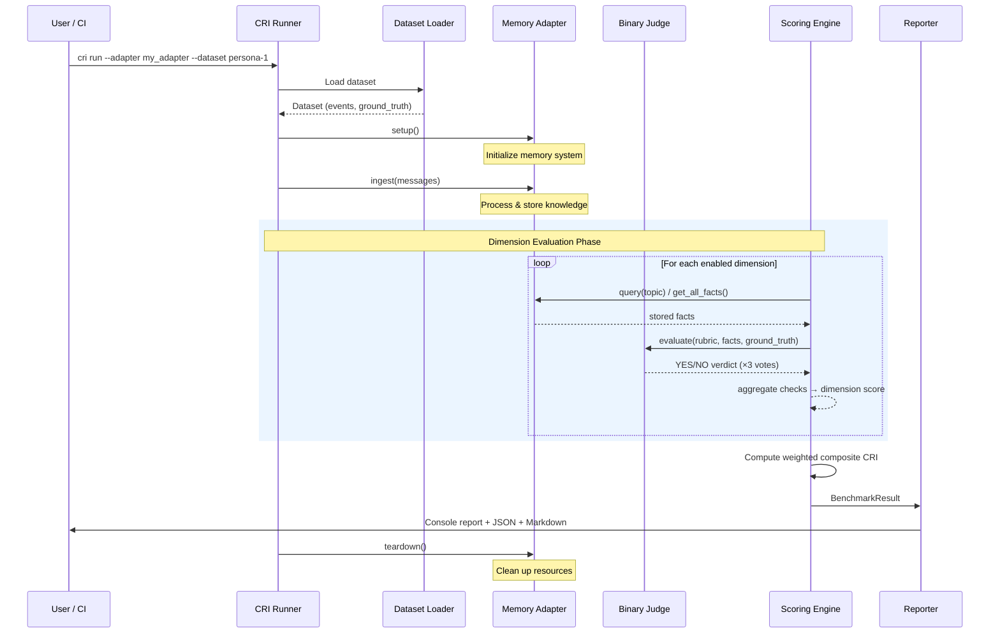
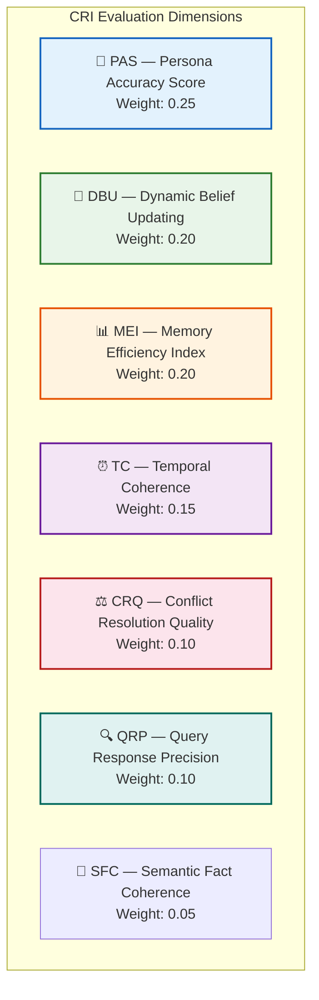
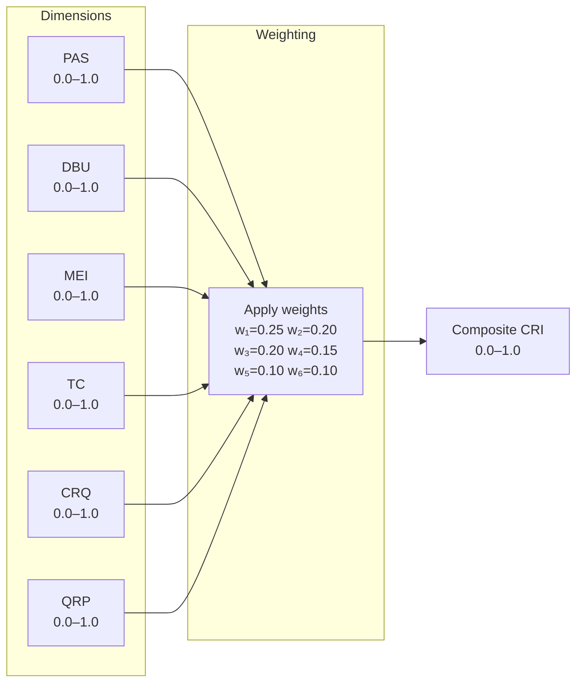
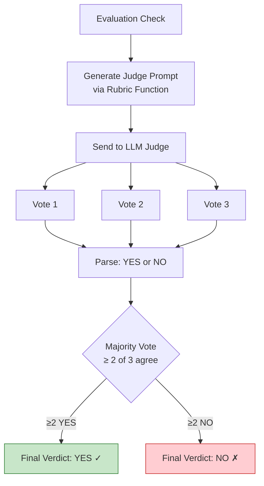
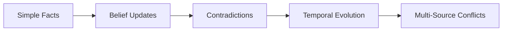

# CRI Benchmark — Evaluation Methodology

> *A benchmark is only as credible as its methodology. This document explains exactly how the CRI Benchmark evaluates memory systems — what is measured, why it is measured, and how it is measured.*

---

## Table of Contents

- [Introduction](#introduction)
- [Evaluation Approach](#evaluation-approach)
  - [The CRI Evaluation Pipeline](#the-cri-evaluation-pipeline)
  - [The Hybrid Scoring Model](#the-hybrid-scoring-model)
  - [Why Binary Verdicts?](#why-binary-verdicts)
- [The Seven Evaluation Dimensions](#the-seven-evaluation-dimensions)
  - [PAS — Persona Accuracy Score](#pas--persona-accuracy-score)
  - [DBU — Dynamic Belief Updating](#dbu--dynamic-belief-updating)
  - [MEI — Memory Efficiency Index](#mei--memory-efficiency-index)
  - [TC — Temporal Coherence](#tc--temporal-coherence)
  - [CRQ — Conflict Resolution Quality](#crq--conflict-resolution-quality)
  - [QRP — Query Response Precision](#qrp--query-response-precision)
  - [SFC — Semantic Fact Coherence](#sfc--semantic-fact-coherence)
- [Composite CRI Score](#composite-cri-score)
  - [Formula and Default Weights](#formula-and-default-weights)
  - [Weight Justification](#weight-justification)
  - [Custom Weight Profiles](#custom-weight-profiles)
  - [Score Interpretation](#score-interpretation)
- [LLM-as-Judge Design](#llm-as-judge-design)
  - [Why LLM-as-Judge?](#why-llm-as-judge)
  - [Binary Judge Architecture](#binary-judge-architecture)
  - [Majority Voting](#majority-voting)
  - [Rubric Functions](#rubric-functions)
  - [Inverted Logic Checks](#inverted-logic-checks)
  - [Auditability](#auditability)
- [Dataset Methodology](#dataset-methodology)
  - [Dataset Structure](#dataset-structure)
  - [Canonical Datasets](#canonical-datasets)
  - [Event Design Philosophy](#event-design-philosophy)
- [Reproducibility](#reproducibility)
- [Known Limitations](#known-limitations)
- [Future Work](#future-work)

---

## Introduction

The **Contextual Resonance Index (CRI)** is a benchmark designed to evaluate how well AI systems maintain, update, and utilize contextual knowledge about users and entities over time. It focuses particularly on memory systems and user profiling mechanisms that accumulate knowledge incrementally through events and interactions.

Existing evaluation approaches for AI memory systems suffer from fundamental problems:

- **Exact-match metrics** cannot handle semantic equivalence ("NYC" ≠ "New York City")
- **LLM scoring on numeric scales** produces poor inter-rater reliability and is difficult to reproduce
- **Embedding similarity** conflates stylistic similarity with factual accuracy
- **Traditional NLP metrics** (BLEU, ROUGE) measure surface overlap rather than semantic correctness

CRI addresses these limitations through a **hybrid scoring model** that combines deterministic structure with semantic intelligence, producing scores that are simultaneously meaningful, reproducible, and auditable.

This document provides the complete technical specification of the CRI evaluation methodology. For deeper treatment of individual components, see the linked documentation pages throughout.

---

## Evaluation Approach

### The CRI Evaluation Pipeline

Every CRI benchmark run follows a deterministic six-stage pipeline. Each stage has clearly defined inputs and outputs, enabling full auditability and reproducibility.



**Stage 1 — Dataset Loading.** The runner loads a benchmark dataset containing a persona specification, chronological events, and ground-truth expected knowledge state.

**Stage 2 — Adapter Initialization.** The memory system under test is initialized via `adapter.setup()`. The adapter implements a minimal, architecture-neutral interface:

```python
class MemoryAdapter(Protocol):
    def ingest(self, messages: list[Message]) -> None: ...
    def query(self, topic: str) -> list[StoredFact]: ...
    def get_all_facts(self) -> list[StoredFact]: ...
```

This interface supports vector stores, knowledge graphs, ontology systems, and hybrid approaches without compromise.

**Stage 3 — Event Ingestion.** Events are fed to the memory system in strict chronological order. Events simulate real-world information flow: biographical facts, preference statements, life updates, contradictions, temporal changes, and noise.

**Stage 4 — Dimension Evaluation.** After all events are ingested, the scoring engine evaluates each enabled dimension independently. Each dimension produces a score between 0.0 and 1.0.

**Stage 5 — Composite CRI Computation.** The weighted composite CRI score is computed from the individual dimension scores.

**Stage 6 — Report Generation.** Results are produced in console (Rich-formatted), JSON (machine-readable), and Markdown (human-readable) formats. Every report includes the complete judge log for full audit capability.

> *See [Architecture Overview](docs/architecture/overview.md) and [Integration Guide](docs/guides/integration.md) for implementation details.*

---

### The Hybrid Scoring Model

CRI employs a **hybrid scoring model** that combines deterministic structure with semantic intelligence. This is one of its most important methodological contributions.

| Approach | Strength | Weakness |
|----------|----------|----------|
| **Exact match** | Perfectly reproducible | Cannot handle semantic equivalence |
| **LLM scoring (1–10 scale)** | Handles semantic nuance | Poor inter-rater reliability |
| **CRI's hybrid approach** | Both reproducible and semantically aware | Requires LLM API calls |

CRI achieves this through four mechanisms:

1. **Structured decomposition** — Each dimension is broken into independent binary checks. Rather than asking "How well did the system handle this?" (subjective), CRI asks "Did the system store the user's occupation correctly?" (binary).

2. **Binary LLM verdicts** — Each check is evaluated by an LLM judge constrained to answer **YES or NO**. Binary questions produce ~90–95% inter-rater agreement compared to ~60–70% for 5-point Likert scales.

3. **Majority voting** — Each check is evaluated **3 times** (configurable). The final verdict is determined by majority vote (≥2 of 3), eliminating most remaining stochastic noise.

4. **Deterministic aggregation** — Dimension scores are computed as `passed_checks / total_checks`. The composite CRI is a weighted sum. No learned parameters, no calibration, no opaque transformations.

### Why Binary Verdicts?

The decision to use binary YES/NO verdicts rather than graded scales is a deliberate design choice grounded in evaluation science:

- **Reproducibility**: Binary questions produce consistent answers across LLM runs. "Is X present?" has a clear answer; "How good is X on a scale of 1–10?" does not.
- **Auditability**: A human reviewer can verify every YES/NO judgment. A 7.3 vs. 7.5 distinction is nearly impossible to audit.
- **Cost efficiency**: `max_tokens=10` eliminates verbose judge responses. Each evaluation costs a fraction of free-form scoring.
- **Granularity through aggregation**: Many binary checks produce fine-grained scores. A dimension with 20 checks can produce scores at 0.05 intervals — equivalent granularity to a 20-point scale but with far higher reliability.

---

## The Seven Evaluation Dimensions

CRI evaluates memory systems across **seven orthogonal dimensions**, each measuring a distinct property of long-term memory behavior. The dimensions are designed to be independent — a system can score high on one and low on another, revealing specific strengths and weaknesses.



The dimensions form a natural hierarchy of memory capabilities:

1. **Can it remember?** (PAS)
2. **Can it update?** (DBU)
3. **Is it efficient?** (MEI)
4. **Can it reason about time?** (TC)
5. **Can it resolve conflicts?** (CRQ)
6. **Can it retrieve effectively?** (QRP)

---

### PAS — Persona Accuracy Score

| Property | Value |
|----------|-------|
| **Weight** | 0.25 (highest) |
| **Measures** | Factual recall of explicit persona attributes |
| **Key question** | *Does the system remember what it was told?* |

#### What It Measures

PAS evaluates how accurately a memory system recalls specific persona details — demographics, preferences, biographical facts, stated opinions. It is the **foundational dimension**: if a system cannot recall basic facts, no other capability matters.

#### Why It Matters

- **User trust depends on accuracy.** A system that forgets or confabulates basic facts erodes user confidence.
- **Downstream tasks depend on correct context.** Personalization, recommendation, and adaptive behavior all require accurate profile recall.
- **PAS is the baseline.** Before evaluating nuanced capabilities, we first verify the system can store and retrieve straightforward facts.

#### How It Is Computed

For each profile dimension in the ground truth:

1. **Query** the adapter using the dimension's `query_topic` to retrieve stored facts.
2. **Create checks**: one per expected value (multi-value attributes generate one check per element).
3. **Evaluate** each check via the binary LLM judge: *"Do the stored facts contain information that semantically matches the expected value?"*
4. **Majority vote** across 3 judge runs determines the verdict.

```
PAS = passed_checks / total_checks
```

**Semantic equivalence** is emphasized — "software developer" matches "software engineer", "NYC" matches "New York City".

#### Example

| Ground Truth | Stored Facts | Verdict |
|-------------|-------------|---------|
| occupation = "software engineer" | "Elena works as a senior software developer" | ✓ YES — semantic match |
| spoken_languages = ["English", "Spanish", "Portuguese"] | "Elena speaks English fluently" + "Elena learned Spanish" | ✓✓✗ — 2/3 checks pass |
| pet = "golden retriever named Max" | *(no facts returned)* | ✗ NO — missing |

> *See [docs/methodology/metrics/pas.md](docs/methodology/metrics/pas.md) for the complete specification.*

---

### DBU — Dynamic Belief Updating

| Property | Value |
|----------|-------|
| **Weight** | 0.20 |
| **Measures** | Correct transition from outdated to current beliefs |
| **Key question** | *When facts change, does the system update?* |

#### What It Measures

DBU evaluates whether the memory system correctly transitions from old beliefs to new ones when information changes. This is what separates a real memory system from an append-only log.

#### Why It Matters

- **Outdated information is worse than no information.** A system that confidently presents stale facts misleads both users and downstream agents.
- **It tests ontological reasoning.** Updating a belief requires recognizing that new information relates to the same entity and attribute, determining that the new value supersedes the old, and updating the internal representation.
- **It reveals architectural differences.** Simple vector stores typically score low on DBU because they lack supersession mechanisms. Ontology-based systems with explicit entity-attribute models tend to score higher.

#### How It Is Computed

Each belief change is evaluated with a **dual-check** approach:

1. **Recency check** — Does the system reflect the new value? (Expected: YES)
2. **Staleness check** — Does the system still assert the old value as current? (Expected: NO)

A belief change passes **only** when both conditions are met. Historical context ("used to be X") is explicitly allowed and is not penalized.

```
DBU = passed_changes / total_changes
```

#### Failure Modes

| Mode | Recency | Staleness | Meaning |
|------|---------|-----------|---------|
| **Clean update** | YES | NO | ✓ Correct — new value present, old superseded |
| **Parallel assertion** | YES | YES | Both old and new asserted as current |
| **Complete failure** | NO | YES | Old value persists, new value missing |
| **Total loss** | NO | NO | Neither value found |

#### Example

**Belief change:** residence: Portland → Seattle

| Stored Facts | Recency | Staleness | Result |
|-------------|---------|-----------|--------|
| "Marcus lives in Seattle" + "Previously lived in Portland" | YES ✓ | NO ✓ | **PASS** |
| "Marcus lives in Seattle" + "Marcus lives in Portland" | YES ✓ | YES ✗ | **FAIL** |

> *See [docs/methodology/metrics/dbu.md](docs/methodology/metrics/dbu.md) for the complete specification.*

---

### MEI — Memory Efficiency Index

| Property | Value |
|----------|-------|
| **Weight** | 0.20 |
| **Measures** | Global storage efficiency |
| **Key question** | *Does the system store exactly what it should — no more, no less?* |

#### What It Measures

MEI evaluates how efficiently a memory system stores knowledge by comparing what the system actually stored against the ground-truth facts it should have stored. A perfect system stores exactly the N ground-truth facts and nothing else, achieving MEI = 1.0.

#### Why It Matters

- **Over-storage wastes resources and degrades retrieval.** A system that stores every utterance verbatim — including greetings, filler, and duplicates — clutters the fact store and makes retrieval harder.
- **Under-storage means lost knowledge.** If the system fails to capture important facts, downstream tasks lose critical context.
- **Efficiency reveals architectural maturity.** Sophisticated systems demonstrate judgment about *what to store*, balancing coverage against bloat.

#### How It Is Computed

MEI calls `adapter.get_all_facts()` once to retrieve the complete fact store, then computes two ratios:

1. **Efficiency ratio** — What fraction of stored facts are actually useful (covered by ground truth)?
2. **Coverage factor** — What fraction of the ground-truth facts were captured?

```
efficiency_ratio = covered_gt_facts / total_facts_stored
coverage_factor  = covered_gt_facts / total_gt_facts

MEI = harmonic_mean(efficiency_ratio, coverage_factor)
```

The harmonic mean ensures that both ratios must be high for a good score — a system cannot compensate for poor coverage by being very precise, or vice versa.

#### Example: Diagnostic Patterns

| Scenario | Stored | Covered GT | Total GT | Efficiency | Coverage | MEI |
|----------|:------:|:----------:|:--------:|:----------:|:--------:|:---:|
| Perfect | 10 | 10 | 10 | 1.00 | 1.00 | **1.00** |
| Over-storage | 50 | 10 | 10 | 0.20 | 1.00 | **0.33** |
| Under-storage | 5 | 5 | 10 | 1.00 | 0.50 | **0.67** |
| Balanced | 15 | 8 | 10 | 0.53 | 0.80 | **0.64** |

> *See [docs/methodology/metrics/mei.md](docs/methodology/metrics/mei.md) for the complete specification.*

---

### TC — Temporal Coherence

| Property | Value |
|----------|-------|
| **Weight** | 0.15 |
| **Measures** | Understanding of time in knowledge management |
| **Key question** | *Does the system understand what is current vs. outdated?* |

#### What It Measures

TC evaluates how well the memory system handles the temporal dimension of knowledge — distinguishing current from expired facts, tracking time-bounded preferences, and recognizing when information has a natural lifespan.

#### Why It Matters

Long-term memory systems accumulate knowledge over extended periods. During this time, people change jobs, move cities, update preferences, and events conclude. A system without temporal awareness commits two critical failures:

1. **Stale persistence** — Retaining expired information as current ("She's currently traveling to Japan" months after the trip ended)
2. **Premature expiry** — Dropping information that is still valid (forgetting an ongoing subscription)

#### How It Is Computed

The evaluation dataset includes facts with explicit temporal properties. For each temporal fact, the system is queried at a specific evaluation time point:

- **Current facts**: Should be present in the system's response → absence = failure
- **Expired facts**: Should NOT be presented as current → presence as current = failure

```
TC = correctly_handled / total_temporal_facts
```

#### Key Distinction from DBU

DBU tests whether the system updates when *explicitly told* something changed. TC tests whether the system handles the *passage of time itself* — even when no explicit correction is provided. A system might pass DBU ("I moved to Seattle") but fail TC (reporting a two-week vacation as ongoing months later).

#### Test Categories

| Category | Example |
|----------|---------|
| Time-bounded preferences | "Doing keto for January" → should not be active in March |
| Expired states | "Has a broken arm" (6 months ago) → should recognize recovery |
| Ongoing vs. completed | "Training for a marathon" vs. "completed the marathon" |
| Implicit expiry | "On a two-week vacation" (ingested 6 weeks ago) → should not report as current |

> *See [docs/methodology/metrics/tc.md](docs/methodology/metrics/tc.md) for the complete specification.*

---

### CRQ — Conflict Resolution Quality

| Property | Value |
|----------|-------|
| **Weight** | 0.10 |
| **Measures** | Handling of contradictory information |
| **Key question** | *When information conflicts, does the system resolve it correctly?* |

#### What It Measures

CRQ evaluates the system's ability to identify, process, and resolve contradictory information. Unlike DBU (which tests clear updates), CRQ focuses on **ambiguous or complex conflicts** where the correct resolution requires reasoning.

#### Why It Matters

Real-world information is inherently messy:

- A user says they're vegetarian but is later observed eating sushi
- Two different sources provide different dates for the same event
- A stated preference contradicts observed behavior
- Gradual changes create a spectrum where no single "correct" answer exists

A system that cannot handle conflicts will either blindly overwrite (losing nuance), blindly accumulate (creating contradictions), or silently fail.

#### How It Is Computed

Each conflict scenario has a ground-truth expected resolution. After all events are processed, queries probe the conflicting information. An LLM judge evaluates whether the system's response reflects the correct resolution.

```
CRQ = correctly_resolved / total_conflicts
```

#### Conflict Types

| Type | Example | Expected Resolution |
|------|---------|---------------------|
| Explicit corrections | "I actually graduated in 2019, not 2018" | Accept the correction |
| Gradual changes | Vegetarian → occasionally eats fish → pescatarian | Reflect the evolution |
| Source authority | Self-report vs. third-party observation | Prefer higher-authority source |
| Behavioral contradictions | Says "I don't watch TV" but binge-watches series | Acknowledge both with nuance |
| Ambiguous conflicts | "Loves hiking" vs. "hasn't hiked in years" | Acknowledge uncertainty |

> *See [docs/methodology/metrics/crq.md](docs/methodology/metrics/crq.md) for the complete specification.*

---

### QRP — Query Response Precision

| Property | Value |
|----------|-------|
| **Weight** | 0.10 |
| **Measures** | Retrieval quality for specific queries |
| **Key question** | *Does the system retrieve the right facts for a given query?* |

#### What It Measures

QRP evaluates retrieval quality — whether the system surfaces relevant information and excludes irrelevant information when queried. This is an **output-side metric**: it tests the system's ability to select the right subset of its knowledge.

#### Why It Matters

As memory grows, the challenge shifts from *having* information to *selecting the right information*. A system with 500 facts must select the 3–5 relevant ones for a specific query. Returning too much overwhelms the consumer; returning too little misses important context.

#### How It Is Computed

Each evaluation query has a defined set of relevant and irrelevant facts. QRP measures both recall and precision:

```
recall    = |relevant ∩ retrieved| / |relevant|
precision = |relevant ∩ retrieved| / |retrieved|

QRP = 0.5 × recall + 0.5 × precision
```

#### Key Distinction from PAS

PAS tests whether the system *has* the correct facts. QRP tests whether it can *find and present the right ones* for a specific query.

#### Example

**Query:** "What does Elena do for work?"

| System Response | Recall | Precision | QRP |
|----------------|:------:|:---------:|:---:|
| "Elena is a graphic designer specializing in brand identity at a creative agency" | 3/3 = 1.0 | 3/3 = 1.0 | **1.00** |
| Same as above + "She has a dog named Biscuit, enjoys Italian food, runs marathons..." | 3/3 = 1.0 | 3/7 = 0.43 | **0.71** |
| "Elena works in a creative field" | 1/3 = 0.33 | 1/1 = 1.0 | **0.67** |
| "Elena has a dog named Biscuit and enjoys running" | 0/3 = 0.0 | 0/2 = 0.0 | **0.00** |

> *See [docs/methodology/metrics/qrp.md](docs/methodology/metrics/qrp.md) for the complete specification.*

---

### SFC — Semantic Fact Coherence

| Property | Value |
|----------|-------|
| **Weight** | 0.05 |
| **Measures** | Internal consistency of the stored knowledge model |
| **Key question** | *Are the stored facts semantically coherent with one another?* |

#### What It Measures

SFC evaluates whether the facts stored by the memory system are internally consistent — free from semantic contradictions, duplicates, and incoherent combinations that would degrade the quality of any downstream use.

#### Why It Matters

- **Internal contradictions undermine trust.** A knowledge store that simultaneously asserts "user is vegetarian" and "user's favourite dish is beef stew" cannot be relied upon.
- **It distinguishes explicit from implicit conflicts.** DBU catches conflicts that arise from explicit updates; SFC catches implicit contradictions that no single event would flag.
- **It reflects architectural maturity.** Systems with formal knowledge representations (ontologies, graphs) tend to enforce consistency; append-only or naive RAG systems do not.

#### How It Is Computed

```
SFC = coherent_fact_pairs / total_evaluated_pairs
```

The scorer samples pairs of stored facts and uses the LLM judge to evaluate whether the two facts are semantically coherent with one another.

> *See [docs/methodology/metrics/sfc.md](docs/methodology/metrics/sfc.md) for the complete specification.*

---

## Composite CRI Score

### Formula and Default Weights

The composite CRI score is a weighted average of all seven dimension scores:

```
CRI = 0.25 × PAS + 0.20 × DBU + 0.20 × MEI + 0.15 × TC + 0.10 × CRQ + 0.10 × QRP + 0.05 × SFC
```

All dimension scores are in the range **[0.0, 1.0]**. The composite CRI score is therefore also in **[0.0, 1.0]**.



### Weight Justification

The default weights reflect a principled ordering of importance for long-term memory quality:

| Dimension | Weight | Justification |
|-----------|:------:|---------------|
| **PAS** | 0.25 | **Foundational** — if the stored knowledge is wrong, nothing else matters. Accuracy is the bedrock of all other capabilities. |
| **DBU** | 0.20 | **Critical** — knowledge that doesn't evolve becomes increasingly wrong over time. Static memory is a liability in a changing world. |
| **MEI** | 0.20 | **Important** — a system that stores too much or too little degrades retrieval quality and wastes resources. Efficiency is a hallmark of architectural maturity. |
| **TC** | 0.15 | **Significant** — temporal reasoning is essential for long-term memory, but most knowledge is not time-bounded. |
| **CRQ** | 0.10 | **Valuable** — contradictions are common in real-world data but occur less frequently than straightforward updates. |
| **QRP** | 0.10 | **Supporting** — retrieval quality matters, but CRI's primary focus is on the knowledge model itself. |

The **core three metrics** (PAS, DBU, MEI) receive higher combined weight (0.65) because they represent the most critical evaluation dimensions for long-term memory quality. The **supporting metrics** (TC, CRQ, QRP) have a combined weight of (0.35) reflecting their importance as secondary indicators that may be refined as the benchmark matures.

### Custom Weight Profiles

Weights are fully configurable for specific use cases:

```python
from cri.models import ScoringConfig

# User profiling emphasis
ScoringConfig(dimension_weights={
    "PAS": 0.35, "DBU": 0.25, "MEI": 0.20,
    "TC": 0.10, "CRQ": 0.05, "QRP": 0.05,
})

# Knowledge management emphasis
ScoringConfig(dimension_weights={
    "PAS": 0.15, "DBU": 0.25, "MEI": 0.15,
    "TC": 0.20, "CRQ": 0.15, "QRP": 0.10,
})

# Conversational AI emphasis
ScoringConfig(dimension_weights={
    "PAS": 0.20, "DBU": 0.15, "MEI": 0.15,
    "TC": 0.15, "CRQ": 0.10, "QRP": 0.25,
})
```

**Constraint:** Weights must always sum to 1.0 (validated at engine initialization with ±0.01 tolerance).

**Re-normalization:** When a dimension is missing from results (disabled, no test data, or scorer error), the engine re-normalizes the remaining weights so the composite score stays on the 0.0–1.0 scale.

### Score Interpretation

| CRI Score | Rating | Interpretation |
|-----------|--------|----------------|
| **0.90 – 1.00** | Exceptional | Near-perfect contextual memory across all dimensions |
| **0.70 – 0.89** | Strong | Strong performance with minor gaps in advanced scenarios |
| **0.50 – 0.69** | Moderate | Solid baseline; captures key facts but struggles with nuance |
| **0.30 – 0.49** | Weak | Significant memory capability gaps |
| **0.00 – 0.29** | Poor | Fundamental memory failures; no-memory baselines typically fall here |

#### The Power of Per-Dimension Reporting

The composite CRI score provides a convenient summary, but the **per-dimension breakdown is where the real diagnostic value lies**:

| System | PAS | DBU | MEI | TC | CRQ | QRP | **CRI** |
|--------|:---:|:---:|:---:|:--:|:---:|:---:|:-------:|
| System A | 0.95 | 0.90 | 0.85 | 0.30 | 0.20 | 0.80 | **0.73** |
| System B | 0.70 | 0.70 | 0.70 | 0.75 | 0.75 | 0.70 | **0.71** |

Both score ~0.72 overall, but they reveal fundamentally different architectures:

- **System A** excels at capturing and updating facts but fails at temporal reasoning and conflict resolution — likely a simple extraction pipeline without temporal metadata.
- **System B** is consistently moderate across all dimensions — likely a more balanced architecture that handles everything adequately but nothing exceptionally.

**Recommendation:** Always report the full dimension breakdown alongside the composite CRI score.

#### Baseline Reference Points

| System Type | Expected CRI Range |
|-------------|-------------------|
| No-memory baseline | 0.00 – 0.10 |
| Full-context window | 0.40 – 0.65 |
| Simple RAG (vector store) | 0.35 – 0.60 |
| Ontology-based memory | 0.70 – 1.00 |

> *See [docs/methodology/metrics/composite-cri.md](docs/methodology/metrics/composite-cri.md) for full details including the API reference.*

---

## LLM-as-Judge Design

### Why LLM-as-Judge?

Memory system evaluation requires understanding whether a response **semantically captures** the expected information — even when expressed in completely different words. Traditional metrics fail at this:

| Metric | Problem |
|--------|---------|
| Exact match | "software developer" ≠ "software engineer" |
| BLEU/ROUGE | Measures n-gram overlap, not factual accuracy |
| Embedding similarity | Conflates style with correctness |
| Rule-based | Cannot scale to natural language diversity |

An LLM judge provides semantic understanding, contextual reasoning, structured evaluation against rubrics, and scalability across thousands of checks.

### Binary Judge Architecture

The CRI Benchmark uses a `BinaryJudge` — a synchronous, majority-voting YES/NO evaluator:



**Key Parameters:**

| Parameter | Default | Description |
|-----------|---------|-------------|
| `model` | `claude-haiku-4-5` | LLM model used for judging |
| `num_runs` | `3` | Independent LLM calls per check |
| `temperature` | `0.0` | Near-deterministic sampling |
| `max_tokens` | `10` | Minimal response (only YES/NO needed) |

**System prompt:** `"You are an evaluation judge. Answer only YES or NO."`

All evaluation context — criteria, facts, questions — is provided via dimension-specific rubric functions in the user prompt.

### Majority Voting

Single LLM calls can produce inconsistent results even at `temperature=0.0` due to floating-point non-determinism in GPU operations, API-side load balancing, and token sampling tie-breaking. Majority voting mitigates this:

| Vote Pattern | Final Verdict | Unanimous? | Interpretation |
|-------------|:-------------:|:----------:|----------------|
| YES, YES, YES | **YES** | ✓ | Strong agreement — high confidence |
| YES, YES, NO | **YES** | ✗ | Majority agrees, one dissent |
| YES, NO, NO | **NO** | ✗ | Majority disagrees, one dissent |
| NO, NO, NO | **NO** | ✓ | Strong agreement — high confidence |

Non-unanimous votes are flagged in the results and indicate potentially ambiguous checks worth manual review.

### Rubric Functions

Each CRI dimension has dedicated rubric functions that generate judge prompts. These are pure functions — no side effects, no state — following a consistent four-part structure:

```
TASK
[Description of the evaluation task and criteria]
[Emphasis on semantic equivalence]

[STRUCTURED DATA]
[The specific values being evaluated]
[Stored/returned facts as a numbered list]

QUESTION
[A clear, specific YES/NO question]
[Optional NOTE for inverted checks]

Answer YES or NO.
```

#### Rubric Catalog

| Function | Dimension | Checks For | Expected Verdict |
|----------|-----------|------------|:----------------:|
| `pas_check` | PAS | Profile value present in facts | YES = pass |
| `dbu_recency_check` | DBU | Updated value reflected as current | YES = pass |
| `dbu_staleness_check` | DBU | Old value still asserted as current | NO = pass |
| `mei_coverage_check` | MEI | Ground-truth fact covered by stored facts | YES = pass |
| `tc_temporal_validity_check` | TC | Temporal fact handled correctly | Context-dependent |
| `crq_resolution_check` | CRQ | Conflict resolved correctly | YES = pass |
| `qrp_relevance_check` | QRP | Relevant fact present in results | YES = pass |
| `qrp_irrelevance_check` | QRP | Irrelevant fact incorrectly included | NO = pass |

### Inverted Logic Checks

Several checks use **inverted logic** where YES from the judge means the system **failed**:

- `dbu_staleness_check` — YES = old value still persists (failure)
- `qrp_irrelevance_check` — YES = irrelevant fact included (failure)

Each inverted prompt includes an explicit NOTE: *"YES means the system FAILED"* to reduce judge confusion.

### Auditability

Every judgment is recorded in a full audit log included in the `BenchmarkResult`:

| Field | Description |
|-------|-------------|
| `check_id` | Unique identifier (e.g., `"pas-occupation-0"`) |
| `verdict` | Final aggregated verdict (YES or NO) |
| `votes` | Individual votes from each LLM call |
| `unanimous` | Whether all votes agreed |
| `prompt` | Full prompt sent to the judge |
| `raw_responses` | Raw text responses from the judge LLM |

This enables practitioners to trace every score back to the exact prompt and response that produced it.

#### Cost Estimation

A typical benchmark run involves ~100–140 checks × 3 votes = **300–420 LLM API calls**. With `claude-haiku-4-5` at approximately $0.001 per short call, a full benchmark run costs roughly **$0.30–$0.50**.

> *See [docs/methodology/judge.md](docs/methodology/judge.md) for the full LLM-as-Judge specification.*

---

## Dataset Methodology

### Dataset Structure

Each CRI dataset is a self-contained directory representing a fictional persona whose information evolves over a sequence of events:

```
persona-1-basic/
├── conversations.jsonl  # Chronological conversation messages (one per line)
├── ground_truth.json    # Expected knowledge state after ingestion
└── metadata.json        # Dataset metadata (seed, version, persona ID)
```

| File | Contents | Purpose |
|------|----------|---------|
| `conversations.jsonl` | Chronological conversation messages | Input to the memory system |
| `ground_truth.json` | Expected knowledge state after ingestion | Evaluation reference |
| `metadata.json` | Dataset metadata (seed, version, persona ID) | Reproducibility |

The dataset loader validates the structure, checks required fields, and produces a typed `Dataset` object. Invalid datasets fail fast with clear error messages.

### Canonical Datasets

CRI ships with three canonical datasets at increasing complexity:

| Dataset | Persona | Complexity | Events | Focus |
|---------|---------|------------|:------:|-------|
| **Persona 1** | Elena Vasquez | Basic | ~8 | Factual recall, simple preferences. No contradictions. |
| **Persona 2** | Marcus Chen | Intermediate | ~15 | Career transitions, dietary changes, location moves. Tests belief updating. |
| **Persona 3** | Sophia Andersson | Advanced | ~20+ | Conflicting information, opinion reversals, multi-source events. Tests conflict resolution and temporal coherence. |

### Event Design Philosophy

Events are designed to test specific memory properties at increasing levels of sophistication:



Each event carries metadata:

- **type** — Category (career, personal, preferences, etc.)
- **source** — Origin of the information (conversation, third_party)
- **reliability** — Source reliability level (for conflict resolution testing)

Events simulate real-world information flow: biographical facts, preference statements, life updates, contradictions, temporal changes, and noise (greetings, filler). The memory system must decide what to extract, store, update, and discard.

#### Ground Truth Design

The ground truth captures the expected state after all events are processed:

- **`final_profile`** — Expected profile dimensions with values and query topics (for PAS)
- **`changes`** — Expected belief transitions with old/new values (for DBU)
- **`signal_examples`** — Facts that should have been captured (retained for dataset compatibility; not used by any active scorer)
- **`noise_examples`** — Content that should have been filtered (retained for dataset compatibility; not used by any active scorer)
- **`temporal_facts`** — Facts with temporal properties (for TC)
- **`conflicts`** — Deliberately introduced contradictions with expected resolutions (for CRQ)
- **`queries`** — Evaluation queries with relevant/irrelevant fact sets (for QRP)

> *See [docs/methodology/datasets.md](docs/methodology/datasets.md) for the full dataset specification.*

---

## Reproducibility

CRI is designed for reproducible results. Given identical inputs:

| Configuration | Effect |
|--------------|--------|
| **Judge temperature: 0.0** | Minimizes LLM stochasticity |
| **Majority voting: 3 runs** | Reduces per-check variance to near zero |
| **Canonical datasets: versioned** | Same data across all evaluations |
| **Rubric prompts: committed** | Same evaluation criteria across all runs |
| **Adapter reset: required** | Clean state for each benchmark run |
| **Random seeds: configurable** | Deterministic behavior for all RNG |

### The Reproducibility Contract

```
GIVEN:
  - Canonical dataset v1.0
  - Adapter implementation X (deterministic behavior)
  - Judge model: claude-haiku-4-5
  - Judge runs: 3
  - Judge temperature: 0.0

THEN:
  - CRI composite score is identical across runs (within ±0.01)
  - Per-dimension scores are identical (within ±0.02)
  - Any non-unanimous verdicts are flagged in the report
```

### Statistical Metadata

Every CRI result includes comprehensive metadata for scientific rigor:

| Metadata | Description | Use Case |
|----------|-------------|----------|
| Per-check verdicts | Individual YES/NO for every binary check | Debugging specific failures |
| Vote distributions | Unanimous vs. split decisions | Identifying ambiguous checks |
| Non-unanimous flags | Checks where the judge disagreed with itself | Quality control |
| Dimension breakdowns | Score, passed/total counts per dimension | Diagnostic analysis |
| Sub-dimension scores | Per-dimension component breakdowns | Granular dimension analysis |
| Judge log | Full prompt and response for every judge call | Complete audit trail |
| Run metadata | Judge model, temperature, timestamp, run ID | Reproducibility verification |

> *See [docs/guides/reproducibility.md](docs/guides/reproducibility.md) for detailed guidance.*

---

## Known Limitations

### 1. LLM Judge Stochasticity

Even at `temperature=0.0`, LLM responses are not perfectly deterministic. Majority voting reduces variance but does not eliminate it entirely. In practice, CRI scores may vary by ±0.01–0.02 between identical runs.

**Mitigation:** Use majority voting with `num_runs=3` or higher. For official benchmarks, run the evaluation 3 times and report the median. Always record the judge model version.

### 2. Semantic Equivalence Quality

Simple equivalences ("NYC" = "New York City") are handled reliably, but subtle cases ("enjoys coding" ≈ "software engineer"?) may produce inconsistent results.

**Mitigation:** Use a capable judge model. Design ground truth values to be unambiguous. Review non-unanimous verdicts.

### 3. Binary Scoring Granularity

Each check is either passed or failed — no partial credit. A system that stores "Elena works in tech" when the expected value is "software engineer" receives the same FAIL as a system that stores nothing.

**Mitigation:** Review per-check details for nuanced analysis. The judge's raw responses provide additional context.

### 4. Static Profile Snapshot

PAS evaluates the **final profile** after all events. It does not evaluate intermediate states. A system that correctly captures a fact early but later loses it during compaction still fails.

**Mitigation:** Combine PAS with DBU and TC for temporal accuracy. Future versions may support intermediate checkpoints.

### 5. Query Topic Sensitivity

PAS and DBU depend on the adapter's `query(topic)` method returning relevant facts. If the query topic doesn't align with how the adapter indexes its knowledge, the adapter may fail to retrieve facts that are actually stored.

**Mitigation:** QRP separately evaluates retrieval precision. Cross-reference PAS with QRP to isolate retrieval issues from storage issues.

### 6. Cultural and Contextual Norms

What constitutes "noise," "conflict," or appropriate temporal boundaries may vary by culture and context. The benchmark assumes specific semantic norms documented in the ground truth.

### 7. No Cross-Validation Across Judge Models

The current implementation uses a single judge model. Different models might produce different verdicts on borderline cases.

**Mitigation:** Standardize on a single judge model for all comparisons. Record the model version. Future versions may support multi-judge cross-validation.

---

## Future Work

The CRI methodology is designed to evolve. Planned improvements include:

1. **Additional dimensions** — Multi-entity reasoning, inference capability, cross-session coherence
2. **Multi-judge cross-validation** — Using multiple LLM models as judges and measuring inter-judge agreement
3. **Intermediate checkpoint evaluation** — Testing memory state at multiple points during ingestion, not just the final state
4. **Adaptive difficulty scaling** — Automatically adjusting dataset complexity based on system capability
5. **Community-contributed datasets** — Standardized process for contributing new evaluation scenarios
6. **Multilingual evaluation** — Extending the benchmark to non-English personas and events
7. **Scalability benchmarks** — Measuring how CRI scores change as memory size grows (100, 1K, 10K, 100K facts)
8. **Real-world dataset validation** — Validating CRI scores against human judgments of memory quality

---

## Further Reading

| Topic | Document |
|-------|----------|
| Project vision and motivation | [docs/vision.md](docs/vision.md) |
| Design principles and philosophy | [docs/concepts/benchmark-philosophy.md](docs/concepts/benchmark-philosophy.md) |
| What is AI memory? | [docs/concepts/ai-memory.md](docs/concepts/ai-memory.md) |
| Why ontology-based memory matters | [docs/concepts/ontology-memory.md](docs/concepts/ontology-memory.md) |
| PAS deep dive | [docs/methodology/metrics/pas.md](docs/methodology/metrics/pas.md) |
| DBU deep dive | [docs/methodology/metrics/dbu.md](docs/methodology/metrics/dbu.md) |
| MEI deep dive | [docs/methodology/metrics/mei.md](docs/methodology/metrics/mei.md) |
| TC deep dive | [docs/methodology/metrics/tc.md](docs/methodology/metrics/tc.md) |
| CRQ deep dive | [docs/methodology/metrics/crq.md](docs/methodology/metrics/crq.md) |
| QRP deep dive | [docs/methodology/metrics/qrp.md](docs/methodology/metrics/qrp.md) |
| Composite CRI details | [docs/methodology/metrics/composite-cri.md](docs/methodology/metrics/composite-cri.md) |
| LLM judge specification | [docs/methodology/judge.md](docs/methodology/judge.md) |
| Dataset design | [docs/methodology/datasets.md](docs/methodology/datasets.md) |
| Architecture overview | [docs/architecture/overview.md](docs/architecture/overview.md) |
| Quick start guide | [docs/guides/quickstart.md](docs/guides/quickstart.md) |
| Integration guide | [docs/guides/integration.md](docs/guides/integration.md) |
| Reproducibility guidelines | [docs/guides/reproducibility.md](docs/guides/reproducibility.md) |

---

*Part of the [CRI Benchmark — Contextual Resonance Index](README.md) documentation.*
