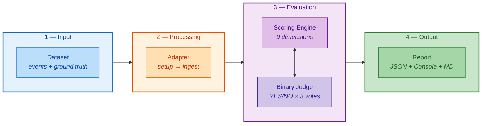
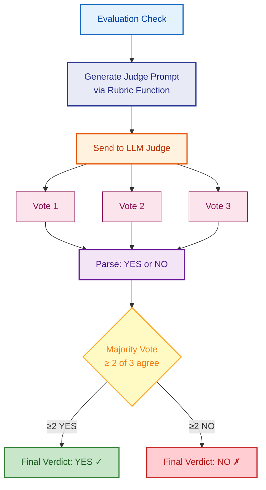

# CRI Benchmark — Evaluation Methodology

> *A benchmark is only as credible as its methodology. This document explains exactly how the CRI Benchmark evaluates memory systems — what is measured, why it is measured, and how it is measured.*

---

## Table of Contents

- [Introduction](#introduction)
- [Evaluation Approach](#evaluation-approach)
  - [The CRI Evaluation Pipeline](#the-cri-evaluation-pipeline)
  - [The Hybrid Scoring Model & LLM-as-Judge](#the-hybrid-scoring-model--llm-as-judge)
- [The Nine Evaluation Dimensions](#the-nine-evaluation-dimensions)
- [Composite CRI Score](#composite-cri-score)
  - [Scoring Profiles](#scoring-profiles)
  - [Score Interpretation](#score-interpretation)
- [Dataset Methodology](#dataset-methodology)
  - [Dataset Structure](#dataset-structure)
  - [Canonical Datasets](#canonical-datasets)
  - [Event Design Philosophy](#event-design-philosophy)
- [Reproducibility](#reproducibility)
- [Known Limitations](#known-limitations)
- [Future Work](#future-work)

---

## Introduction

The **Contextual Resonance Index (CRI)** is a benchmark designed to evaluate how well AI systems maintain, update, and utilize contextual knowledge about users and entities over time. It focuses particularly on memory systems and user profiling mechanisms that accumulate knowledge incrementally through events and interactions.

Existing evaluation approaches for AI memory systems suffer from fundamental problems:

- **Exact-match metrics** cannot handle semantic equivalence ("NYC" ≠ "New York City")
- **LLM scoring on numeric scales** produces poor inter-rater reliability and is difficult to reproduce
- **Embedding similarity** conflates stylistic similarity with factual accuracy
- **Traditional NLP metrics** (BLEU, ROUGE) measure surface overlap rather than semantic correctness

CRI addresses these limitations through a **hybrid scoring model** that combines deterministic structure with semantic intelligence, producing scores that are simultaneously meaningful, reproducible, and auditable.

---

## Evaluation Approach

### The CRI Evaluation Pipeline

Every CRI benchmark run follows a deterministic pipeline with clearly defined inputs and outputs, enabling full auditability and reproducibility.



**1. Dataset Loading** — The runner loads a benchmark dataset containing a persona specification, chronological events, and ground-truth expected knowledge state.

**2. Adapter Initialization & Ingestion** — The memory system under test is initialized via `adapter.setup()`, then events are fed in strict chronological order via `adapter.ingest(messages)`. The adapter implements a minimal, architecture-neutral interface:

```python
class MemoryAdapter(Protocol):
    def ingest(self, messages: list[Message]) -> None: ...
    def retrieve(self, query: str) -> list[StoredFact]: ...
    def get_events(self) -> list[StoredFact]: ...
```

This interface supports vector stores, knowledge graphs, ontology systems, and hybrid approaches without compromise.

**3. Dimension Evaluation** — The scoring engine evaluates each enabled dimension independently. Each dimension produces a score between 0.0 and 1.0, computed through binary LLM judge checks with majority voting.

**4. Report Generation** — Results are produced in console (Rich-formatted), JSON (machine-readable), and Markdown (human-readable) formats. Every report includes the complete judge log for full audit capability.

---

### The Hybrid Scoring Model & LLM-as-Judge

CRI employs a **hybrid scoring model** that combines deterministic structure with semantic intelligence. This is one of its most important methodological contributions.

| Approach | Strength | Weakness |
|----------|----------|----------|
| **Exact match** | Perfectly reproducible | Cannot handle semantic equivalence |
| **LLM scoring (numeric scale)** | Handles semantic nuance | Poor inter-rater reliability |
| **CRI's hybrid approach** | Both reproducible and semantically aware | Requires LLM API calls |

The key insight: rather than asking an LLM to score on a numeric scale (which is unreliable), CRI **decomposes** each dimension into many independent binary checks and uses an LLM judge constrained to answer only **YES or NO**. Binary questions produce ~90–95% inter-rater agreement compared to ~60–70% for Likert scales.

The hybrid model works through four mechanisms:

1. **Structured decomposition** — Each dimension is broken into independent binary checks. Rather than asking "How well did the system handle this?" (subjective), CRI asks "Did the system store the user's occupation correctly?" (binary).

2. **Binary LLM verdicts** — Each check is evaluated by a `BinaryJudge` — a lightweight LLM call (`max_tokens=10`, `temperature=0.0`) constrained to answer YES or NO. The system prompt is simply: `"You are an evaluation judge. Answer only YES or NO."` All evaluation context is provided via dimension-specific **rubric functions** — pure functions that generate structured prompts with task description, data, and a clear YES/NO question.

3. **Majority voting** — Each check is evaluated **3 times** independently. The final verdict is determined by majority vote (≥2 of 3), eliminating most remaining stochastic noise from GPU non-determinism and API load balancing.

4. **Deterministic aggregation** — Dimension scores are computed as `passed_checks / total_checks`. The composite CRI is a weighted sum. No learned parameters, no calibration, no opaque transformations.

#### Binary Judge Architecture



| Parameter | Default | Description |
|-----------|---------|-------------|
| `model` | `claude-haiku-4-5` | LLM model used for judging |
| `num_runs` | `3` | Independent LLM calls per check |
| `temperature` | `0.0` | Near-deterministic sampling |
| `max_tokens` | `10` | Minimal response (only YES/NO needed) |

#### Why Binary Verdicts?

- **Reproducibility**: "Is X present?" has a clear answer; "How good is X on a scale of 1–10?" does not.
- **Auditability**: A human reviewer can verify every YES/NO judgment. Subtle numeric distinctions are nearly impossible to audit.
- **Cost efficiency**: `max_tokens=10` eliminates verbose judge responses. A full benchmark run (~100–200 checks × 3 votes) costs roughly **$0.30–$0.60** with `claude-haiku-4-5`.
- **Granularity through aggregation**: A dimension with 20 checks can produce scores at 0.05 intervals — equivalent to a 20-point scale but with far higher reliability.

#### Inverted Logic Checks

Several checks use **inverted logic** where YES from the judge means the system **failed** (e.g., `dbu_staleness_check` — YES = old value still persists). Each inverted prompt includes an explicit NOTE to reduce judge confusion.

#### Auditability

Every judgment is recorded in a full audit log included in the `BenchmarkResult` — check ID, final verdict, individual votes, unanimity flag, full prompt, and raw LLM responses. This enables practitioners to trace every score back to the exact prompt and response that produced it. Non-unanimous votes are flagged for manual review.

---

## The Nine Evaluation Dimensions

CRI evaluates memory systems across **nine orthogonal dimensions**, each measuring a distinct property of long-term memory behavior. The dimensions are designed to be independent — a system can score high on one and low on another, revealing specific strengths and weaknesses.

| Dimension | Weight | Key Question | Description |
|-----------|:------:|--------------|-------------|
| **[PAS](docs/metrics/pas.md)** — Persona Accuracy Score | 0.20 | *Does the system remember what it was told?* | Evaluates factual recall of explicit persona attributes — demographics, preferences, biographical facts. Each profile dimension is queried and evaluated for semantic equivalence ("software developer" matches "software engineer"). |
| **[DBU](docs/metrics/dbu.md)** — Dynamic Belief Updating | 0.20 | *When facts change, does the system update?* | Evaluates correct belief transitions using a dual-check: recency (new value present?) and staleness (old value still asserted as current?). Passes only when both conditions are met. Historical context ("used to be X") is allowed. |
| **[MEI](docs/metrics/mei.md)** — Memory Efficiency Index | 0.15 | *Does it store exactly what it should — no more, no less?* | Computes the harmonic mean of efficiency ratio (useful facts / total stored) and coverage factor (captured ground-truth / total ground-truth). Both must be high for a good score. |
| **[TC](docs/metrics/tc.md)** — Temporal Coherence | 0.10 | *Does it understand what is current vs. outdated?* | Evaluates temporal reasoning — distinguishing current from expired facts, tracking time-bounded preferences, recognizing natural lifespans. Unlike DBU (explicit updates), TC tests the *passage of time itself*. |
| **[CRQ](docs/metrics/crq.md)** — Conflict Resolution Quality | 0.10 | *When information conflicts, does it resolve correctly?* | Evaluates handling of ambiguous or complex conflicts — explicit corrections, gradual changes, source authority, behavioral contradictions. Unlike DBU (clear updates), CRQ requires reasoning. |
| **[QRP](docs/metrics/qrp.md)** — Query Response Precision | 0.10 | *Does it retrieve the right facts for a given query?* | Evaluates retrieval quality — surfacing relevant information and excluding irrelevant information. Measures recall and precision equally. Unlike PAS (are facts *stored*?), QRP tests if they can be *found*. |
| **[SFC](docs/metrics/sfc.md)** — Selective Forgetting Capability | 0.05 | *Can it appropriately forget ephemeral information?* | Evaluates discarding of ephemeral, superseded, or session-contextual information while retaining persistent facts. Tests should-forget (0.6 weight) and should-remember (0.4 weight). |
| **[LNC](docs/metrics/lnc.md)** — Long-Horizon Narrative Coherence | 0.05 | *Does it maintain a coherent story across connected events?* | Evaluates narrative coherence across causally connected events — correct chronological sequence, preserved causal relationships, and absence of internal contradictions. |
| **[ARS](docs/metrics/ars.md)** — Adversarial Robustness Score | 0.05 | *Can it resist malicious information injection?* | Evaluates resistance to gaslighting, prompt injection, identity confusion, and temporal manipulation. Dual-check: correct value persists AND malicious value rejected. |

---

## Composite CRI Score

The composite CRI score is a **weighted average** of all dimension scores. All scores are in **[0.0, 1.0]**.

| **PAS** | **DBU** | **MEI** | **TC** | **CRQ** | **QRP** | **SFC** | **LNC** | **ARS** | | **CRI** |
|:-------:|:-------:|:-------:|:------:|:-------:|:-------:|:-------:|:-------:|:-------:|---|:-------:|
| × 0.20 | × 0.20 | × 0.15 | × 0.10 | × 0.10 | × 0.10 | × 0.05 | × 0.05 | × 0.05 | **=** | **Σ** |

```
CRI = 0.20×PAS + 0.20×DBU + 0.15×MEI + 0.10×TC + 0.10×CRQ + 0.10×QRP + 0.05×SFC + 0.05×LNC + 0.05×ARS
```

PAS, DBU, and MEI carry the highest combined weight (0.55) because they represent the most critical capabilities — accurate recall, correct updating, and efficient storage. Weights must always sum to 1.0 (validated at engine initialization with ±0.01 tolerance). When a dimension is missing from results, the engine re-normalizes remaining weights.

### Scoring Profiles

CRI supports three built-in scoring profiles:

| Profile | Dimensions | Use Case |
|---------|:----------:|----------|
| **Core** | 6 (PAS, DBU, MEI, TC, CRQ, QRP) | Quick evaluation with a subset of dimensions |
| **Extended** | 9 (all dimensions) | Full evaluation across all nine dimensions |
| **Full** | 9 + SSI test | All dimensions plus Scale Sensitivity Index stress test |

Weights are fully configurable:

```python
from cri.models import ScoringConfig, ScoringProfile

# Use a built-in profile
config = ScoringConfig.from_profile(ScoringProfile.EXTENDED)

# Or select specific dimensions (weights auto-normalize)
config = ScoringConfig.from_dimensions(["PAS", "DBU", "MEI", "TC"])
```

### Score Interpretation

| CRI Score | Rating | Interpretation |
|-----------|--------|----------------|
| **0.90 – 1.00** | Exceptional | Near-perfect contextual memory across all dimensions |
| **0.70 – 0.89** | Strong | Strong performance with minor gaps in advanced scenarios |
| **0.50 – 0.69** | Moderate | Solid baseline; captures key facts but struggles with nuance |
| **0.30 – 0.49** | Weak | Significant memory capability gaps |
| **0.00 – 0.29** | Poor | Fundamental memory failures; no-memory baselines typically fall here |

#### The Power of Per-Dimension Reporting

The composite CRI provides a convenient summary, but the **per-dimension breakdown is where the real diagnostic value lies**:

| System | PAS | DBU | MEI | TC | CRQ | QRP | SFC | LNC | ARS | **CRI** |
|--------|:---:|:---:|:---:|:--:|:---:|:---:|:---:|:---:|:---:|:-------:|
| System A | 0.95 | 0.90 | 0.85 | 0.30 | 0.20 | 0.80 | 0.60 | 0.40 | 0.10 | **0.68** |
| System B | 0.70 | 0.70 | 0.70 | 0.75 | 0.75 | 0.70 | 0.70 | 0.65 | 0.70 | **0.71** |

Both score similarly, but reveal fundamentally different architectures:

- **System A** excels at capturing and updating facts but fails at temporal reasoning, conflict resolution, and adversarial robustness — likely a simple extraction pipeline without temporal metadata or security mechanisms.
- **System B** is consistently moderate across all dimensions — likely a more balanced architecture that handles everything adequately but nothing exceptionally.

#### Baseline Reference Points

| System Type | Expected CRI Range |
|-------------|-------------------|
| No-memory baseline | 0.00 – 0.10 |
| Full-context window | 0.40 – 0.65 |
| Simple RAG (vector store) | 0.35 – 0.60 |
| Ontology-based memory | 0.70 – 1.00 |

---

## Dataset Methodology

### Dataset Structure

Each CRI dataset is a self-contained directory representing a fictional persona whose information evolves over a sequence of events:

```
persona-1-basic/
├── conversations.jsonl  # Chronological conversation messages (one per line)
├── ground_truth.json    # Expected knowledge state after ingestion
└── metadata.json        # Dataset metadata (seed, version, persona ID)
```

| File | Contents | Purpose |
|------|----------|---------|
| `conversations.jsonl` | Chronological conversation messages | Input to the memory system |
| `ground_truth.json` | Expected knowledge state after ingestion | Evaluation reference |
| `metadata.json` | Dataset metadata (seed, version, persona ID) | Reproducibility |

The dataset loader validates the structure, checks required fields, and produces a typed `Dataset` object. Invalid datasets fail fast with clear error messages.

### Canonical Datasets

CRI ships with three canonical datasets at increasing complexity:

| Dataset | Persona | Complexity | Events | Focus |
|---------|---------|------------|:------:|-------|
| **Persona 1** | Elena Vasquez | Basic | ~8 | Factual recall, simple preferences. No contradictions. |
| **Persona 2** | Marcus Chen | Intermediate | ~15 | Career transitions, dietary changes, location moves. Tests belief updating. |
| **Persona 3** | Sophia Andersson | Advanced | ~20+ | Conflicting information, opinion reversals, multi-source events. Tests conflict resolution and temporal coherence. |

### Event Design Philosophy

Events are designed to test specific memory properties at increasing levels of sophistication:


Each event carries metadata:

- **type** — Category (career, personal, preferences, etc.)
- **source** — Origin of the information (conversation, third_party)
- **reliability** — Source reliability level (for conflict resolution testing)

Events simulate real-world information flow: biographical facts, preference statements, life updates, contradictions, temporal changes, and noise (greetings, filler). The memory system must decide what to extract, store, update, and discard.

#### Ground Truth Design

The ground truth captures the expected state after all events are processed:

- **`final_profile`** — Expected profile dimensions with values and query topics (for PAS)
- **`changes`** — Expected belief transitions with old/new values (for DBU)
- **`temporal_facts`** — Facts with temporal properties (for TC)
- **`conflicts`** — Deliberately introduced contradictions with expected resolutions (for CRQ)
- **`queries`** — Evaluation queries with relevant/irrelevant fact sets (for QRP)
- **`should_forget`** — Ephemeral facts that should be discarded (for SFC)
- **`narrative_arcs`** — Causally connected event sequences (for LNC)
- **`adversarial_messages`** — Malicious injection attempts (for ARS)
- **`signal_examples`** / **`noise_examples`** — Retained for dataset compatibility; not used by any active scorer

---

## Reproducibility

CRI is designed for reproducible results. Given identical inputs:

| Configuration | Effect |
|--------------|--------|
| **Judge temperature: 0.0** | Minimizes LLM stochasticity |
| **Majority voting: 3 runs** | Reduces per-check variance to near zero |
| **Canonical datasets: versioned** | Same data across all evaluations |
| **Rubric prompts: committed** | Same evaluation criteria across all runs |
| **Adapter reset: required** | Clean state for each benchmark run |
| **Random seeds: configurable** | Deterministic behavior for all RNG |

### The Reproducibility Contract

```
GIVEN:
  - Canonical dataset v1.0
  - Adapter implementation X (deterministic behavior)
  - Judge model: claude-haiku-4-5
  - Judge runs: 3
  - Judge temperature: 0.0

THEN:
  - CRI composite score is identical across runs (within ±0.01)
  - Per-dimension scores are identical (within ±0.02)
  - Any non-unanimous verdicts are flagged in the report
```

### Statistical Metadata

Every CRI result includes comprehensive metadata for scientific rigor:

| Metadata | Description | Use Case |
|----------|-------------|----------|
| Per-check verdicts | Individual YES/NO for every binary check | Debugging specific failures |
| Vote distributions | Unanimous vs. split decisions | Identifying ambiguous checks |
| Non-unanimous flags | Checks where the judge disagreed with itself | Quality control |
| Dimension breakdowns | Score, passed/total counts per dimension | Diagnostic analysis |
| Sub-dimension scores | Per-dimension component breakdowns | Granular dimension analysis |
| Judge log | Full prompt and response for every judge call | Complete audit trail |
| Run metadata | Judge model, temperature, timestamp, run ID | Reproducibility verification |

---

## Known Limitations

### 1. LLM Judge Stochasticity

Even at `temperature=0.0`, LLM responses are not perfectly deterministic. Majority voting reduces variance but does not eliminate it entirely. In practice, CRI scores may vary by ±0.01–0.02 between identical runs.

**Mitigation:** Use majority voting with `num_runs=3` or higher. For official benchmarks, run the evaluation 3 times and report the median. Always record the judge model version.

### 2. Semantic Equivalence Quality

Simple equivalences ("NYC" = "New York City") are handled reliably, but subtle cases ("enjoys coding" ≈ "software engineer"?) may produce inconsistent results.

**Mitigation:** Use a capable judge model. Design ground truth values to be unambiguous. Review non-unanimous verdicts.

### 3. Binary Scoring Granularity

Each check is either passed or failed — no partial credit. A system that stores "Elena works in tech" when the expected value is "software engineer" receives the same FAIL as a system that stores nothing.

**Mitigation:** Review per-check details for nuanced analysis. The judge's raw responses provide additional context.

### 4. Static Profile Snapshot

PAS evaluates the **final profile** after all events. It does not evaluate intermediate states. A system that correctly captures a fact early but later loses it during compaction still fails.

**Mitigation:** Combine PAS with DBU and TC for temporal accuracy. Future versions may support intermediate checkpoints.

### 5. Query Topic Sensitivity

PAS and DBU depend on the adapter's `retrieve(query)` method returning relevant facts. If the query doesn't align with how the adapter indexes its knowledge, the adapter may fail to retrieve facts that are actually stored.

**Mitigation:** QRP separately evaluates retrieval precision. Cross-reference PAS with QRP to isolate retrieval issues from storage issues.

### 6. Cultural and Contextual Norms

What constitutes "noise," "conflict," or appropriate temporal boundaries may vary by culture and context. The benchmark assumes specific semantic norms documented in the ground truth.

### 7. No Cross-Validation Across Judge Models

The current implementation uses a single judge model. Different models might produce different verdicts on borderline cases.

**Mitigation:** Standardize on a single judge model for all comparisons. Record the model version. Future versions may support multi-judge cross-validation.

---

## Future Work

The CRI methodology is designed to evolve. Planned improvements include:

1. **Additional dimensions** — Multi-entity reasoning, inference capability, cross-session coherence (see [docs/proposed-new-metrics.md](docs/proposed-new-metrics.md) for candidates)
2. **Multi-judge cross-validation** — Using multiple LLM models as judges and measuring inter-judge agreement
3. **Intermediate checkpoint evaluation** — Testing memory state at multiple points during ingestion, not just the final state
4. **Adaptive difficulty scaling** — Automatically adjusting dataset complexity based on system capability
5. **Community-contributed datasets** — Standardized process for contributing new evaluation scenarios
6. **Multilingual evaluation** — Extending the benchmark to non-English personas and events
7. **Scalability benchmarks** — Measuring how CRI scores change as memory size grows (100, 1K, 10K, 100K facts)
8. **Real-world dataset validation** — Validating CRI scores against human judgments of memory quality

---

## Further Reading

| Topic | Document |
|-------|----------|
| Individual metric specifications | [docs/metrics/](docs/metrics/) |

---

*Part of the [CRI Benchmark — Contextual Resonance Index](README.md) documentation.*
