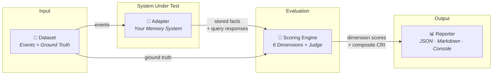

<p align="center">
  <h1 align="center"> CRI Benchmark — Contextual Resonance Index</h1>
  <p align="center">
    <strong>The open-source standard for evaluating AI long-term memory systems</strong>
  </p>
  <p align="center">
    <a href="https://opensource.org/licenses/MIT"></a>
    <a href="https://www.python.org/downloads/"></a>
    <a href="https://github.com/Contextually-AI/cri-benchmark/actions/workflows/ci.yml"></a>
    <a href="https://pypi.org/project/cri-benchmark/"></a>
    <a href="https://discord.gg/FJnjytqP"></a>
  </p>
  <p align="center">
    Created by <a href="https://contextually.me/"><strong>Contextually</strong></a> — building the infrastructure for context-aware AI.
  </p>
</p>

---

The **Contextual Resonance Index (CRI)** is a benchmark framework designed to evaluate how well AI systems maintain, update, and utilize contextual knowledge about users and entities over time. It measures the quality of long-term memory — not just what a system can retrieve, but how accurately it captures evolving facts, resolves contradictions, handles temporal knowledge, and maintains coherent representations across hundreds of interactions. CRI provides a transparent, reproducible, and scientifically grounded evaluation methodology that any memory system can adopt through a minimal adapter interface.

---

## What CRI Measures

Existing AI benchmarks focus on retrieval accuracy or downstream task performance. **CRI evaluates the knowledge model itself** — what was stored, what was updated, what was correctly rejected, and how coherently knowledge evolves over time.

This is critical for memory systems that go beyond naive RAG or append-only logs: ontology-based architectures, knowledge graphs, user profiling engines, and any system where structured understanding matters more than raw recall.

> 📏 Read the full [Evaluation Methodology →](METHODOLOGY.md)

## Key Features

- 🎯 **Six scored dimensions** — each measuring a distinct property of memory behavior
- ⚖️ **Transparent composite score** — weighted formula with published justification for every weight
- 🤖 **LLM-as-judge scoring** — semantic evaluation with 3× majority voting for robust, reproducible verdicts
- 🔌 **3-method adapter interface** — based on [UPP](https://github.com/Contextually-AI/upp) (Universal Personalization Protocol), integrate any memory system with minimal effort
- 📊 **Canonical datasets** — hand-crafted personas for realistic, high-quality evaluation
- 🛠️ **Dataset generator** — create custom scenarios for your specific use cases
- 🔬 **Fully reproducible** — logged prompts, majority voting, and deterministic dataset generation
- 🧩 **Extensible** — add new metrics, datasets, and adapters without modifying the core engine

## Architecture



The benchmark pipeline is simple: **Dataset → Adapter → Scorer → Reporter**. Your memory system only needs to implement the Adapter — everything else is handled by CRI.

## Evaluation Dimensions

CRI evaluates memory systems across **six scored dimensions** plus a **meta-metric** (SSI), each targeting a distinct property of long-term knowledge management:

| Code | Dimension | What It Measures |
|------|-----------|-----------------|
| [**PAS**](docs/metrics/pas.md) | Profile Accuracy Score | Does the system accurately capture and recall entity facts? |
| [**DBU**](docs/metrics/dbu.md) | Dynamic Belief Updating | When facts change, does the system update its beliefs? |
| [**MEI**](docs/metrics/mei.md) | Memory Efficiency Index | Does the system retain all ground-truth facts from conversations? |
| [**TC**](docs/metrics/tc.md) | Temporal Coherence | Does the system handle time-bounded and expiring knowledge? |
| [**CRQ**](docs/metrics/crq.md) | Conflict Resolution Quality | When contradictory information arrives, is it resolved correctly? |
| [**QRP**](docs/metrics/qrp.md) | Query Response Precision | Are retrieved facts relevant to the query, and irrelevant facts excluded? |
| [**SSI**](docs/metrics/ssi.md) | Scale Sensitivity Index | Does the system maintain quality as data volume increases? *(meta-metric, reported separately)* |

### Composite Score

The CRI composite score combines all six dimensions with published, configurable weights:

```
CRI = 0.25 × PAS + 0.20 × DBU + 0.20 × MEI + 0.15 × TC + 0.10 × CRQ + 0.10 × QRP
```

SSI is **not** included in the composite — it is reported separately as a scale-sensitivity stress test (enabled via the `full` profile or `--scale-test` flag).

All dimension scores are normalized to **[0.0, 1.0]**. The composite weights reflect the relative importance of each capability for real-world memory systems: accurate knowledge capture (PAS), belief evolution (DBU), and storage efficiency (MEI) are weighted highest, while conflict resolution (CRQ) and query precision (QRP) serve as important secondary indicators.

> 📊 Full methodology details: [Evaluation Methodology →](METHODOLOGY.md)

## Quick Start

```bash
pip install cri-benchmark
cri run --adapter full-context --dataset datasets/canonical/persona-1-base --verbose
```

Or with Docker (runs all adapters against all datasets):

```bash
./run.sh --limit 50
```

> For the full step-by-step guide (datasets, adapters, Docker options, saving results), see the [Quick Start Guide](docs/guides/quickstart.md).

## Based on the Universal Personalization Protocol (UPP)

CRI's adapter interface is aligned with the [Universal Personalization Protocol (UPP)](https://pypi.org/project/upp-python/) — an open standard for structured personalization data. UPP defines how memory systems should ingest, retrieve, and manage personal knowledge through a set of standardized operations.

By aligning with UPP, CRI ensures that:

- **Adapter method names match UPP operations** — `ingest`, `retrieve`, and `get_events` map directly to `upp/ingest`, `upp/retrieve`, and `upp/get_events`.
- **Any UPP-compatible system can be benchmarked** with minimal adapter code.
- **Results are comparable** across different memory architectures that follow the same protocol.

The `upp-python` package is a core dependency of CRI and is installed automatically.

## Implement Your Own Adapter

Connecting your memory system to CRI requires implementing **three methods**, aligned with UPP operations:

| Method | Signature | UPP Operation | Purpose |
|--------|-----------|---------------|---------|
| `ingest` | `(messages: list[Message]) -> None` | `upp/ingest` | Process and store conversation messages into your memory system |
| `retrieve` | `(query: str) -> list[StoredFact]` | `upp/retrieve` | Retrieve facts relevant to a given query |
| `get_events` | `() -> list[StoredFact]` | `upp/get_events` | Return every stored fact for memory-hygiene auditing |

Because `MemoryAdapter` uses structural subtyping (a `typing.Protocol`), your class does **not** need to inherit from it — just implement the three methods with compatible signatures.

That's it. No complex protocols, no proprietary formats, no infrastructure requirements.

## Documentation

- 📏 [Evaluation Methodology](METHODOLOGY.md) — how CRI evaluates memory systems, scoring profiles, and composite formula
- 📐 [Metric Definitions](docs/metrics/) — detailed specification of each dimension
- 📋 [Contributing Guide](CONTRIBUTING.md) — how to contribute adapters, metrics, datasets, and more

## Example Adapters

The repository includes reference adapter implementations to help you get started:

| Adapter | Description |
|---------|-------------|
| [`full_context`](examples/adapters/) | Sends all events as LLM context — strong but expensive baseline |
| [`rag`](examples/adapters/) | ChromaDB-backed retrieval — standard vector store approach |
| [`no_memory`](examples/adapters/) | Answers with no context — useful lower bound |
| [`upp`](examples/adapters/) | UPP ontology-based memory — structured knowledge via the UPP protocol |

## Contributing

We welcome contributions! Whether it's new evaluation dimensions, datasets, adapter implementations, documentation improvements, or bug fixes — all contributions help CRI become a better standard.

Please read our [Contributing Guide](CONTRIBUTING.md) before submitting a pull request.

Areas where contributions are especially welcome:
- 🔌 Adapter implementations for popular memory systems
- 📐 New evaluation dimensions with published justification
- 📁 Domain-specific datasets
- 📖 Documentation improvements and translations
- 🧪 Test coverage

## Community & Resources

- 💬 **[Join the Discord](https://discord.gg/FJnjytqP)** — discuss benchmarking, propose new dimensions, and connect with other contributors.
- 📜 **[UPP — Universal Personalization Protocol](https://github.com/Contextually-AI/upp)** — the open protocol that defines how AI systems manage structured context. CRI's adapter interface is aligned with UPP.
- 🌐 **[Contextually](https://contextually.me/)** — the team behind CRI and UPP. We're building the infrastructure for context-aware AI — our mission is to make AI that truly understands.

## Project Status

CRI is in **active early development** (v0.1.0). The core framework, six evaluation dimensions, and canonical datasets are being established. We aim to release a stable v1.0 once the methodology has been validated through community feedback and real-world usage.

## License

[MIT](LICENSE) — use it, extend it, contribute back.

---

<p align="center">
  <a href="https://contextually.me/">
    
  </a>
  <br/><br/>
  <strong>CRI Benchmark is an open standard by <a href="https://contextually.me/">Contextually</a>. Evaluate memory. Improve AI.</strong>
  <br/>
  <a href="https://discord.gg/FJnjytqP">Discord</a> · <a href="https://github.com/Contextually-AI/upp">UPP Protocol</a> · <a href="https://contextually.me/">contextually.me</a>
</p>
