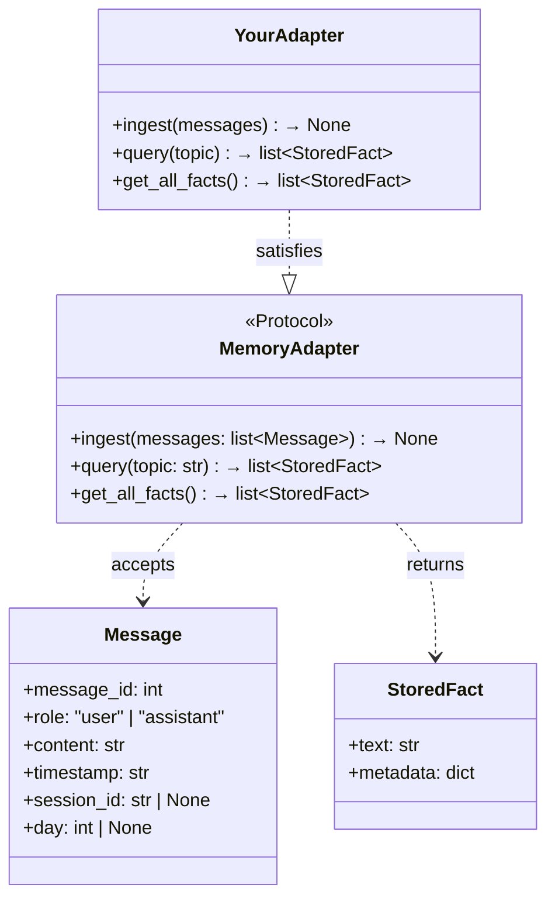
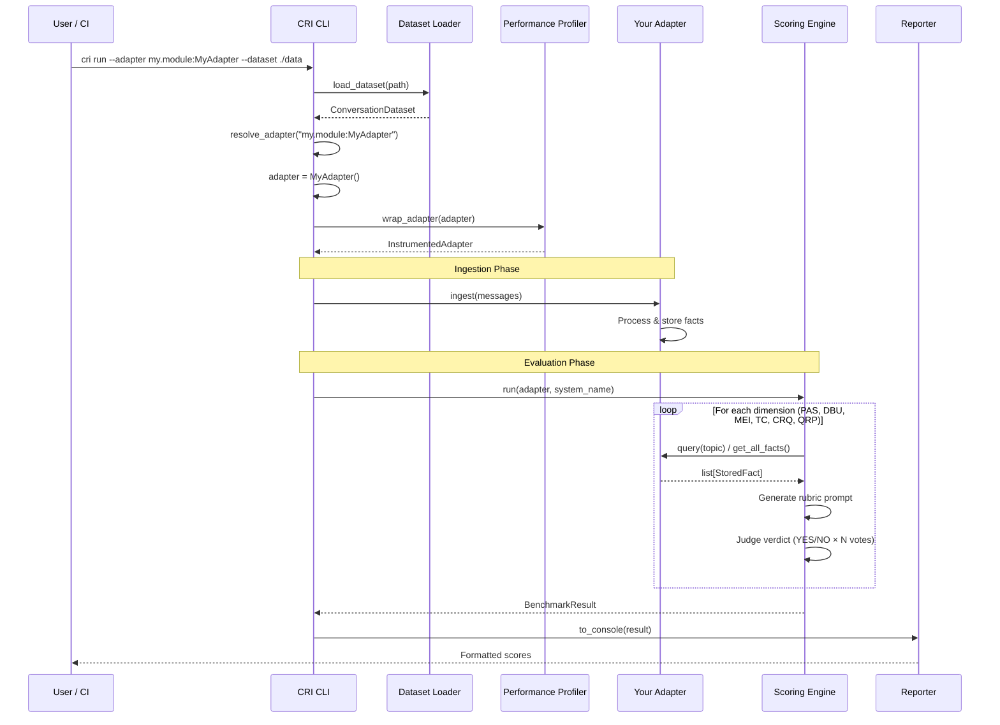
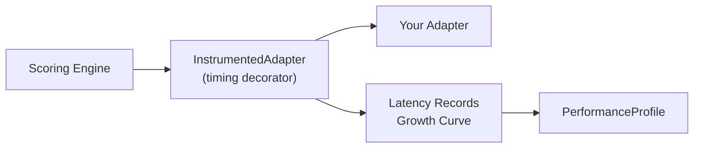

# Adapter Interface

> How memory systems connect to the CRI Benchmark.

---

## Overview

The adapter interface is the **integration boundary** between the CRI Benchmark and any memory system under evaluation. It defines the minimal contract a system must fulfill to be benchmarked — three methods, no inheritance required, no framework dependency.

The interface is designed to be:

- **Simple** — Three methods cover the entire benchmark lifecycle
- **Non-intrusive** — Uses structural subtyping (duck typing); no base class needed
- **Flexible** — Works with any architecture: ontology engines, vector stores, graph databases, custom systems
- **Auditable** — The `get_all_facts()` method enables full memory hygiene inspection

---

## The MemoryAdapter Protocol



### Protocol Definition

```python
from typing import Protocol, runtime_checkable
from cri.models import Message, StoredFact

@runtime_checkable
class MemoryAdapter(Protocol):
    def ingest(self, messages: list[Message]) -> None: ...
    def query(self, topic: str) -> list[StoredFact]: ...
    def get_all_facts(self) -> list[StoredFact]: ...
```

Because `MemoryAdapter` is a `typing.Protocol` with `@runtime_checkable`:

- **No inheritance required** — your class just needs matching method signatures
- **No CRI import needed** — you can implement the interface in a standalone package
- **Runtime verification** — `isinstance(adapter, MemoryAdapter)` works at runtime
- **Static type checking** — `mypy` and `pyright` verify compliance automatically

---

## Method Specifications

### `ingest(messages: list[Message]) → None`

Feed a chronological sequence of conversation messages into the memory system.

| Aspect | Detail |
|--------|--------|
| **When called** | Once (or in batches) before scoring begins |
| **Input** | Ordered list of `Message` objects, sorted by `message_id` / `timestamp` |
| **Expected behavior** | Parse messages, extract facts, store knowledge, handle updates |
| **Side effects** | Modifies the memory system's internal state |
| **Measured** | Latency is recorded by the performance profiler |

**What the memory system should do:**

1. Process each message for factual content about the user or relevant entities
2. Store extracted facts in its internal knowledge representation
3. Handle knowledge updates — newer messages may contradict or supersede earlier ones
4. Filter noise — greetings, filler, and small talk should ideally not be stored as facts

**Message fields:**

```python
class Message(BaseModel):
    message_id: int          # Sequential identifier (1-indexed)
    role: "user" | "assistant"  # Who sent the message
    content: str             # Message text
    timestamp: str           # ISO-8601 timestamp
    session_id: str | None   # Optional session grouping
    day: int | None          # Simulation day number
```

### `query(topic: str) → list[StoredFact]`

Retrieve stored facts relevant to a given topic.

| Aspect | Detail |
|--------|--------|
| **When called** | Multiple times during scoring, once per evaluation check |
| **Input** | Natural-language topic string (e.g., `"current occupation"`, `"dietary preferences"`) |
| **Expected behavior** | Return facts semantically relevant to the topic |
| **Return** | List of `StoredFact` objects (may be empty) |
| **Measured** | Latency is recorded per query call |

**What the memory system should do:**

1. Search its knowledge store for facts related to the topic
2. Return **only** relevant facts — irrelevant results penalize precision scores
3. Return facts as `StoredFact` objects with a text representation

**Topics are aligned with the seven CRI evaluation dimensions:**

| Dimension | Example Topics |
|-----------|---------------|
| PAS | `"occupation"`, `"favorite color"`, `"hometown"` |
| DBU | `"current job"` (after a job change was mentioned) |
| MEI | `"dietary preferences"`, `"political views"` |
| TC | `"employment history"`, `"previous residence"` |
| CRQ | Topics where contradictory information was embedded |
| QRP | General retrieval precision probes |

### `get_all_facts() → list[StoredFact]`

Return every fact currently stored in the memory system.

| Aspect | Detail |
|--------|--------|
| **When called** | During MEI scoring and memory efficiency auditing |
| **Input** | None |
| **Expected behavior** | Return a complete dump of all stored facts |
| **Return** | List of all `StoredFact` objects (may be empty) |
| **Side effects** | Must not modify internal state (read-only snapshot) |

**This method enables:**

- **Noise filtering evaluation** — Did the system store irrelevant conversational noise?
- **Duplication detection** — Are there redundant or near-duplicate facts?
- **Completeness verification** — Were important signal messages captured?
- **Memory growth analysis** — How does the fact count evolve with message ingestion?
- **Phantom fact detection** — Are there facts that were never in the conversation?

---

## Integration Flow



---

## Implementing an Adapter

### Minimal Implementation

```python
from cri.models import Message, StoredFact

class MyMemoryAdapter:
    """Adapter for the Acme Memory Engine."""

    def __init__(self):
        self._facts: list[StoredFact] = []

    def ingest(self, messages: list[Message]) -> None:
        for msg in messages:
            if msg.role == "user":
                # Your extraction logic here
                extracted = self._extract_facts(msg.content)
                self._facts.extend(extracted)

    def query(self, topic: str) -> list[StoredFact]:
        # Your relevance filtering here
        return [f for f in self._facts if self._is_relevant(f, topic)]

    def get_all_facts(self) -> list[StoredFact]:
        return list(self._facts)

    def _extract_facts(self, text: str) -> list[StoredFact]:
        # Implementation-specific fact extraction
        ...

    def _is_relevant(self, fact: StoredFact, topic: str) -> bool:
        # Implementation-specific relevance matching
        ...
```

### With an Ontology Engine

```python
class OntologyAdapter:
    """Adapter wrapping an ontology-based memory system."""

    def __init__(self, engine: OntologyEngine):
        self._engine = engine

    def ingest(self, messages: list[Message]) -> None:
        for msg in messages:
            self._engine.process_message(
                content=msg.content,
                role=msg.role,
                timestamp=msg.timestamp,
            )

    def query(self, topic: str) -> list[StoredFact]:
        entities = self._engine.search_entities(topic)
        return [
            StoredFact(
                text=e.to_natural_language(),
                metadata={"entity_id": e.id, "confidence": e.confidence}
            )
            for e in entities
        ]

    def get_all_facts(self) -> list[StoredFact]:
        return [
            StoredFact(text=fact.text, metadata=fact.properties)
            for fact in self._engine.get_all_knowledge()
        ]
```

### With a RAG / Vector Store

```python
import chromadb

class RAGAdapter:
    """Adapter using ChromaDB for vector-based retrieval."""

    def __init__(self):
        self._client = chromadb.Client()
        self._collection = self._client.create_collection("cri_bench")

    def ingest(self, messages: list[Message]) -> None:
        user_msgs = [m for m in messages if m.role == "user"]
        self._collection.add(
            documents=[m.content for m in user_msgs],
            ids=[str(m.message_id) for m in user_msgs],
            metadatas=[{"timestamp": m.timestamp} for m in user_msgs],
        )

    def query(self, topic: str) -> list[StoredFact]:
        results = self._collection.query(query_texts=[topic], n_results=10)
        return [
            StoredFact(text=doc, metadata={"distance": dist})
            for doc, dist in zip(
                results["documents"][0],
                results["distances"][0],
            )
        ]

    def get_all_facts(self) -> list[StoredFact]:
        all_docs = self._collection.get()
        return [StoredFact(text=doc) for doc in all_docs["documents"]]
```

---

## Adapter Resolution

The CRI CLI resolves adapters through two mechanisms:

### 1. Built-in Registry

CRI ships with reference adapters for establishing baselines:

| Name | Class | Description |
|------|-------|-------------|
| `no-memory` | `NoMemoryAdapter` | Discards all input, returns nothing. **Lower-bound baseline.** |
| `full-context` | `FullContextAdapter` | Stores every user message, returns all on query. **Upper-bound recall baseline.** |
| `rag` | `RAGAdapter` | ChromaDB vector retrieval. Requires `pip install cri-benchmark[rag]`. |
| `upp` | `UPPAdapter` | UPP ontology-based memory. Requires `pip install cri-benchmark[upp]`. |

Usage: `cri run --adapter no-memory --dataset ./data`

### 2. Dynamic Import

Any adapter class can be loaded from a dotted Python path:

```bash
# Colon syntax (preferred)
cri run --adapter mypackage.adapters:MyAdapter --dataset ./data

# Dot syntax (also supported)
cri run --adapter mypackage.adapters.MyAdapter --dataset ./data
```

The adapter class is instantiated with no arguments (`cls()`). If your adapter requires configuration, handle it internally (e.g., environment variables, config files).

---

## StoredFact Model

The `StoredFact` is the universal unit of knowledge returned by adapters:

```python
class StoredFact(BaseModel):
    text: str                         # Human-readable fact text
    metadata: dict[str, Any] = {}     # Optional system-specific metadata
```

The `text` field should be a self-contained natural-language statement such as:

- ✅ `"The user works as a software engineer at Acme Corp"`
- ✅ `"User prefers vegetarian food"`
- ✅ `"User moved from New York to San Francisco in 2024"`
- ❌ `"software engineer"` (too terse — lacks context)
- ❌ `"{'occupation': 'engineer', 'company': 'Acme'}"` (not natural language)

The `metadata` field is adapter-specific and not used for scoring. It can include:

- Confidence scores
- Timestamps (when the fact was extracted)
- Source message IDs
- Entity IDs from the knowledge graph
- Embedding vectors or similarity scores

---

## Performance Instrumentation

When the benchmark runs, your adapter is automatically wrapped with `InstrumentedAdapter`, which:

1. Measures wall-clock latency for every `ingest()`, `query()`, and `get_all_facts()` call
2. Tracks memory growth by calling `get_all_facts()` after each `ingest()` batch
3. Records data points for the `PerformanceProfile` included in the final result

This wrapping is **transparent** — your adapter does not need to know about it. The `InstrumentedAdapter` satisfies the same `MemoryAdapter` protocol and delegates all calls to your implementation.



---

## Validation & Compliance

The benchmark runner validates adapter compliance at startup:

```python
assert isinstance(adapter, MemoryAdapter), \
    "Adapter does not satisfy MemoryAdapter protocol"
```

This check verifies that your class has all three required methods with compatible signatures. If it fails, the benchmark aborts with a clear error message before any evaluation begins.

### Quick Compliance Check

You can verify your adapter independently:

```python
from cri.adapter import MemoryAdapter

adapter = MyAdapter()
assert isinstance(adapter, MemoryAdapter), "Protocol not satisfied"
print("✓ Adapter is CRI-compatible")
```

---

## Design Rationale

### Why a Protocol instead of an ABC?

| Feature | Protocol (chosen) | ABC |
|---------|-------------------|-----|
| Inheritance required | No | Yes |
| CRI import required | No | Yes |
| Static type checking | Yes | Yes |
| Runtime checking | Yes (with `@runtime_checkable`) | Yes |
| Existing class retrofit | Yes (no code changes) | Requires subclassing |
| Cross-package compatibility | Excellent | Coupling |

### Why exactly three methods?

The three methods cover the **complete evaluation lifecycle**:

1. **`ingest`** — The system processes information (input phase)
2. **`query`** — The system retrieves relevant knowledge (output phase)
3. **`get_all_facts`** — The system's full state is inspectable (audit phase)

This is the **minimal complete interface** for evaluating a knowledge system. Adding more methods would increase the integration burden; fewer methods would prevent certain evaluation dimensions.

### Why synchronous methods?

The adapter methods are synchronous to minimize integration complexity. If your memory system is inherently async, you can use `asyncio.run()` or equivalent within your adapter methods. The benchmark runner handles async orchestration at a higher level.

---

## Related Documentation

- **[Architecture Overview](overview.md)** — System-wide architecture
- **[Scoring Engine](scoring-engine.md)** — How the engine uses adapters during evaluation
- **[Data Flow](data-flow.md)** — Complete pipeline sequence
- **[Integration Guide](../guides/integration.md)** — Step-by-step walkthrough
- **[Quickstart Guide](../guides/quickstart.md)** — Get running in 5 minutes
