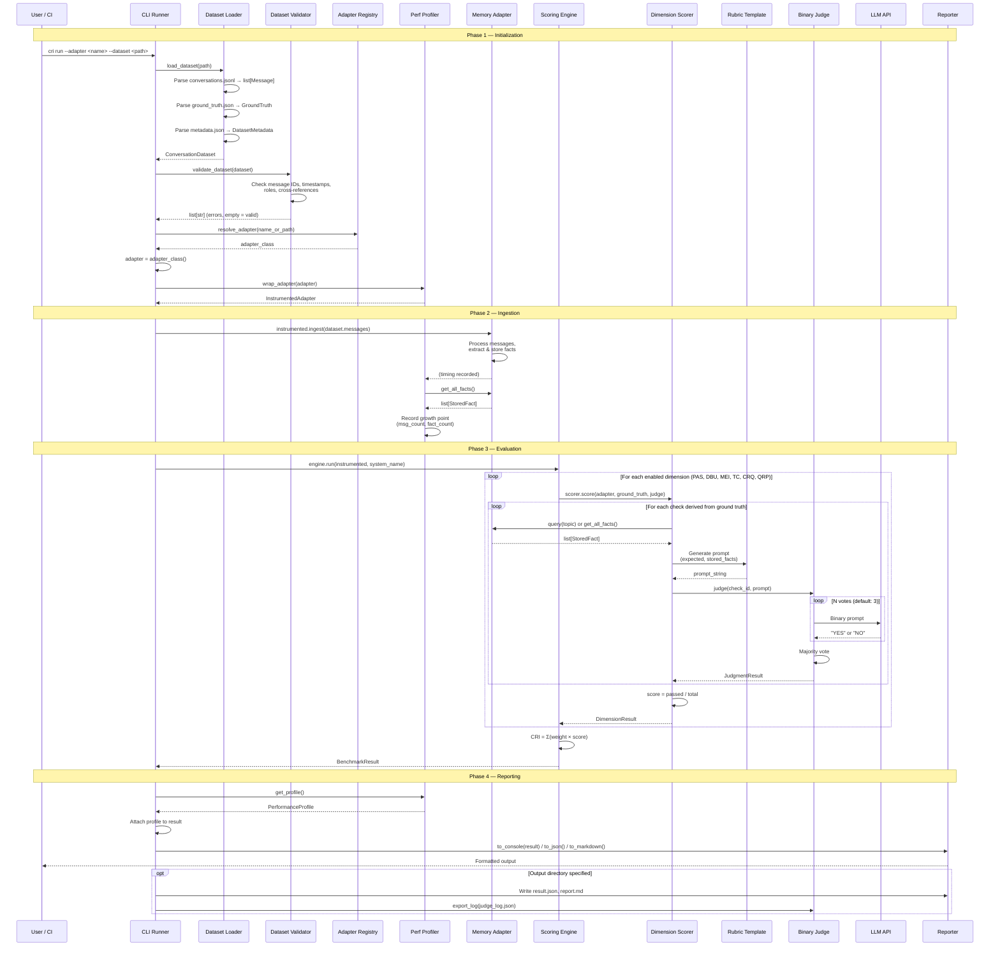
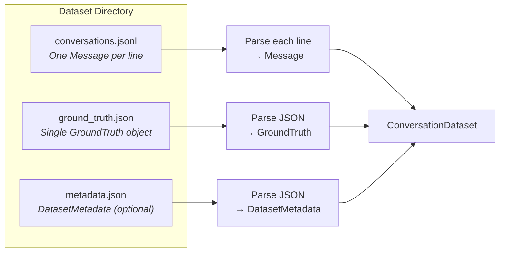
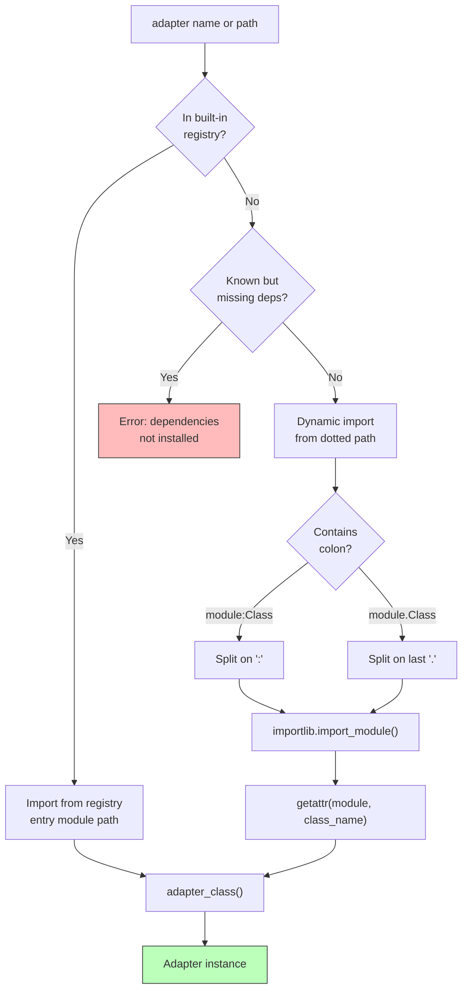
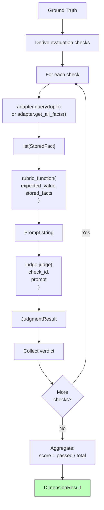
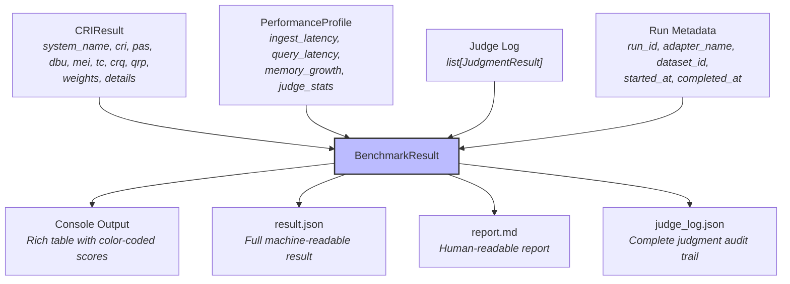
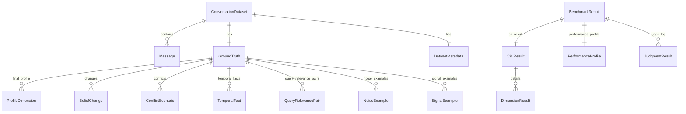
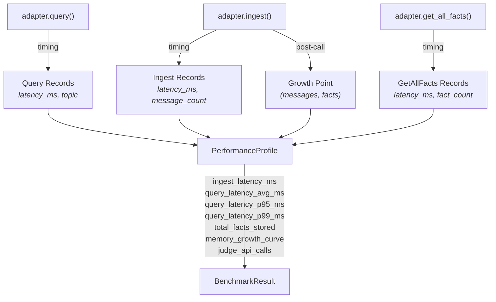

# Data Flow

> End-to-end sequence from CLI invocation to benchmark result output.

---

## Overview

This document traces how data flows through the CRI Benchmark pipeline, from the initial CLI command through dataset loading, message ingestion, multi-dimension evaluation, and result generation. Each stage transforms data in a well-defined way, with clear inputs and outputs at every boundary.

---

## Complete Pipeline Sequence



---

## Phase 1: Initialization

### Dataset Loading

The dataset loader reads three files from the dataset directory:



**Data transformations:**

| File | Input Format | Output Model | Validation |
|------|-------------|--------------|------------|
| `conversations.jsonl` | JSONL (one JSON object per line) | `list[Message]` | Pydantic v2 validation per line |
| `ground_truth.json` | Single JSON object | `GroundTruth` | Pydantic v2 schema validation |
| `metadata.json` | Single JSON object (optional) | `DatasetMetadata` | Inferred from directory name if absent |

### Dataset Validation

The validator performs structural integrity checks:

- ✅ Messages list is non-empty
- ✅ Message IDs are unique and sequential (1-indexed)
- ✅ Timestamps are non-decreasing
- ✅ Roles are valid (`"user"` or `"assistant"`)
- ✅ Ground truth `final_profile` is non-empty
- ✅ `metadata.message_count` matches actual count
- ✅ Belief change `changed_around_msg` references valid message IDs
- ✅ Conflict scenario `introduced_at_messages` references valid message IDs

### Adapter Resolution



---

## Phase 2: Ingestion

During ingestion, the memory system processes the full conversation and builds its internal knowledge representation.

### Data Flow

```
list[Message] → adapter.ingest(messages) → internal state change
                                         → profiler records timing
                                         → profiler captures growth point
```

**Key details:**

1. The `InstrumentedAdapter` wraps the real adapter transparently
2. Wall-clock timing is measured via `time.monotonic()`
3. After ingestion, `get_all_facts()` is called to record the growth data point
4. The growth curve tracks `(cumulative_messages, facts_stored)` over time

### Message Model

```python
Message {
    message_id: int           # 1, 2, 3, ...
    role: "user" | "assistant"
    content: str              # "I just started a new job as a data scientist"
    timestamp: str            # "2024-01-15T10:30:00Z"
    session_id: str | None    # "session-42"
    day: int | None           # 15
}
```

---

## Phase 3: Evaluation

The evaluation phase is where the scoring engine queries the adapter and judges its responses.

### Per-Dimension Evaluation Pattern

Every dimension scorer follows the same general pattern, though the specifics vary:



### Ground Truth → Checks Mapping

Each dimension derives its checks from specific parts of the ground truth:

| Dimension | Ground Truth Source | Checks Generated |
|-----------|-------------------|-----------------|
| **PAS** | `final_profile` (dict of ProfileDimension) | 1 check per profile value (multi-value = multiple checks) |
| **DBU** | `changes` (list of BeliefChange) | 2 checks per change (recency + staleness) |
| **MEI** | `signal_examples`, `noise_examples` | 1 check per signal + 1 per noise |
| **TC** | `temporal_facts` (list of TemporalFact) | 1 check per temporal fact |
| **CRQ** | `conflicts` (list of ConflictScenario) | 1 check per conflict |
| **QRP** | `query_relevance_pairs` (list of QueryRelevancePair) | 1 per expected_relevant + 1 per expected_irrelevant |

### Judgment Data Flow

```
Query/Adapter Response → Rubric Function → Prompt String → BinaryJudge
                                                              ↓
                                                      N × LLM API calls
                                                              ↓
                                                      Majority vote
                                                              ↓
                                                      JudgmentResult {
                                                          check_id,
                                                          verdict: YES|NO,
                                                          votes: [YES, YES, NO],
                                                          unanimous: false,
                                                          prompt: "...",
                                                          raw_responses: [...]
                                                      }
```

### Score Aggregation

```
Dimension scores:
    PAS = passed_PAS / total_PAS         (e.g., 8/10 = 0.80)
    DBU = passed_DBU / total_DBU         (e.g., 3/4  = 0.75)
    MEI = passed_MEI / total_MEI        (e.g., 12/15 = 0.80)
    TC  = passed_TC  / total_TC          (e.g., 2/3  = 0.67)
    CRQ = passed_CRQ / total_CRQ        (e.g., 1/2  = 0.50)
    QRP = passed_QRP / total_QRP         (e.g., 6/8  = 0.75)

Composite CRI:
    CRI = 0.25×0.80 + 0.20×0.75 + 0.20×0.80 (MEI) + 0.15×0.67 + 0.10×0.50 + 0.10×0.75
        = 0.200 + 0.150 + 0.160 + 0.100 + 0.050 + 0.075
        = 0.735
```

---

## Phase 4: Reporting

### Result Assembly

The final `BenchmarkResult` aggregates all evaluation data:



### Output Formats

**Console Output:**

```
═══ CRI Benchmark Report ═══
System: my-memory-system
Dataset: persona-1-basic

┌────────────────────┬──────┬──────┬──────┬──────┬─────┬──────┬──────┐
│ System             │  CRI │  PAS │  DBU │  MEI │  TC │  CRQ │  QRP │
├────────────────────┼──────┼──────┼──────┼──────┼─────┼──────┼──────┤
│ my-memory-system   │ 0.74 │ 0.80 │ 0.75 │ 0.80 │ 0.67│ 0.50 │ 0.75 │
└────────────────────┴──────┴──────┴──────┴──────┴─────┴──────┴──────┘
```

**JSON Output** (`result.json`):

```json
{
  "run_id": "uuid",
  "adapter_name": "my-memory-system",
  "dataset_id": "persona-1-basic",
  "started_at": "2024-01-15T10:00:00Z",
  "completed_at": "2024-01-15T10:05:23Z",
  "cri_result": {
    "system_name": "my-memory-system",
    "cri": 0.735,
    "pas": 0.80,
    "dbu": 0.75,
    "mei": 0.80,
    "tc": 0.67,
    "crq": 0.50,
    "qrp": 0.75,
    "dimension_weights": { "PAS": 0.25, "DBU": 0.20, ... },
    "details": { ... }
  },
  "performance_profile": {
    "ingest_latency_ms": 12.5,
    "query_latency_avg_ms": 3.2,
    "query_latency_p95_ms": 8.1,
    "query_latency_p99_ms": 15.3,
    "total_facts_stored": 47,
    "memory_growth_curve": [[50, 12], [100, 28], [150, 47]],
    "judge_api_calls": 120
  },
  "judge_log": [ ... ]
}
```

**Markdown Output** (`report.md`):

A comprehensive human-readable report including score summary tables, per-dimension breakdowns with check counts, performance metrics, and score interpretation.

---

## Data Model Summary

### Core Models and Their Relationships



### Model Lifecycle

```
                    Input                                  Output
                    ─────                                  ──────

    conversations.jsonl  ──→  list[Message]  ──→  adapter.ingest()
    ground_truth.json    ──→  GroundTruth    ──→  evaluation checks

                         adapter.query()    ──→  list[StoredFact]
                         adapter.get_all_facts() → list[StoredFact]

                         rubric_function()  ──→  prompt string
                         judge.judge()      ──→  JudgmentResult

                         scorer.score()     ──→  DimensionResult
                         engine.run()       ──→  BenchmarkResult

                         reporter.to_*()    ──→  Console / JSON / Markdown
```

---

## Performance Data Flow



---

## Output Files

When `--output <dir>` is specified, the benchmark writes three files:

| File | Content | Purpose |
|------|---------|---------|
| `result.json` | Complete `BenchmarkResult` serialized as JSON | Machine-readable result for automation and comparison |
| `report.md` | Markdown report (if `--format markdown`) | Human-readable analysis document |
| `judge_log.json` | Array of all `JudgmentResult` objects | Full audit trail for every evaluation check |

---

## Related Documentation

- **[Architecture Overview](overview.md)** — Component diagram and design decisions
- **[Adapter Interface](adapter-interface.md)** — The three-method protocol
- **[Scoring Engine](scoring-engine.md)** — Dimension evaluation and composite score
- **[Methodology Overview](../methodology/overview.md)** — Scientific foundation
- **[Reproducibility Guide](../guides/reproducibility.md)** — Ensuring consistent results
