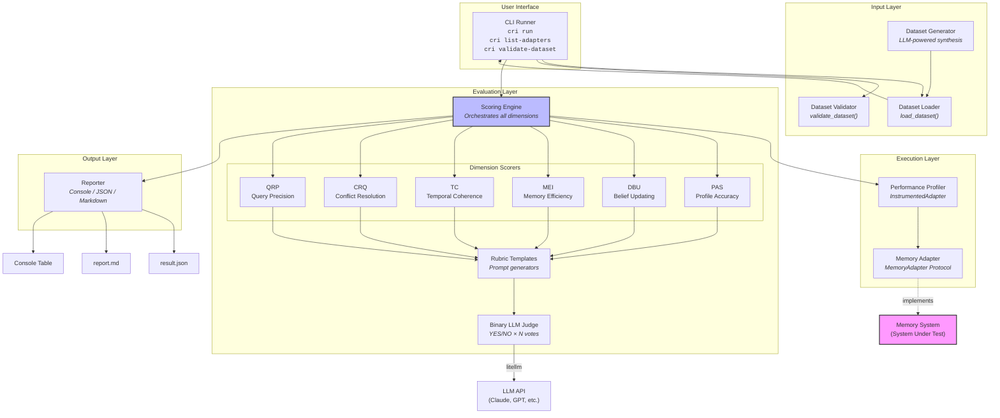

# Architecture Overview

> **CRI Benchmark — Contextual Resonance Index**
>
> A modular, extensible framework for evaluating AI long-term memory systems.

---

## Design Philosophy

The CRI Benchmark architecture follows three guiding principles:

1. **Minimal coupling** — Memory systems connect through a 3-method protocol interface. No inheritance, no framework lock-in, no runtime dependency on CRI.
2. **Modular scoring** — Each evaluation dimension is an independent, pluggable scorer. New dimensions can be added without modifying existing code.
3. **Transparent evaluation** — Every judgment is logged, every score is traceable to individual binary verdicts, and every rubric prompt is inspectable.

The framework is organized as a **linear pipeline** with well-defined boundaries between stages, making it straightforward to understand, extend, and debug.

---

## System Architecture



---

## Component Overview

### User Interface — CLI Runner

The CLI (`cri`) is built with [Click](https://click.palletsprojects.com/) and [Rich](https://rich.readthedocs.io/). It provides four commands:

| Command | Description |
|---------|-------------|
| `cri run` | Execute the full benchmark pipeline |
| `cri list-adapters` | Show registered adapters and their availability |
| `cri list-datasets` | Discover canonical datasets |
| `cri validate-dataset` | Validate a dataset directory |

The CLI resolves adapters from a built-in registry or from user-provided dotted Python paths (e.g., `mypackage.adapters:MyAdapter`), enabling integration without modifying the CRI codebase.

**Module:** `cri.runner`

### Input Layer — Dataset Loading & Generation

The input layer handles two concerns:

- **Dataset Loader** (`cri.datasets.loader`) — Reads dataset directories containing `conversations.jsonl` (message stream) and `ground_truth.json` (expected outcomes). Validates structural integrity including sequential message IDs, non-decreasing timestamps, valid cross-references, and metadata consistency.

- **Dataset Generator** (`cri.datasets.generator`) — Uses LLM-powered synthesis (via litellm) to generate realistic multi-day conversations with embedded belief changes, conflicts, temporal facts, and noise. Produces complete datasets with ground truth annotations.

Datasets follow a directory convention:

```
dataset_dir/
├── conversations.jsonl    # One Message JSON object per line
├── ground_truth.json      # Single GroundTruth JSON object
└── metadata.json          # DatasetMetadata (optional)
```

### Execution Layer — Adapter & Profiling

- **Memory Adapter** (`cri.adapter`) — A `typing.Protocol` defining the three methods any memory system must implement: `ingest()`, `query()`, and `get_all_facts()`. Uses structural subtyping — no inheritance required. See [Adapter Interface](adapter-interface.md) for details.

- **Performance Profiler** (`cri.performance`) — Wraps any adapter with transparent instrumentation via `InstrumentedAdapter`. Records wall-clock latency for every `ingest()`, `query()`, and `get_all_facts()` call. Tracks memory growth curves (messages ingested → facts stored) and produces latency percentile statistics.

### Evaluation Layer — Scoring Engine & Judge

The evaluation layer is the heart of the benchmark:

- **Scoring Engine** (`cri.scoring.engine`) — Orchestrates evaluation across all enabled dimensions. Iterates through registered `MetricDimension` scorers, collects `DimensionResult` objects, and computes the weighted composite CRI score. Handles errors gracefully — if any scorer fails, it records a zero and continues.

- **Dimension Scorers** (`cri.scoring.dimensions.*`) — Six independent scorers, each encapsulating the evaluation logic for one CRI dimension. Each scorer derives checks from the ground truth, queries the adapter, and uses the judge to produce binary verdicts. See [Scoring Engine](scoring-engine.md) for the strategy pattern.

- **Rubric Templates** (`cri.scoring.rubrics`) — Pure functions that generate LLM judge prompts. Each function accepts structured inputs (expected values, stored facts) and returns a complete prompt string. Rubrics emphasize semantic equivalence over exact text matching.

- **Binary LLM Judge** (`cri.judge`) — Sends evaluation prompts to an LLM (via litellm) and collects YES/NO verdicts. Uses majority voting across N independent calls (default: 3) for robustness. Logs every judgment for full auditability.

### Output Layer — Reporter

The reporter (`cri.reporter`) generates results in three formats:

| Format | Description | Use Case |
|--------|-------------|----------|
| **Console** | Rich-formatted table with color-coded scores | Interactive use |
| **JSON** | Machine-readable full result dump | Programmatic consumption, CI pipelines |
| **Markdown** | Human-readable report with tables and interpretation | Documentation, sharing |

The reporter also supports **comparison tables** for side-by-side evaluation of multiple memory systems.

---

## Package Structure

```
src/cri/
├── __init__.py              # Package root and version
├── adapter.py               # MemoryAdapter Protocol definition
├── models.py                # All Pydantic v2 data models
├── judge.py                 # BinaryJudge + legacy Judge
├── runner.py                # CLI + BenchmarkRunner + pipeline orchestration
├── reporter.py              # Multi-format report generation
├── performance.py           # InstrumentedAdapter + PerformanceProfiler
│
├── scoring/
│   ├── __init__.py
│   ├── engine.py            # ScoringEngine + LegacyScoringEngine
│   ├── rubrics.py           # Binary verdict prompt templates
│   └── dimensions/
│       ├── __init__.py
│       ├── base.py          # MetricDimension ABC + DimensionScorer (legacy)
│       ├── pas.py           # Persona Accuracy Score
│       ├── dbu.py           # Dynamic Belief Updating
│       ├── mei.py           # Memory Efficiency Index
│       ├── tc.py            # Temporal Coherence
│       ├── crq.py           # Conflict Resolution Quality
│       └── qrp.py           # Query Response Precision
│
└── datasets/
    ├── __init__.py
    ├── loader.py            # Dataset loading, validation, discovery
    ├── generator.py         # LLM-powered dataset synthesis
    └── personas/
        ├── __init__.py
        └── specs.py         # Pre-defined persona specifications
```

### Supporting Directories

```
cri-benchmark/
├── datasets/
│   └── canonical/           # Shipped benchmark datasets
│       ├── persona-1-basic/
│       ├── persona-2-intermediate/
│       └── persona-3-advanced/
│
├── examples/
│   └── adapters/            # Reference adapter implementations
│       ├── no_memory_adapter.py
│       ├── full_context_adapter.py
│       ├── rag_adapter.py
│       └── upp_adapter.py
│
└── tests/                   # pytest test suite
```

---

## Technology Stack

| Technology | Role | Why |
|------------|------|-----|
| **Python 3.10+** | Runtime | Type hints, structural pattern matching, modern async |
| **Pydantic v2** | Data models | Type-safe serialization, validation, JSON schema generation |
| **litellm** | LLM access | Model-agnostic — works with Claude, GPT, Gemini, local models |
| **Click** | CLI framework | Composable commands, type validation, help generation |
| **Rich** | Terminal UI | Color-coded tables, progress bars, formatted output |
| **pytest** | Testing | Fixtures, parametrization, async support |
| **ChromaDB** | Vector store | Optional dependency for the RAG reference adapter |

---

## Key Design Decisions

### 1. Protocol-Based Adapter Interface

The adapter uses `typing.Protocol` (structural subtyping) rather than abstract base classes. This means:

- **No inheritance required** — implement three methods and you're done
- **No CRI dependency** — your adapter doesn't need to import from CRI
- **Runtime checking** — `isinstance(adapter, MemoryAdapter)` works via `@runtime_checkable`
- **Static type safety** — `mypy` and `pyright` verify compliance at type-check time

### 2. Binary Verdict Scoring

Instead of asking an LLM to assign a 0-10 score (which is noisy and poorly calibrated), CRI uses binary YES/NO verdicts with majority voting:

- Each check produces a clear, reproducible YES or NO
- Multiple votes (default: 3) reduce LLM noise
- Dimension scores are simple ratios: `passed_checks / total_checks`
- The composite CRI is a weighted average of dimension scores

### 3. Strategy Pattern for Dimensions

Each dimension is a `MetricDimension` subclass with a single `score()` method. The scoring engine maintains a registry and iterates through it — adding a new dimension requires:

1. Implementing a `MetricDimension` subclass
2. Registering it in the dimension registry
3. Adding its weight to the scoring configuration

No existing code needs to change.

### 4. Performance Separate from CRI Score

Latency and memory growth are measured and reported but **not** included in the composite CRI score. This avoids conflating accuracy evaluation with performance benchmarking — they are fundamentally different quality dimensions.

### 5. Deterministic + Semantic Hybrid Evaluation

Where possible (e.g., structural validation, fact counting), CRI uses deterministic checks. For semantic evaluation (e.g., "does this stored fact match the expected value?"), it delegates to the LLM judge. This maximizes reproducibility while handling the inherent ambiguity of natural language.

### 6. Full Auditability

Every judge call is logged with the complete prompt, raw LLM responses, individual votes, and final verdict. Results include per-check details showing exactly why each check passed or failed. This enables:

- Debugging unexpected scores
- Identifying systematic judge failures
- Validating rubric quality
- Comparing judge models

---

## Composite CRI Score

The Contextual Resonance Index is computed as:

```
CRI = w_PAS × PAS + w_DBU × DBU + w_MEI × MEI + w_TC × TC + w_CRQ × CRQ + w_QRP × QRP
```

Default weights:

| Dimension | Weight | Rationale |
|-----------|--------|-----------|
| PAS | 0.25 | Fundamental — must recall what it was told |
| DBU | 0.20 | Critical — beliefs must update with new info |
| MEI | 0.20 | Important — memory storage efficiency |
| TC | 0.15 | Valuable — temporal awareness matters |
| CRQ | 0.10 | Advanced — conflict resolution capability |
| QRP | 0.10 | Advanced — retrieval precision |

All scores are in **[0.0, 1.0]**. Weights are configurable and automatically re-normalized if some dimensions are disabled or have no applicable checks.

---

## Related Documentation

- **[Adapter Interface](adapter-interface.md)** — How to integrate your memory system
- **[Scoring Engine](scoring-engine.md)** — How dimensions are evaluated and scores computed
- **[Data Flow](data-flow.md)** — End-to-end sequence from CLI to results
- **[Integration Guide](../guides/integration.md)** — Step-by-step adapter implementation walkthrough
- **[Methodology Overview](../methodology/overview.md)** — Scientific justification for the evaluation approach
