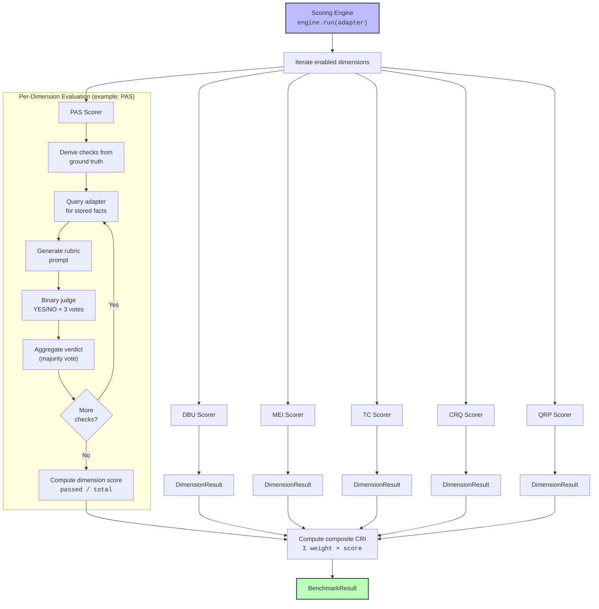
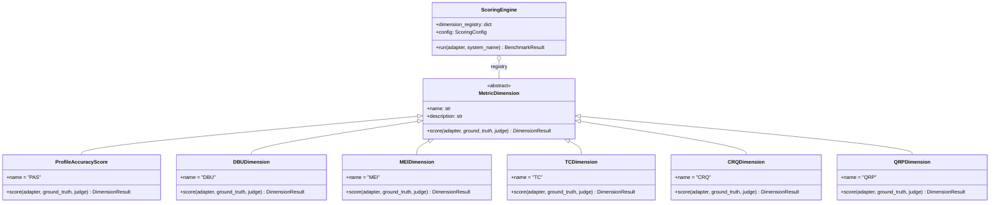
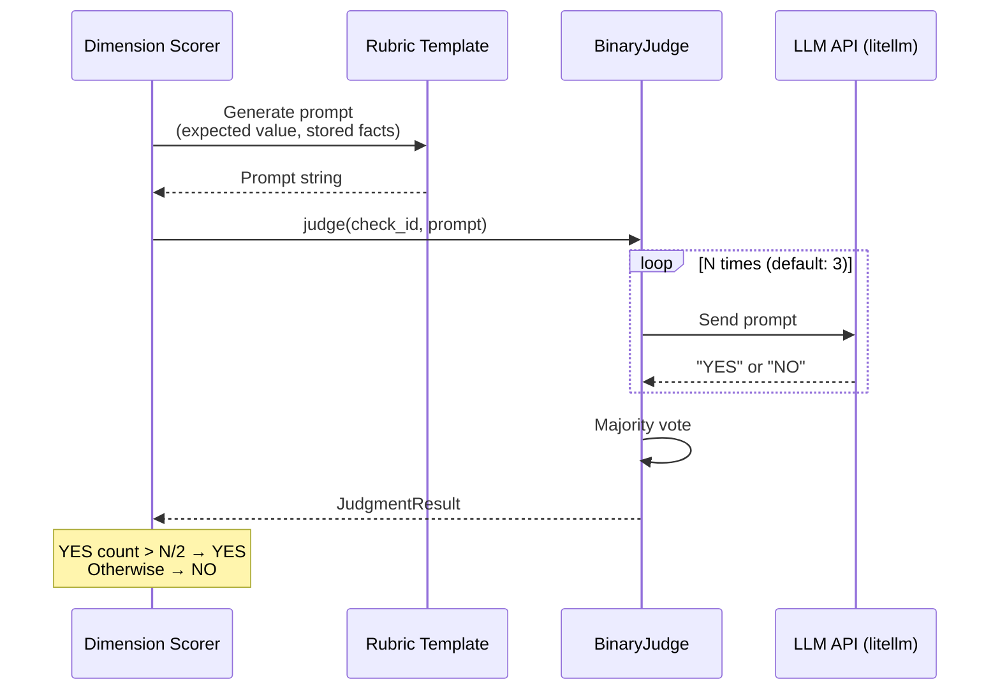

# Scoring Engine

> How CRI evaluates memory systems across seven dimensions and computes the composite Contextual Resonance Index.

---

## Overview

The scoring engine is the **evaluation core** of the CRI Benchmark. It orchestrates the full evaluation pipeline: iterating through dimension scorers, collecting binary verdicts from the LLM judge, aggregating results into per-dimension scores, and computing the weighted composite CRI score.

The engine follows the **Strategy Pattern** — each evaluation dimension is an independent, pluggable scorer that encapsulates its own evaluation logic. New dimensions can be added without modifying the engine.

---

## Scoring Pipeline



---

## Strategy Pattern: Pluggable Dimensions

Each evaluation dimension is implemented as a `MetricDimension` subclass — an independent scorer that encapsulates all logic for evaluating one aspect of memory behavior.



### Registering Dimensions

The engine maintains a dimension registry mapping dimension codes to scorer instances:

```python
_DEFAULT_DIMENSION_REGISTRY = {
    "PAS": ProfileAccuracyScore(),
    "DBU": DBUDimension(),
    "MEI": MEIDimension(),
    "TC": TCDimension(),
    "CRQ": CRQDimension(),
    "QRP": QRPDimension(),
    "SFC": SFCDimension(),
}
```

### Adding a New Dimension

To add a custom dimension:

1. **Subclass `MetricDimension`** — Define `name`, `description`, and implement `score()`:

```python
from cri.scoring.dimensions.base import MetricDimension
from cri.models import DimensionResult, GroundTruth

class MyCustomDimension(MetricDimension):
    name = "MCD"
    description = "Measures my custom property of memory behavior."

    async def score(self, adapter, ground_truth, judge):
        # Derive checks from ground_truth
        # Query adapter for facts
        # Use judge for binary verdicts
        # Return DimensionResult
        ...
```

2. **Register it** — Add to the engine's registry:

```python
engine.dimension_registry["MCD"] = MyCustomDimension()
```

3. **Add weight** — Update the scoring configuration:

```python
config = ScoringConfig(
    dimension_weights={"PAS": 0.20, "DBU": 0.15, ..., "MCD": 0.10},
    enabled_dimensions=["PAS", "DBU", ..., "MCD"],
)
```

No existing code needs to change.

---

## The Seven CRI Dimensions

### PAS — Persona Accuracy Score (Weight: 0.25)

**Measures:** Factual recall accuracy of stored persona details.

**How it works:**

1. For each `ProfileDimension` in `ground_truth.final_profile`:
   - Query the adapter for facts related to the dimension's `query_topic`
   - For each expected value, generate a `pas_check` rubric prompt
   - Judge whether stored facts semantically match the expected value
2. Multi-value dimensions (e.g., multiple hobbies) generate one check per value

**Ground truth source:** `GroundTruth.final_profile` → `dict[str, ProfileDimension]`

**Example check:** "Does the system know the user's occupation is 'software engineer'?"

### DBU — Dynamic Belief Updating (Weight: 0.20)

**Measures:** Ability to update beliefs when new information supersedes old.

**How it works:**

For each `BeliefChange` in the ground truth:
1. **Recency check** — Query for the changed topic, judge whether the *new* value is reflected (expected: YES)
2. **Staleness check** — Judge whether the *old* value is still asserted as current (expected: NO)
3. A change **passes** only when recency = YES AND staleness = NO

**Ground truth source:** `GroundTruth.changes` → `list[BeliefChange]`

**Example check:** "After the user mentioned they switched jobs, does the system reflect the new job and not still assert the old one?"

### MEI — Memory Efficiency Index (Weight: 0.20)

**Measures:** Storage efficiency via coverage and noise rejection ratios.

**How it works:**

Evaluations using `get_all_facts()`:
1. **Coverage checks** — For each `SignalExample`, judge whether the target fact was captured
2. **Efficiency checks** — For each `NoiseExample`, judge whether the noise was incorrectly stored (failure if YES)

**Ground truth source:** `GroundTruth.signal_examples`, `noise_examples`

**Example check:** "Was the user's mention of 'I'm vegetarian' stored as a fact?" / "Was 'Hello, how are you?' correctly filtered out?"

### TC — Temporal Coherence (Weight: 0.15)

**Measures:** Correct handling of time-bounded facts.

**How it works:**

For each `TemporalFact` in the ground truth:
1. Query the adapter for facts related to the temporal fact's `query_topic`
2. If `should_be_current` is True: judge whether the fact is present and treated as current (expected: YES)
3. If `should_be_current` is False: judge whether the expired fact is still asserted as valid (expected: NO = pass)

**Ground truth source:** `GroundTruth.temporal_facts` → `list[TemporalFact]`

**Example check:** "Does the system know the user worked at Company X from 2020 to 2023 and that it's no longer their current job?"

### CRQ — Conflict Resolution Quality (Weight: 0.10)

**Measures:** Ability to resolve contradictory information correctly.

**How it works:**

For each `ConflictScenario` in the ground truth:
1. Query the adapter for facts related to the conflict `topic`
2. Judge whether stored facts reflect the `correct_resolution`
3. Verdict: YES = resolved correctly, NO = failed

**Ground truth source:** `GroundTruth.conflicts` → `list[ConflictScenario]`

**Example check:** "The user first said they live in NYC, then later corrected to SF. Does the system reflect SF?"

### QRP — Query Response Precision (Weight: 0.10)

**Measures:** Precision and recall of fact retrieval.

**How it works:**

For each `QueryRelevancePair` in the ground truth:
1. Query the adapter with the pair's query string
2. **Relevance checks** — For each `expected_relevant_fact`, judge whether it's in the results (expected: YES)
3. **Irrelevance checks** — For each `expected_irrelevant_fact`, judge whether it was incorrectly included (expected: NO = pass)

**Ground truth source:** `GroundTruth.query_relevance_pairs` → `list[QueryRelevancePair]`

**Example check:** "When asked about 'dietary preferences', does the system return 'vegetarian' and not include 'lives in San Francisco'?"

---

## Binary Judge: Majority-Vote Evaluation

Each evaluation check is sent to the LLM judge as a binary YES/NO question. To reduce noise, the judge makes multiple independent calls and uses majority voting.



### JudgmentResult Structure

```python
class JudgmentResult(BaseModel):
    check_id: str              # Unique check identifier (e.g., "pas-occupation")
    verdict: Verdict           # Final YES or NO
    votes: list[Verdict]       # Individual votes from each LLM call
    unanimous: bool            # Whether all votes agreed
    prompt: str                # The prompt that was sent
    raw_responses: list[str]   # Raw LLM response strings
```

### Judge Configuration

```python
judge = BinaryJudge(
    model="claude-haiku-4-5-20250315",  # LLM model for evaluation
    num_runs=3,                          # Votes per check (odd number recommended)
    temperature=0.0,                     # Deterministic for reproducibility
    max_tokens=10,                       # Only need YES or NO
)
```

---

## Rubric System

Rubrics are **pure functions** that generate evaluation prompts. Each function accepts structured inputs and returns a complete prompt string ready for the judge.

### Design Principles

1. **MAX_FACTS_PER_PROMPT = 30** — Context budget prevents overloading the judge
2. **Consistent formatting** — `format_facts()` produces numbered lists
3. **Semantic equivalence** — Prompts emphasize meaning match, not exact text
4. **Clear polarity** — For "negative" checks, the prompt explicitly states that YES = failure

### Available Rubric Functions

| Function | Dimension | What It Checks | YES Means |
|----------|-----------|----------------|-----------|
| `pas_check` | PAS | Stored facts match expected profile value | ✅ Pass |
| `dbu_recency_check` | DBU | New/updated value is reflected | ✅ Pass |
| `dbu_staleness_check` | DBU | Old value still asserted as current | ❌ Fail |
| `mei_coverage_check` | MEI | Important fact was captured | ✅ Pass |
| `mei_efficiency_check` | MEI | Noise was incorrectly stored | ❌ Fail |
| `tc_temporal_validity_check` | TC | Temporal fact handled correctly | Context-dependent |
| `crq_resolution_check` | CRQ | Conflict resolved correctly | ✅ Pass |
| `qrp_relevance_check` | QRP | Relevant fact present in results | ✅ Pass |
| `qrp_irrelevance_check` | QRP | Irrelevant fact incorrectly included | ❌ Fail |

---

## Composite CRI Score Computation

The composite Contextual Resonance Index is a weighted average of all dimension scores:

```
CRI = Σ (w_i × score_i)  for all enabled dimensions i
```

### Default Weights

| Dimension | Weight | Rationale |
|-----------|--------|-----------|
| **PAS** | 0.25 | Fundamental accuracy — the baseline of memory |
| **DBU** | 0.20 | Critical for any evolving knowledge system |
| **MEI** | 0.20 | Memory efficiency is key for quality |
| **TC** | 0.15 | Temporal awareness is valuable but not all systems need it |
| **CRQ** | 0.10 | Advanced capability — conflict resolution |
| **QRP** | 0.10 | Advanced capability — retrieval precision |

### Weight Re-normalization

If some dimensions have no applicable checks (e.g., no temporal facts in the ground truth), their weights are redistributed proportionally:

```python
# Example: If TC has no checks (weight 0.15 redistributed)
# Original: PAS=0.25, DBU=0.20, MEI=0.20, TC=0.15, CRQ=0.10, QRP=0.10
# Active total: 0.25 + 0.20 + 0.20 + 0.10 + 0.10 = 0.85
# Re-normalized: PAS=0.294, DBU=0.235, MEI=0.235, CRQ=0.118, QRP=0.118
```

### Custom Weights

```python
from cri.scoring.engine import ScoringEngine
from cri.models import ScoringConfig

config = ScoringConfig(
    dimension_weights={
        "PAS": 0.30,
        "DBU": 0.25,
        "MEI": 0.15,
        "TC": 0.10,
        "CRQ": 0.10,
        "QRP": 0.10,
    },
    enabled_dimensions=["PAS", "DBU", "MEI", "TC", "CRQ", "QRP"],
)

engine = ScoringEngine(
    ground_truth=dataset.ground_truth,
    judge=BinaryJudge(),
    config=config,
)
```

Weights must sum to 1.0 (±0.01 tolerance). The engine validates this at initialization.

---

## Error Resilience

The scoring engine is designed to **always complete**, even if individual dimension scorers fail:

```python
try:
    result = await scorer.score(adapter, ground_truth, judge)
    dimension_results[dim_name] = result
except Exception as exc:
    logger.warning("Dimension %r scorer raised %s — recording 0.0", dim_name, exc)
    dimension_results[dim_name] = DimensionResult(
        dimension_name=dim_name,
        score=0.0,
        passed_checks=0,
        total_checks=0,
        details=[{"error": str(exc)}],
    )
```

This ensures that:
- A bug in one scorer doesn't prevent evaluation of other dimensions
- Partial results are always available
- Error details are preserved in the result for debugging

---

## Engine API Reference

### ScoringEngine

```python
class ScoringEngine:
    def __init__(
        self,
        ground_truth: GroundTruth,
        judge: BinaryJudge,
        config: ScoringConfig | None = None,  # defaults to standard weights
    ) -> None: ...

    async def run(
        self,
        adapter: MemoryAdapter,
        system_name: str,
    ) -> BenchmarkResult: ...
```

### DimensionResult

```python
class DimensionResult(BaseModel):
    dimension_name: str          # "PAS", "DBU", etc.
    score: float                 # 0.0 to 1.0
    passed_checks: int           # Number of checks that passed
    total_checks: int            # Total number of checks evaluated
    details: list[dict]          # Per-check detail records
```

### CRIResult

```python
class CRIResult(BaseModel):
    system_name: str             # Name of the evaluated system
    cri: float                   # Composite CRI score (0.0-1.0)
    pas: float                   # Individual dimension scores
    dbu: float
    mei: float
    tc: float
    crq: float
    qrp: float
    sfc: float
    dimension_weights: dict      # Weights used for composite
    details: dict                # Per-dimension DimensionResult objects
```

---

## Score Interpretation

| CRI Score | Rating | Interpretation |
|-----------|--------|----------------|
| **0.90 – 1.00** | **Exceptional** | Near-perfect contextual understanding |
| **0.70 – 0.89** | **Strong** | Reliable memory with minor gaps |
| **0.50 – 0.69** | **Moderate** | Functional but with notable weaknesses |
| **0.30 – 0.49** | **Weak** | Significant memory failures |
| **0.00 – 0.29** | **Poor** | Minimal or no effective memory |

---

## Related Documentation

- **[Architecture Overview](overview.md)** — System-wide component diagram
- **[Adapter Interface](adapter-interface.md)** — The three-method protocol
- **[Data Flow](data-flow.md)** — End-to-end pipeline sequence
- **[Methodology Overview](../methodology/overview.md)** — Scientific justification
- **[Metric Documentation](../methodology/metrics/)** — Detailed per-dimension methodology
- **[Adding New Metrics Guide](../guides/new-metrics.md)** — How to create custom dimensions
