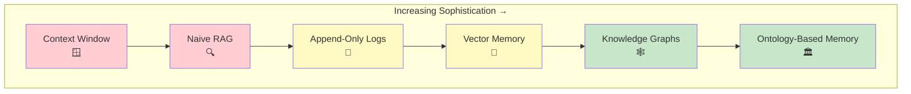
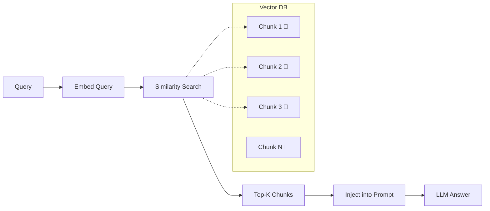
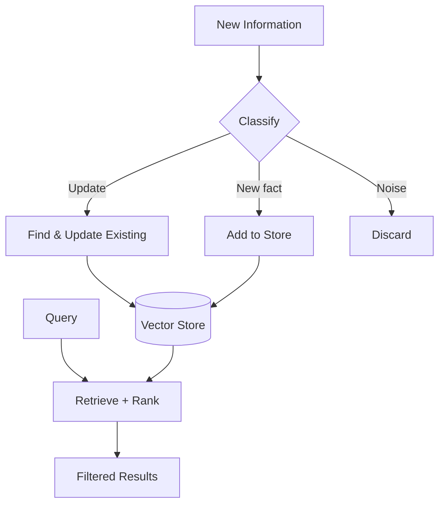
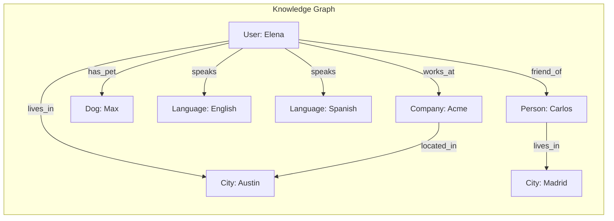
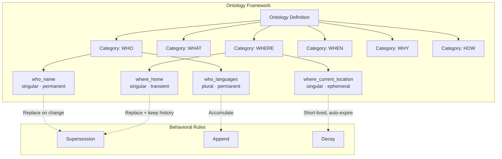
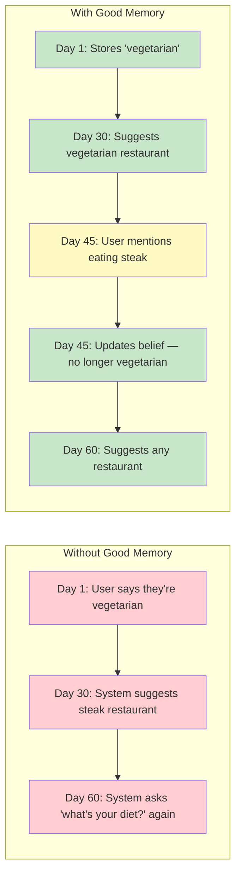

# What is AI Memory?

> *A taxonomy of how AI systems remember — and why most approaches fall short for long-term knowledge.*

---

## Overview

AI memory refers to the mechanisms by which an AI system **stores, retrieves, updates, and reasons about** information across interactions. Unlike human memory — which emerges naturally from neural processes — AI memory must be explicitly designed, engineered, and maintained.

The challenge isn't just *storing* information. Any database can do that. The challenge is building a system that:

- Knows what's **worth remembering**
- Knows when facts have **changed**
- Can **resolve contradictions** between old and new information
- Understands which facts are **current** and which are **historical**
- Can **retrieve the right context** for a given situation

This page provides a taxonomy of AI memory approaches, from simplest to most sophisticated, examining the strengths and limitations of each.

---

## The Memory Landscape



---

## 1. Context Window (No Persistent Memory)

**How it works:** Everything the model "knows" exists within its current context window. When the conversation ends, everything is lost.

**Example:**
```
Session 1: User says "I live in Buenos Aires"
Session 2: Model has no knowledge of where the user lives
```

| Strength | Limitation |
|----------|-----------|
| Zero complexity | No persistence whatsoever |
| No infrastructure needed | Limited by context window size (4K–200K tokens) |
| Perfect for single-turn tasks | Cannot learn about users over time |

**When it works:** Single-turn tasks, stateless interactions, quick Q&A.

**When it fails:** Any scenario requiring continuity — personal assistants, ongoing projects, relationship-building.

**CRI score expectation:** 0.0 across all dimensions. The `no_memory` baseline adapter validates this.

---

## 2. Naive RAG (Retrieval-Augmented Generation)

**How it works:** Documents or conversation chunks are embedded into vectors and stored in a vector database. At query time, the most semantically similar chunks are retrieved and injected into the LLM's context.



**Example:**
```
Stored: "User mentioned they are vegetarian" (embedding 0.82, 0.14, ...)
Stored: "User had steak for dinner" (embedding 0.79, 0.18, ...)
Query:  "What does the user eat?"
Result: Both chunks retrieved — contradiction unresolved
```

| Strength | Limitation |
|----------|-----------|
| Simple to implement | No understanding of knowledge evolution |
| Good for static knowledge bases | Cannot resolve contradictions |
| Scales to large corpora | No temporal awareness — old and new chunks coexist |
| Mature tooling ecosystem | Chunk boundaries can split important context |
| | Retrieval is similarity-based, not semantics-based |
| | No distinction between signal and noise |

**When it works:** Static document retrieval, FAQ systems, knowledge bases that don't change.

**When it fails:** User profiling, evolving knowledge, any scenario where facts change over time.

**CRI score expectation:** Moderate PAS (may retrieve correct facts), low DBU (cannot update beliefs), low MEI (stores everything including noise), near-zero TC and CRQ.

---

## 3. Append-Only Logs

**How it works:** Every interaction is stored chronologically. When context is needed, recent entries are replayed or summarized.

**Example:**
```
Log entry 001: [2024-01-15] User lives in New York
Log entry 047: [2024-03-22] User moved to Buenos Aires
Log entry 128: [2024-06-10] User is considering moving to Tokyo

Query: "Where does the user live?"
Answer depends entirely on which log entries are retrieved/summarized
```

| Strength | Limitation |
|----------|-----------|
| Complete history preserved | No semantic organization |
| Simple to implement | Grows unbounded — linear cost increase |
| Natural chronological ordering | Summarization may lose critical details |
| Good for audit trails | No contradiction detection |
| | Recency bias — old but important facts get lost |
| | No way to distinguish current state from historical |

**When it works:** Audit trails, session replay, short-term conversation memory.

**When it fails:** Long-term knowledge maintenance, any scenario requiring current-state queries over long histories.

**CRI score expectation:** Variable PAS depending on summarization quality, low DBU (no explicit update mechanism), very low MEI (stores everything), low TC (implicit at best).

---

## 4. Vector Memory with Managed Updates

**How it works:** Like naive RAG, but with active management — deduplication, summarization, metadata tagging, and sometimes explicit update/delete operations.

Systems like **Mem0**, **MemoryBank**, and **Letta** fall into this category. They add intelligence on top of vector storage: detecting when new information should overwrite old information, summarizing redundant entries, and tagging memories with metadata.



**Example:**
```
Day 1:  Store: "User is vegetarian" (tagged: diet, confidence: 0.95)
Day 30: Input: "User had steak for dinner"
        System detects potential conflict with diet tag
        Updates: "User is no longer vegetarian" (confidence: 0.80)
```

| Strength | Limitation |
|----------|-----------|
| More intelligent than naive RAG | Update logic is ad-hoc and system-specific |
| Can handle some knowledge evolution | Conflict resolution quality varies widely |
| Metadata enables filtering | No formal model of knowledge relationships |
| Deduplication reduces noise | Embedding-based similarity can miss semantic conflicts |
| Proven in production systems | No standardized evaluation for update quality |
| | Temporal reasoning typically rudimentary |

**When it works:** Personal assistant memory, user preference tracking, simple profile building.

**When it fails:** Complex knowledge evolution, multi-entity reasoning, long supersession chains, scenarios requiring temporal precision.

**CRI score expectation:** Moderate-to-good PAS, variable DBU (depends on update logic quality), moderate MEI, low-to-moderate TC and CRQ.

---

## 5. Knowledge Graphs

**How it works:** Information is stored as typed entities and relationships in a graph structure. Queries traverse the graph to find relevant information. Systems like **Zep** and **GraphRAG** use this approach.



| Strength | Limitation |
|----------|-----------|
| Explicit entity and relationship modeling | Graph construction from text is error-prone |
| Supports relationship queries naturally | Schema must be defined or discovered |
| Entity deduplication built into structure | May struggle with nuanced or subjective knowledge |
| Temporal annotations on edges are possible | Graph traversal can be slow at scale |
| Good for multi-entity reasoning | Requires sophisticated NLP for construction |
| | Update granularity is at entity/edge level |

**When it works:** Multi-entity scenarios, relationship reasoning, scenarios where entities and connections matter.

**When it fails:** Highly nuanced knowledge, subjective preferences, scenarios requiring fine-grained temporal reasoning about individual facts.

**CRI score expectation:** Good PAS for entity-level facts, moderate DBU (edge updates), good MEI for entity-level dedup, moderate TC and CRQ depending on implementation.

---

## 6. Ontology-Based Memory

**How it works:** Knowledge is organized according to a formal ontology — a structured taxonomy that defines what types of knowledge exist, how they relate, and how they behave. Each piece of knowledge is classified by semantic type, and the ontology defines rules for updates, supersession, accumulation, and temporal behavior.



This is fundamentally different from all previous approaches because the **ontology itself encodes how knowledge should behave** — whether a fact replaces or accumulates, how long it should last, how sensitive it is.

**Example:**
```
Ontology: "where_home" is singular, transient
  → When a new home location arrives, supersede the old one
  → Mark old event as superseded (keep for history)
  → New event becomes the active fact

Event 1: "Lives in New York"    [where_home] → status: valid
Event 2: "Moved to Buenos Aires" [where_home] → status: valid
  → Event 1 automatically marked: status: superseded

Query: "Where does user live?" → "Buenos Aires" (only valid events returned)
Query: "Where has user lived?" → ["New York", "Buenos Aires"] (full history available)
```

| Strength | Limitation |
|----------|-----------|
| Explicit rules for knowledge behavior | Requires ontology design and maintenance |
| Natural supersession mechanics | Higher implementation complexity |
| Temporal semantics built in | Classification accuracy depends on NLP quality |
| Privacy tiers by knowledge type | Ontology may not cover all knowledge types |
| Accumulation vs. replacement is formalized | Less flexible than unstructured approaches |
| Audit trail through event sourcing | Requires domain expertise to design well |
| Cross-entity reasoning through shared ontology | |

**When it works:** User profiling systems, persistent AI assistants, any scenario requiring long-term knowledge coherence with traceable updates.

**When it fails:** Highly dynamic, unstructured domains where knowledge doesn't fit into predefined categories.

**CRI score expectation:** Highest potential across all dimensions — if well implemented. The ontology's explicit rules for supersession, accumulation, and temporal behavior directly map to CRI's evaluation dimensions.

> *For a deeper exploration of ontology-based memory, see [Ontology-Based Memory](ontology-memory.md).*

---

## Why Long-Term Memory Matters

Short-term memory (context window) works for single conversations. But increasingly, AI systems are expected to:

### Build Relationships
A personal assistant that forgets your name, your job, and your preferences every session is not a personal assistant — it's a chatbot with amnesia.

### Evolve Understanding
People change. They move cities, change jobs, develop new interests, update their beliefs. A memory system that captures a snapshot but never updates it becomes increasingly wrong over time.

### Handle Complexity
Real-world knowledge is messy. People contradict themselves. Information arrives from multiple sources with varying reliability. An effective memory system must navigate this complexity.

### Scale Across Time
The value of memory grows with time. A system that knows you for a year should be dramatically more useful than one that knows you for a day. But only if its stored knowledge is *accurate and coherent* — not a tangled mess of outdated, contradictory facts.



---

## The Memory Quality Gap

The critical insight that motivates CRI is this: **there is a vast gap between "having a memory system" and "having a *good* memory system."**

Most existing memory solutions address the storage problem (where to put the data) but neglect the knowledge management problem (how to keep the data correct, coherent, and current).

| Property | The Storage Problem | The Knowledge Problem |
|----------|--------------------|-----------------------|
| Core question | Where do I put this? | Should I store this? Does it change something? |
| Difficulty | Engineering (solved) | AI + engineering (unsolved) |
| Current solutions | Vector DBs, key-value stores, graphs | Ad-hoc, system-specific, uneval­uated |
| Benchmarks | Retrieval accuracy benchmarks | **CRI** (this project) |

CRI exists to measure the *knowledge problem* — the hard part that determines whether a memory system is actually useful over time.

---

## Comparative Summary

| Property | Context Window | Naive RAG | Append Log | Vector Memory | Knowledge Graph | Ontology Memory |
|----------|:---:|:---:|:---:|:---:|:---:|:---:|
| Persistence | ❌ | ✅ | ✅ | ✅ | ✅ | ✅ |
| Knowledge updates | ❌ | ❌ | ❌ | ⚠️ | ⚠️ | ✅ |
| Conflict resolution | ❌ | ❌ | ❌ | ⚠️ | ⚠️ | ✅ |
| Temporal awareness | ❌ | ❌ | ⚠️ | ⚠️ | ⚠️ | ✅ |
| Noise rejection | ❌ | ❌ | ❌ | ⚠️ | ⚠️ | ✅ |
| Relationship reasoning | ❌ | ❌ | ❌ | ❌ | ✅ | ✅ |
| Implementation complexity | None | Low | Low | Medium | High | High |
| CRI evaluation value | Floor | Low | Low | Medium | Medium-High | High |

*Legend: ✅ = strong support, ⚠️ = partial/varies by implementation, ❌ = not supported*

---

## What CRI Measures Across All Approaches

CRI is **architecture-neutral** — any system in this taxonomy can be evaluated. The seven CRI dimensions map naturally to the properties that differentiate these approaches:

| CRI Dimension | What It Tests | Which Approaches Struggle |
|---------------|---------------|--------------------------|
| **PAS** (Persona Accuracy) | Did it capture the correct facts? | Context window (nothing stored), naive RAG (chunks, not facts) |
| **DBU** (Dynamic Belief Updating) | Did it update when facts changed? | Append logs (no updates), naive RAG (no update mechanism) |
| **MEI** (Memory Efficiency) | Did it store knowledge efficiently? | Append logs (store everything), naive RAG (store everything) |
| **TC** (Temporal Coherence) | Does it understand time? | Most approaches except ontology-based |
| **CRQ** (Conflict Resolution) | Does it handle contradictions? | Most approaches except ontology and advanced graphs |
| **QRP** (Query Relevance) | Does it retrieve the right context? | Append logs (sequential), context window (nothing to retrieve) |
| **SFC** (Semantic Fact Coherence) | Are stored facts internally consistent? | Append logs (no deduplication), naive RAG (no coherence checking) |

---

## Further Reading

- **[Ontology-Based Memory](ontology-memory.md)** — Deep dive into ontology-based memory systems
- **[Benchmark Philosophy](benchmark-philosophy.md)** — Why CRI measures what it measures
- **[Methodology Overview](../methodology/overview.md)** — How CRI evaluation works
- **[Project Vision](../vision.md)** — The broader goals of the CRI project
