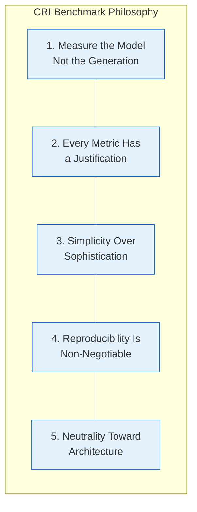
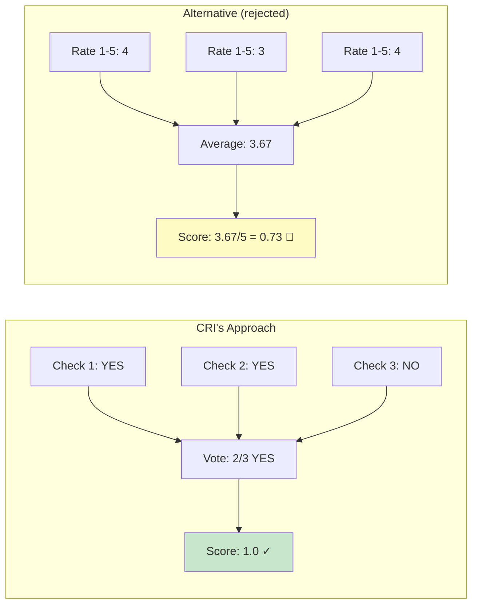
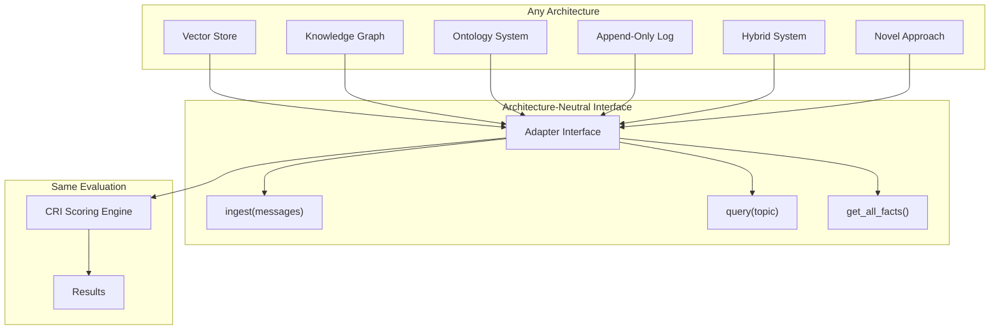
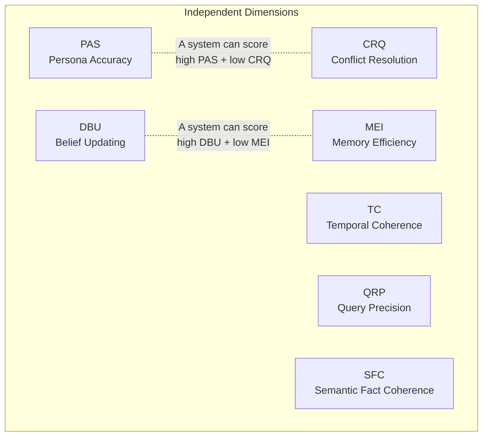

# Benchmark Philosophy

> *A benchmark is only useful if people understand it, trust it, and can reproduce it.*

---

## Why Philosophy Matters

A benchmark is more than a scoring script. It's a **claim about what matters** — a statement that says "these properties are important, and here's how to measure them."

If that claim isn't clearly justified, the benchmark will be ignored. If it's biased toward a specific approach, it will be rejected. If it can't be reproduced, it will be distrusted.

CRI's philosophy is built on five core principles that govern every design decision.

---

## The Five Principles



---

### 1. Measure the Model, Not the Generation

**The principle:** CRI evaluates what the memory system *stored* — the knowledge model it built — not what an LLM would *generate* given that knowledge.

**Why this matters:**

Most benchmarks work like this:
```
Input → Memory System → LLM Generation → Score the generation
```

The problem: a brilliant LLM can compensate for a broken memory system. If the memory stores both "lives in New York" and "lives in Buenos Aires," a clever LLM might still pick the right answer based on recency cues in the text. The memory system gets credit it doesn't deserve.

CRI works like this:
```
Input → Memory System → Inspect stored knowledge → Score the knowledge model
```

This separation is critical. It's the difference between testing a database for data integrity versus testing the application that queries it. Both matter, but they measure fundamentally different things.

**Concrete example:**

```
Ground truth: User's current city is Buenos Aires (moved from New York)

Memory System A stores: ["Lives in Buenos Aires"]
  → CRI: PAS ✅, DBU ✅ (correctly updated)

Memory System B stores: ["Lives in New York", "Lives in Buenos Aires"]  
  → CRI: PAS ⚠️ (both old and new present), DBU ❌ (old belief not updated)

With a downstream LLM, System B might still answer "Buenos Aires" correctly.
But its knowledge model is broken — and CRI catches this.
```

**What this means in practice:**
- CRI's adapter interface includes `get_all_facts()` — not just `query()`
- Memory efficiency (MEI) directly inspects stored facts, not query results
- The LLM judge evaluates stored facts against ground truth, not generated text against expected answers

---

### 2. Every Metric Has a Justification

**The principle:** No metric exists in CRI without a clear answer to three questions:

| Question | What It Ensures |
|----------|----------------|
| **What** does this metric measure? | Clarity — everyone understands what's being evaluated |
| **Why** does this metric matter? | Motivation — the measurement serves a real need |
| **How** is it computed? | Transparency — anyone can verify the calculation |

**Why this matters:**

Benchmarks that include metrics "because they seemed interesting" lose credibility. Every metric in CRI has a documented chain of reasoning from real-world impact to measurement methodology.

**CRI's seven dimensions and their justifications:**

| Dimension | What | Why | How |
|-----------|------|-----|-----|
| **PAS** | Accuracy of the current knowledge model | An inaccurate model means wrong recommendations, wrong assumptions, wrong personalization | Binary LLM judge: "Does stored knowledge match ground truth?" per dimension |
| **DBU** | Ability to update beliefs when facts change | Knowledge that doesn't evolve becomes increasingly wrong over time | Dual check: new value present (YES) AND old value not asserted as current (NO) |
| **MEI** | Storage efficiency and coverage | A model cluttered with noise and low coverage degrades retrieval quality | Two sub-scores: coverage ratio (signal retained?) and efficiency ratio (noise rejected?) |
| **TC** | Handling of time-dependent knowledge | Real-world facts have temporal scope — ignoring time leads to incoherent knowledge | Tests: time-bounded facts, temporal precedence, expiration handling |
| **CRQ** | Resolution of contradictory information | Contradictions are inevitable in real-world data — systems must handle them | Tests: direct contradictions, source credibility, temporal override |
| **QRP** | Precision and recall of context retrieval | Storing correct facts is useless if they can't be retrieved when needed | Tests: topic-relevant retrieval, irrelevant fact exclusion, ranking quality |
| **SFC** | Semantic fact coherence across the knowledge store | A knowledge store that contains internally incoherent or self-contradictory facts degrades all downstream use | Tests: fact-level semantic consistency, cross-fact coherence, internal contradiction detection |

**What this means in practice:**
- Each metric has its own documentation page explaining the full justification
- Metric definitions are versioned — changes require explanation
- New metrics must pass the three-question test before inclusion
- Community proposals for new metrics follow the same framework

---

### 3. Simplicity Over Sophistication

**The principle:** When choosing between a simple measurement approach and a complex one, prefer the simple approach unless the complex one provides meaningfully better information.

**Why this matters:**

Complex metrics are:
- Harder to understand → people don't trust what they can't understand
- Harder to debug → when a score seems wrong, finding the cause is difficult
- Harder to reproduce → more parameters mean more potential for divergence
- More expensive to compute → higher barrier to adoption

**How CRI applies this:**

| Design Decision | Simple Choice | Complex Alternative (Rejected) |
|----------------|---------------|-------------------------------|
| Judge verdict | Binary YES/NO | 5-point Likert scale |
| Voting | Majority of 3 runs | Weighted ensemble with calibration |
| Rubric format | Single question per check | Multi-criteria rubric matrix |
| Composite score | Weighted sum | Neural learned aggregation |
| Ground truth | Annotated expected facts | Multi-annotator agreement scoring |
| Score range | [0.0, 1.0] per dimension | Custom scales per dimension |

**The binary judge decision deserves special attention:**

CRI uses a binary LLM judge (YES/NO) rather than Likert scales (1-5) because:

1. **Inter-rater reliability is dramatically higher** for binary judgments than for fine-grained scales
2. **Majority voting** over binary verdicts is well-understood and robust
3. **Every judgment is auditable** — a human can verify a YES/NO question
4. **Cost is lower** — `max_tokens=10` eliminates judge verbosity
5. **The result is just as informative** — aggregating many binary checks produces fine-grained scores



**What this means in practice:**
- Every rubric is a single YES/NO question
- Temperature is set to 0.0 for maximum consistency
- Max tokens is set to 10 to prevent judge rambling
- Each check is logged with full prompt and response
- The simplest correct approach wins over the most sophisticated one

---

### 4. Reproducibility Is Non-Negotiable

**The principle:** Given the same dataset, the same adapter implementation, and the same judge configuration, CRI must produce the same results — within documented tolerance.

**Why this matters:**

A benchmark that gives different results every time it's run is not a benchmark — it's a random number generator with extra steps. Reproducibility is what allows:
- **Fair comparison** between systems
- **Regression testing** over time
- **Published results** that others can verify
- **Scientific credibility** in academic contexts

**How CRI ensures reproducibility:**

| Source of Variance | CRI's Mitigation |
|-------------------|------------------|
| LLM judge randomness | Temperature 0.0 + majority voting over 3 runs |
| Dataset variations | Canonical datasets are versioned and immutable |
| Prompt variations | All rubric prompts are committed to repository, versioned |
| Adapter state | Adapters must implement `reset()` for clean evaluation |
| System randomness | All random seeds are configurable and logged |
| Judge model changes | Judge model version is recorded in results metadata |

**What "documented tolerance" means:**

CRI uses an LLM judge for semantic evaluation, which introduces *some* variance. This variance is:
- **Measured**: Run the same benchmark 10 times and report standard deviation
- **Bounded**: Majority voting reduces per-check variance to near zero
- **Documented**: Every result includes metadata about judge model, runs, and non-unanimous verdicts
- **Auditable**: Every prompt and response is logged for inspection

**The reproducibility contract:**

```
GIVEN:
  - Canonical dataset v1.0 (datasets/canonical/persona-1-basic/)
  - Adapter implementation X (deterministic behavior)
  - Judge model: claude-sonnet-4-20250514
  - Judge runs: 3
  - Judge temperature: 0.0

THEN:
  - CRI composite score is identical across runs (within ±0.01)
  - Per-dimension scores are identical (within ±0.02)
  - Any non-unanimous verdicts are flagged in the report
```

**What this means in practice:**
- Results include full metadata: judge model, run count, API calls, timestamps
- Judge logs capture every prompt and raw response
- Canonical datasets are never modified after release (only new versions)
- The `run_benchmark` CLI produces deterministic output given fixed inputs
- Non-unanimous judge verdicts are logged for review

---

### 5. Neutrality Toward Architecture

**The principle:** CRI does not assume, favor, or penalize any specific memory architecture. It evaluates observable behavior — what went in, what was stored, what comes out when queried.

**Why this matters:**

The benchmark must be useful to everyone:
- **Vector store** teams running ChromaDB with semantic search
- **Knowledge graph** teams using Neo4j with entity resolution
- **Ontology-based** teams using structured event-sourcing
- **Hybrid** teams combining multiple approaches
- **Novel approaches** that don't fit existing categories

If CRI assumed any specific architecture, it would cease to be a standard and become an advocacy tool.

**How CRI maintains neutrality:**



**The neutrality test:** Before adding any feature, metric, or design decision, CRI asks: *"Would a vector store team consider this fair?"* and *"Would an ontology team consider this fair?"* If either answer is no, the design needs revision.

**What neutrality does NOT mean:**

Neutrality means CRI doesn't *assume* an architecture. It doesn't mean CRI can't *reveal architectural differences*. If ontology-based systems consistently outperform vector stores on the TC dimension, that's a legitimate finding — CRI measured the same properties with the same methodology, and the results reflect real differences in capability.

CRI is neutral in method, honest in results.

**Concrete neutrality examples:**

| CRI Feature | Why It's Neutral |
|-------------|-----------------|
| `get_all_facts()` returns `StoredFact` with just `text` + optional `metadata` | No assumption about internal storage format |
| `query(topic)` takes a free-text string | No assumption about query language or graph traversal |
| Ground truth is a list of expected facts, not expected graph structures | No assumption about knowledge representation |
| Scoring compares semantic content, not structural format | "Lives in BA" matches "Home: Buenos Aires, Argentina" |
| Performance profiling is reported separately from quality score | Systems aren't penalized for being slower if they're more accurate |

---

## Orthogonal Dimensions

A critical design property: CRI's seven dimensions measure **distinct, independent properties**. A system can score high on one dimension and low on another.



**Why orthogonality matters:**

A single composite score hides important information. Consider two systems:

| System | PAS | DBU | MEI | TC | CRQ | QRP | Composite |
|--------|:---:|:---:|:---:|:--:|:---:|:---:|:---------:|
| System A | 0.95 | 0.90 | 0.85 | 0.30 | 0.20 | 0.80 | 0.72 |
| System B | 0.70 | 0.70 | 0.70 | 0.75 | 0.75 | 0.70 | 0.71 |

These systems have nearly identical composite scores, but they're fundamentally different. System A excels at capturing and updating facts but fails at temporal reasoning and conflict resolution. System B is consistently moderate across all dimensions. CRI's per-dimension reporting makes this visible.

---

## What CRI Deliberately Does NOT Measure

### Speed as a Quality Metric
Latency matters in production, but it's not a *memory quality* metric. A system that takes 2 seconds but stores perfectly accurate knowledge is a better memory system than one that takes 10ms but stores garbage. CRI reports latency as a **performance profile** — visible but not part of the quality score.

### Cost Efficiency
How much it costs to run the memory system is a deployment concern, not a quality concern. CRI doesn't score systems on API costs, storage costs, or compute utilization.

### API Compliance
CRI evaluates *behavior*, not *interface design*. Whether a system uses REST, GraphQL, gRPC, or JSON-RPC is irrelevant to memory quality.

### Generation Quality
What an LLM generates using the stored memory is a separate concern. CRI tests the raw material, not the finished product. A good memory system should produce good raw material regardless of which LLM consumes it.

### Language-Specific Capabilities
CRI v1.0 evaluates English-language scenarios. Multilingual evaluation is a future extension, not a core metric.

---

## Scoring Philosophy

### The Composite Score

```
CRI = 0.25 × PAS + 0.20 × DBU + 0.20 × MEI + 0.15 × TC + 0.10 × CRQ + 0.10 × QRP
```

All scores are in `[0.0, 1.0]`. Weights are configurable but defaults are provided with justification:

| Dimension | Default Weight | Justification |
|-----------|:-:|---|
| **PAS** | 0.25 | Foundational — if the stored knowledge is wrong, nothing else matters |
| **DBU** | 0.20 | Critical — knowledge that doesn't evolve becomes increasingly wrong |
| **MEI** | 0.20 | Important — storage efficiency directly impacts retrieval quality |
| **TC** | 0.15 | Significant — temporal reasoning is essential for long-term memory |
| **CRQ** | 0.10 | Valuable — contradictions are common but less frequent than updates |
| **QRP** | 0.10 | Supporting — retrieval quality matters but CRI primarily tests storage |

### Why Weighted Sum?

More sophisticated aggregation methods (geometric mean, neural scoring, learned weights) were considered and rejected under the Simplicity principle. A weighted sum is:
- Immediately understandable
- Trivially customizable
- Transparent — high scores on one dimension can't compensate for zero scores on another (unlike multiplicative approaches)
- Standard practice in established benchmarks

### Statistical Metadata

Every CRI result includes:
- Per-dimension breakdown
- Per-check verdicts
- Non-unanimous judge votes
- Confidence metadata
- Full judge logs for audit

---

## Evolution

CRI is designed to grow with the field:

- **New dimensions** can be added as the research community identifies new important properties
- **Existing dimensions** can be refined based on empirical analysis and community feedback
- **Datasets** can grow to cover new scenarios, personas, and complexity levels
- **Weights** can be adjusted based on community consensus and empirical validation
- **New benchmark tiers** (basic/extended/advanced) can accommodate systems at different capability levels

The philosophy is stable. The implementation evolves.

---

## Further Reading

- **[Project Vision](../vision.md)** — The broader goals of CRI
- **[What is AI Memory?](ai-memory.md)** — Taxonomy of memory approaches
- **[Ontology-Based Memory](ontology-memory.md)** — Deep dive into structured knowledge systems
- **[Methodology Overview](../methodology/overview.md)** — How CRI implements these principles
- **[Metric Definitions](../methodology/metrics/pas.md)** — Individual metric justifications
