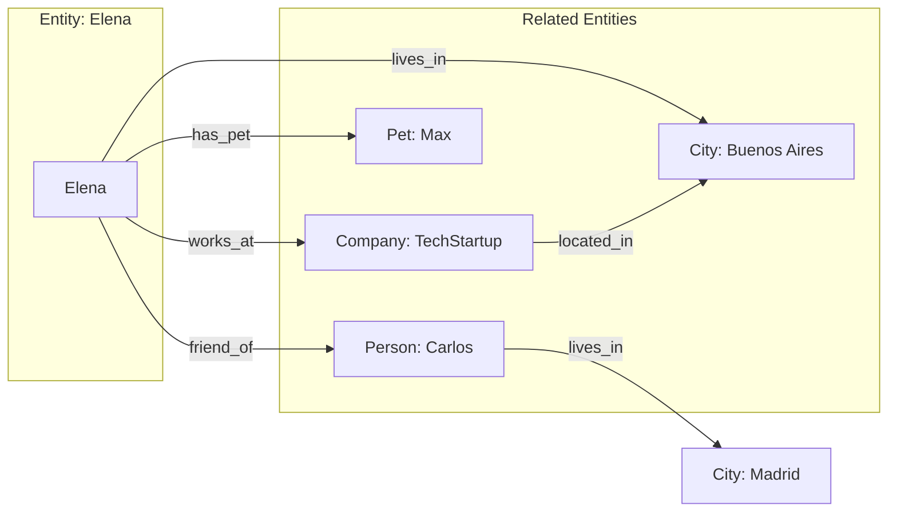
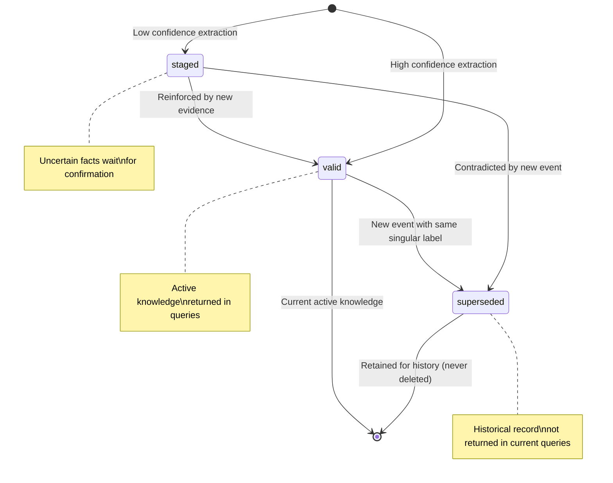
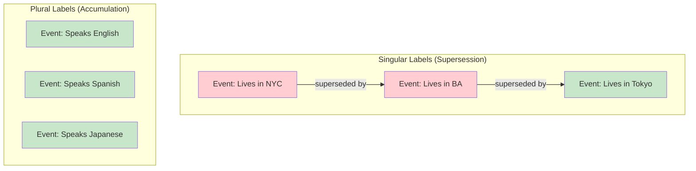
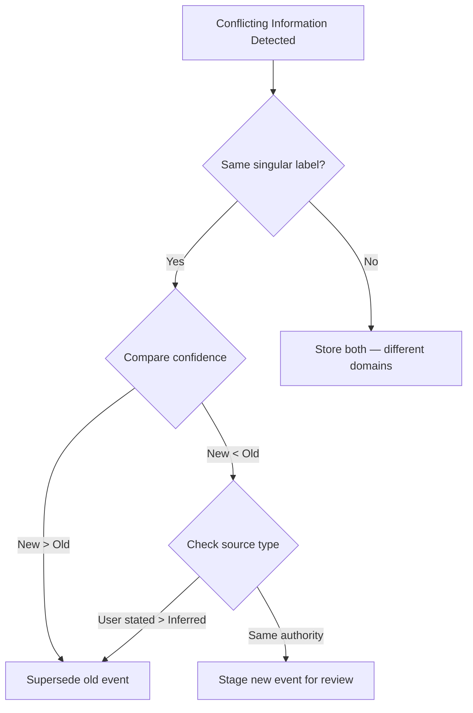

# Ontology-Based Memory

> *Treating knowledge as structured, typed, rule-governed information — not raw text.*

---

## What is Ontology-Based Memory?

In an ontology-based memory system, knowledge is organized according to a **formal taxonomy** — a structured framework that defines:

- **What types of knowledge exist** (identity, location, preferences, relationships...)
- **How each type behaves** (does new information replace old, or accumulate alongside it?)
- **How long each type lasts** (permanent, transient, or ephemeral)
- **How sensitive each type is** (public, personal, sensitive)

The ontology acts as the **constitution of the memory system** — it defines the rules by which knowledge is stored, updated, and retrieved.

This is fundamentally different from unstructured approaches where all information is treated equally. In an ontology-based system, the system *knows* that "user's name" behaves differently from "user's current mood" — the first is permanent and singular (only one active value), while the second is ephemeral and may change moment to moment.

---

## Core Concepts

### Events

The atomic unit of knowledge is the **event** — an immutable record of a fact extracted from text.

```
Event {
  value:       "Elena moved to Buenos Aires"
  labels:      [where_home]
  confidence:  0.92
  source_type: user_stated
  status:      valid
  created_at:  2024-03-15T10:30:00Z
}
```

Events are **immutable**. Once created, an event is never modified. When knowledge changes, the old event is marked as `superseded` and a new event is created. This append-only model provides a complete audit trail of how knowledge evolved.

### Entities

An **entity** is anything the system accumulates knowledge about — a person, a project, a company, a place. Each entity has its own collection of events.

```
Entity: user_elena
├── Event: "Name is Elena"         [who_name]        → valid
├── Event: "Lives in Buenos Aires"  [where_home]      → valid
├── Event: "Lived in New York"      [where_home]      → superseded
├── Event: "Speaks English"         [who_languages]   → valid
├── Event: "Speaks Spanish"         [who_languages]   → valid
├── Event: "Works at TechStartup"   [who_role]        → valid
└── Event: "Enjoys hiking"          [what_interests]  → valid
```

### Labels

Each event is classified with one or more **labels** from the ontology. Labels carry metadata that defines how that type of knowledge behaves:

| Property | Values | Meaning |
|----------|--------|---------|
| **Cardinality** | `singular` or `plural` | Can there be only one active value, or many? |
| **Durability** | `permanent`, `transient`, or `ephemeral` | How long does this type of knowledge typically last? |
| **Sensitivity** | `public` → `sensitive` | How private is this type of information? |

**Examples of label behavior:**

| Label | Cardinality | Durability | Behavior |
|-------|:-----------:|:----------:|----------|
| `who_name` | singular | permanent | Only one active name. Rarely changes. New name supersedes old. |
| `who_languages` | plural | permanent | Multiple languages accumulate. Learning a new one doesn't erase others. |
| `where_home` | singular | transient | One home at a time. Changes when user moves. Old location superseded. |
| `where_current_location` | singular | ephemeral | Current location. Changes constantly. Auto-expires. |
| `what_interests_hobbies` | plural | transient | Multiple hobbies accumulate. May fade over time. |

### Relationships

In an ontology system, **relationships between entities** are first-class concepts:



Relationships can carry temporal annotations, enabling queries like "Where did Elena work in 2023?" or "When did Elena move to Buenos Aires?"

---

## The Event Lifecycle

The most critical concept in ontology-based memory is **supersession** — the process by which new knowledge replaces old knowledge for singular-cardinality labels.



### How Supersession Works

**Step 1: Initial knowledge**
```
Event A: "Elena lives in New York" [where_home, singular] → status: VALID
```

**Step 2: New information arrives**
```
Input: "I just moved to Buenos Aires!"
System extracts: "Elena lives in Buenos Aires" [where_home, singular]
```

**Step 3: Supersession**
The ontology knows `where_home` has `singular` cardinality — only one value can be active. The system:
1. Creates Event B: "Elena lives in Buenos Aires" → status: VALID
2. Marks Event A: status: SUPERSEDED, superseded_by: Event B

```
Event A: "Lives in New York"      [where_home] → SUPERSEDED (by Event B)
Event B: "Lives in Buenos Aires"  [where_home] → VALID
```

**Step 4: Queries reflect current state**
```
Query: "Where does Elena live?" → "Buenos Aires" (only valid events returned)
Query: "Where has Elena lived?" → "New York, Buenos Aires" (full history)
```

### Accumulation vs. Supersession

For **plural** labels, new events **accumulate** rather than supersede:

```
Event 1: "Elena speaks English"  [who_languages, plural] → VALID
Event 2: "Elena speaks Spanish"  [who_languages, plural] → VALID
Event 3: "Elena is learning Japanese" [who_languages, plural] → VALID

Query: "What languages does Elena speak?" → "English, Spanish, Japanese"
(All three remain valid — plural labels accumulate)
```

This distinction is fundamental: **some knowledge replaces, some knowledge accumulates.** An ontology-based system explicitly models this distinction through label metadata.



---

## Why Ontology-Based Memory Matters

### 1. Knowledge Updates Are Principled, Not Ad-Hoc

In a vector store, updating knowledge means "maybe find the old embedding, delete it, add a new one." The update logic is ad-hoc and error-prone.

In an ontology system, the rules are explicit: singular labels supersede, plural labels accumulate. There's no ambiguity about what should happen when new information arrives.

**What this looks like in practice:**

| Scenario | Vector Store | Ontology System |
|----------|-------------|-----------------|
| User changes jobs | May store both old and new job | Old job superseded, new job becomes valid |
| User learns new language | May store as new embedding | New language accumulates alongside existing ones |
| User's mood changes | May store all mood mentions equally | Ephemeral label — previous mood events auto-expire |

### 2. Temporal Reasoning Is Built In

Ontology-based systems naturally handle time because:
- **Durability** tells the system how long knowledge should last
- **Event timestamps** create a chronological record
- **Supersession chains** show how knowledge evolved
- **Status** distinguishes current from historical knowledge

This enables queries that other systems cannot answer:
- "Where does Elena live **now**?" → Only valid events
- "Where did Elena live **in 2023**?" → Historical query against superseded events
- "When did Elena **move**?" → Supersession timestamp

### 3. Conflict Resolution Has a Framework

When contradictory information arrives, an ontology system has a principled framework:
- **Cardinality** determines whether supersession applies
- **Confidence scores** indicate extraction certainty
- **Source types** distinguish user statements from agent observations from inferences
- **Temporal ordering** provides recency information



### 4. Privacy and Sensitivity Are Structural

Each label carries a sensitivity tier, making privacy a structural property of the knowledge system rather than a bolted-on filter:

| Tier | Level | Example Labels |
|------|:-----:|----------------|
| `public` | 1 | Languages, timezone, communication style |
| `work` | 2 | Job title, skills, company, tech stack |
| `personal` | 3 | Name, hobbies, food preferences, pet |
| `sensitive` | 4 | Health, finances, political views, family |

When a query arrives, the system can filter results by sensitivity tier — returning only public information for an external query, while including personal details for the user's own assistant.

### 5. Knowledge Quality Is Auditable

Because events are immutable and supersession creates explicit chains, the complete history of how knowledge evolved is always available:

```
Audit Trail for "where_home":
  2024-01-15  "Lives in New York"      [valid → superseded 2024-03-22]
  2024-03-22  "Lives in Buenos Aires"  [valid → superseded 2024-08-10]
  2024-08-10  "Lives in Tokyo"         [valid → current]
```

This auditability is critical for debugging, compliance, and trust.

---

## The 5W+H Framework

A well-designed ontology for user/entity knowledge can be organized using the journalistic **5W+H framework** — Who, What, Where, When, Why, How:

| Category | What It Captures | Example Labels | Typical Count |
|----------|-----------------|----------------|:---:|
| **WHO** | Identity, demographics, social | Name, age, languages, relationships, health | ~19 |
| **WHAT** | Skills, knowledge, interests | Skills, hobbies, education, tech stack, projects | ~9 |
| **WHERE** | Locations, environments | Home, work, current location, travel | ~6 |
| **WHEN** | Temporal patterns, schedules | Timezone, routines, life events, work schedule | ~8 |
| **WHY** | Goals, motivations, values | Goals, aspirations, fears, priorities | ~6 |
| **HOW** | Behavioral patterns | Communication style, learning style, workflow | ~9 |

This framework is naturally exhaustive — most facts about a person can be classified into one of these six categories. It also provides a useful structure for benchmark evaluation: does the memory system perform equally well across all categories, or does it struggle with certain types of knowledge?

---

## Comparison with Other Memory Paradigms

### Memory-as-Tool vs. Memory-as-Structure

Most memory systems treat memory as a **tool** — a module that stores and retrieves data. The ontology approach treats memory as a **structure** — a framework that defines *how knowledge behaves*.

| Aspect | Memory-as-Tool | Memory-as-Structure |
|--------|:---:|:---:|
| Knowledge update | Ad-hoc logic | Ontology-defined rules |
| Temporal handling | Implementation-specific | Durability semantics |
| Conflict resolution | Case-by-case | Cardinality + confidence + source |
| Privacy | External filter | Structural sensitivity tiers |
| Audit trail | Varies | Built-in (immutable events) |
| Scalability model | Storage-dependent | Event accumulation |

### What Ontology Adds Over Knowledge Graphs

Knowledge graphs represent entities and relationships but don't inherently define *behavior rules*. An ontology-based system adds:

1. **Cardinality semantics** — The graph knows "name" is singular and "hobbies" is plural
2. **Durability semantics** — The graph knows "mood" expires and "name" persists
3. **Sensitivity classification** — The graph knows "health" is more sensitive than "timezone"
4. **Supersession mechanics** — The graph knows how to handle updates, not just store edges

A knowledge graph is a *data structure*. An ontology-based memory is a *knowledge system*.

---

## Implications for CRI Benchmark

CRI's six evaluation dimensions map directly to the properties that distinguish ontology-based memory:

| CRI Dimension | What It Tests | Ontology Property |
|---------------|---------------|-------------------|
| **PAS** | Correct current state captured | Event extraction + classification |
| **DBU** | Facts updated when they change | Supersession mechanics |
| **MEI** | Storage efficiency and coverage | Source type + confidence filtering |
| **TC** | Time-dependent knowledge handled | Durability semantics |
| **CRQ** | Contradictions resolved | Cardinality + confidence + source |
| **QRP** | Relevant context retrieved | Label-based retrieval + ranking |

This is not accidental. CRI is *informed by* the properties that ontology-based systems formalize — but it evaluates them in an **architecture-neutral** way. A vector-based system that manages to handle supersession correctly will score just as well as an ontology system on the DBU dimension.

**CRI measures outcomes, not architecture.**

---

## Example: A Complete Knowledge Flow

Here is a complete example showing how ontology-based memory handles a realistic sequence of events:

```
Day 1: "Hi, I'm Elena. I'm a software engineer in New York."
  → Event: "Name is Elena"              [who_name, singular, permanent]   → VALID
  → Event: "Software engineer"          [who_role, singular, transient]   → VALID  
  → Event: "Lives in New York"          [where_home, singular, transient] → VALID

Day 15: "I've been doing a lot of hiking lately, and I'm also into pottery."
  → Event: "Enjoys hiking"              [what_interests, plural, transient] → VALID
  → Event: "Enjoys pottery"             [what_interests, plural, transient] → VALID

Day 30: "Big news — I accepted a job at DataCorp and I'm moving to Buenos Aires!"
  → Event: "Works at DataCorp"          [who_role, singular]   → VALID
     ↳ Previous "Software engineer" → SUPERSEDED
  → Event: "Lives in Buenos Aires"      [where_home, singular] → VALID
     ↳ Previous "Lives in New York" → SUPERSEDED

Day 45: "I'm feeling really overwhelmed today. Everything is stressful."
  → Event: "Feeling overwhelmed"        [when_routines, plural, ephemeral] → VALID
  (This will auto-expire — ephemeral durability)

Day 60: "I've picked up cooking since moving here. The food scene is amazing."
  → Event: "Enjoys cooking"             [what_interests, plural, transient] → VALID
  (Accumulates alongside hiking and pottery — plural cardinality)
```

**Query on Day 60: "Tell me about Elena"**
```
Valid events returned:
  - Name: Elena                    [permanent, valid]
  - Works at DataCorp              [transient, valid]  
  - Lives in Buenos Aires          [transient, valid]
  - Enjoys hiking                  [transient, valid]
  - Enjoys pottery                 [transient, valid]
  - Enjoys cooking                 [transient, valid]

NOT returned (superseded):
  - Software engineer              [superseded by "Works at DataCorp"]
  - Lives in New York              [superseded by "Lives in Buenos Aires"]

NOT returned (expired):
  - Feeling overwhelmed            [ephemeral, expired]
```

This is the behavior that CRI's dimensions evaluate: Did the system capture the right facts (PAS)? Did it update when things changed (DBU)? Did it store knowledge efficiently with good coverage (MEI)? Does it understand temporal context (TC)?

---

## Further Reading

- **[What is AI Memory?](ai-memory.md)** — Taxonomy of memory approaches
- **[Benchmark Philosophy](benchmark-philosophy.md)** — CRI's evaluation principles
- **[Research: Ontology as Memory](../research/ontology-as-memory-analysis.md)** — Analysis of the Animesis/CMA approach
- **[Research: UPP Protocol](../research/upp-protocol-analysis.md)** — Protocol-level analysis of structured memory
- **[Methodology Overview](../methodology/overview.md)** — How CRI evaluates these properties
