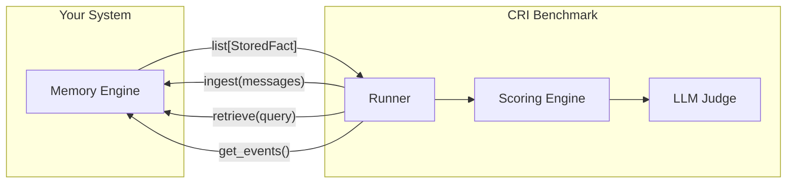

# Integration Guide

This guide walks you through integrating your memory system with the CRI Benchmark, from implementing the adapter interface to running your first evaluation.

## Overview

The CRI Benchmark communicates with memory systems through a simple **adapter protocol**. Your system needs to implement three methods — that's it.



## The MemoryAdapter Protocol

The `MemoryAdapter` is defined as a Python `Protocol` with structural subtyping. This means:

- **No inheritance required** — your class doesn't need to import or subclass anything from CRI
- **No dependency on CRI** — you can implement the interface in your own package
- **Runtime verification** — the runner checks compliance with `isinstance()` before starting

### The Three Methods

| Method | Purpose | Input | Output |
|--------|---------|-------|--------|
| `ingest(messages)` | Process conversation messages and store extracted facts | `list[Message]` | `None` |
| `retrieve(query)` | Retrieve facts relevant to a query string | `str` | `list[StoredFact]` |
| `get_events()` | Dump the entire fact store for auditing | — | `list[StoredFact]` |

### Data Models

```python
from pydantic import BaseModel

class Message(BaseModel):
    message_id: int          # Sequential identifier
    role: str                # "user" or "assistant"
    content: str             # Message text
    timestamp: str           # ISO-8601 timestamp
    session_id: str | None   # Optional session grouping
    day: int | None          # Simulation day number

class StoredFact(BaseModel):
    text: str                # Textual content of the fact
    metadata: dict           # Arbitrary metadata (scores, timestamps, etc.)
```

## Step-by-Step Integration

### Step 1 — Create Your Adapter Class

```python
# my_adapter.py
from cri.models import Message, StoredFact


class MyMemoryAdapter:
    """Adapter for the Acme Memory Engine."""

    def __init__(self):
        self._facts: list[StoredFact] = []

    def ingest(self, messages: list[Message]) -> None:
        """Process messages and extract facts."""
        for msg in messages:
            if msg.role == "user":
                # Your fact extraction logic here
                extracted = self._extract_facts(msg.content)
                for fact_text in extracted:
                    self._facts.append(
                        StoredFact(
                            text=fact_text,
                            metadata={
                                "source_msg": msg.message_id,
                                "timestamp": msg.timestamp,
                            },
                        )
                    )

    def retrieve(self, query: str) -> list[StoredFact]:
        """Retrieve facts relevant to the given query."""
        relevant = []
        for fact in self._facts:
            if self._is_relevant(fact.text, query):
                relevant.append(fact)
        return relevant

    def get_events(self) -> list[StoredFact]:
        """Return all stored facts."""
        return list(self._facts)

    # -- Your internal logic --

    def _extract_facts(self, content: str) -> list[str]:
        """Extract factual statements from message content."""
        # Replace with your extraction pipeline
        # (NLP, LLM, regex, ontology builder, etc.)
        return [content]  # naive: treat entire message as a fact

    def _is_relevant(self, fact_text: str, query: str) -> bool:
        """Check if a fact is relevant to a query."""
        # Replace with your relevance logic
        # (embedding similarity, keyword match, ontology traversal, etc.)
        return query.lower() in fact_text.lower()
```

> **Key insight**: The benchmark doesn't prescribe _how_ your system extracts facts, determines relevance, or structures its internal knowledge. It only cares about the inputs and outputs of these three methods.

### Step 2 — Verify Protocol Compliance

```python
from cri.adapter import MemoryAdapter
from my_adapter import MyMemoryAdapter

adapter = MyMemoryAdapter()
assert isinstance(adapter, MemoryAdapter), "Adapter doesn't satisfy protocol!"
print("✓ Adapter is protocol-compliant")
```

### Step 3 — Run via CLI

The simplest way to run your adapter is through the CLI with a dotted import path:

```bash
cri run \
  --adapter my_adapter:MyMemoryAdapter \
  --dataset datasets/canonical/persona-1-base \
  --verbose
```

The `--adapter` flag accepts either:
- A **registry name**: `no-memory`, `full-context`, `rag`
- A **dotted path**: `my_package.adapters:MyMemoryAdapter` or `my_package.adapters.MyMemoryAdapter`

### Step 4 — Run Programmatically

For more control, use the Python API:

```python
import asyncio
from pathlib import Path

from cri.runner import run_benchmark
from my_adapter import MyMemoryAdapter


async def main():
    result = await run_benchmark(
        adapter_name="my_adapter:MyMemoryAdapter",
        dataset_path="datasets/canonical/persona-1-base",
        judge_runs=3,
        output_dir="results/my-system",
        output_format="json",
        verbose=True,
    )

    print(f"Composite CRI: {result.cri_result.cri}")
    print(f"PAS: {result.cri_result.pas}")
    print(f"DBU: {result.cri_result.dbu}")


asyncio.run(main())
```

## Advanced Integration Patterns

### Wrapping an Existing System

If your memory system already has its own API, create a thin adapter wrapper:

```python
from cri.models import Message, StoredFact


class OntologyMemoryAdapter:
    """Adapter wrapping an ontology-based memory system."""

    def __init__(self, endpoint: str = "http://localhost:8080"):
        import requests
        self._session = requests.Session()
        self._endpoint = endpoint

    def ingest(self, messages: list[Message]) -> None:
        # Convert CRI messages to your system's event format
        events = [
            {
                "text": msg.content,
                "role": msg.role,
                "timestamp": msg.timestamp,
                "session": msg.session_id,
            }
            for msg in messages
        ]
        self._session.post(
            f"{self._endpoint}/ingest",
            json={"events": events},
        )

    def retrieve(self, query: str) -> list[StoredFact]:
        resp = self._session.get(
            f"{self._endpoint}/query",
            params={"topic": query},
        )
        results = resp.json()["results"]
        return [
            StoredFact(
                text=r["text"],
                metadata={"confidence": r.get("confidence", 1.0)},
            )
            for r in results
        ]

    def get_events(self) -> list[StoredFact]:
        resp = self._session.get(f"{self._endpoint}/facts")
        facts = resp.json()["facts"]
        return [
            StoredFact(text=f["text"], metadata=f.get("metadata", {}))
            for f in facts
        ]
```

### Adapter with Setup and Teardown

If your adapter needs initialization (loading models, connecting to databases), handle it in `__init__`:

```python
class EmbeddingMemoryAdapter:
    def __init__(self):
        # Initialize your system here
        from sentence_transformers import SentenceTransformer
        self._model = SentenceTransformer("all-MiniLM-L6-v2")
        self._facts: list[StoredFact] = []
        self._embeddings = []

    def ingest(self, messages: list[Message]) -> None:
        for msg in messages:
            if msg.role == "user":
                self._facts.append(StoredFact(text=msg.content))
                self._embeddings.append(
                    self._model.encode(msg.content)
                )

    def retrieve(self, query: str) -> list[StoredFact]:
        import numpy as np
        query_emb = self._model.encode(query)
        similarities = [
            np.dot(query_emb, emb) / (np.linalg.norm(query_emb) * np.linalg.norm(emb))
            for emb in self._embeddings
        ]
        # Return top-5 most relevant facts
        top_indices = np.argsort(similarities)[-5:][::-1]
        return [self._facts[i] for i in top_indices if similarities[i] > 0.3]

    def get_events(self) -> list[StoredFact]:
        return list(self._facts)
```

## What the Benchmark Evaluates

When your adapter runs, the benchmark:

1. **Ingests** all conversation messages in chronological order via `ingest()`
2. **Queries** your system with query strings derived from the ground truth via `retrieve()`
3. **Audits** your fact store via `get_events()` for noise, duplication, and completeness
4. **Judges** each check using an LLM that compares your system's output against expected answers

### What Makes a Good Adapter

| Property | Why It Matters |
|----------|---------------|
| **Fact extraction** | Filter noise (greetings, filler) from signal (facts about the user) |
| **Knowledge updates** | When a user says "I moved to Denver," update the stored location |
| **Conflict resolution** | When contradictory info appears, resolve to the most recent/authoritative |
| **Temporal tracking** | Know which facts are current vs. historical |
| **Precise retrieval** | Return only relevant facts for a query, not everything |

## Troubleshooting

### "Adapter does not satisfy MemoryAdapter protocol"

Ensure your class has all three methods with the correct signatures:
- `ingest(self, messages: list[Message]) -> None`
- `retrieve(self, query: str) -> list[StoredFact]`
- `get_events(self) -> list[StoredFact]`

### "Cannot resolve adapter"

If using a dotted path, ensure:
- The module is importable (on `sys.path` or installed)
- The path uses either `module.path:ClassName` or `module.path.ClassName` format
- The class name is spelled correctly

## Next Steps

- [Quick Start Guide](quickstart.md) — Run built-in baselines
- [Evaluation Dimensions](../../README.md#evaluation-dimensions) — What each dimension measures
- [Metric Definitions](../metrics/) — Detailed specs for each scored dimension
- [Methodology](../../METHODOLOGY.md) — How CRI evaluates memory systems
