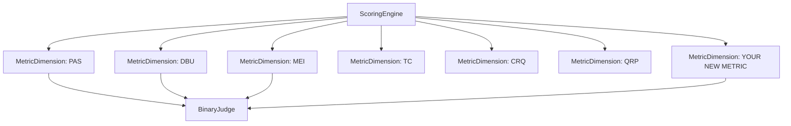

# Adding New Metrics

This guide walks you through creating a custom evaluation dimension for the CRI Benchmark. CRI ships with seven built-in dimensions (PAS, DBU, MEI, TC, CRQ, QRP, SFC), but the framework is designed to be extended with new metrics that measure additional properties of long-term memory systems.

## Architecture Overview



Every CRI dimension is a subclass of `MetricDimension`. The `ScoringEngine` iterates through registered dimensions and calls each one's `score()` method, which produces a `DimensionResult`.

## Step 1 — Define Your Metric

Before writing code, answer these questions:

1. **What property of memory are you measuring?** (e.g., "Does the system detect emotional sentiment in messages?")
2. **What ground truth data do you need?** (e.g., expected emotional annotations)
3. **How will the judge evaluate correctness?** (e.g., "Does the stored fact capture the user's emotional state?")

## Step 2 — Create a MetricDimension Subclass

Create a new file in `src/cri/scoring/dimensions/`:

```python
# src/cri/scoring/dimensions/esa.py
"""Emotional Sentiment Accuracy (ESA) dimension.

Measures whether the memory system captures and stores the emotional
sentiment expressed by the user across conversations.
"""

from __future__ import annotations

from typing import TYPE_CHECKING

from cri.models import DimensionResult, GroundTruth
from cri.scoring.dimensions.base import MetricDimension

if TYPE_CHECKING:
    from cri.adapter import MemoryAdapter
    from cri.judge import BinaryJudge


class ESADimension(MetricDimension):
    """Emotional Sentiment Accuracy.

    Evaluates whether the memory system correctly identifies and stores
    the emotional context expressed by the user in their messages.
    """

    name = "ESA"
    description = (
        "Measures whether the memory system captures emotional "
        "sentiment expressed by the user across conversations."
    )

    async def score(
        self,
        adapter: MemoryAdapter,
        ground_truth: GroundTruth,
        judge: BinaryJudge,
    ) -> DimensionResult:
        """Evaluate the adapter on emotional sentiment accuracy."""
        passed = 0
        total = 0
        details: list[dict] = []

        # Example: check if the system captures sentiment-bearing facts
        # from the ground truth profile dimensions
        for dim_name, dim in ground_truth.final_profile.items():
            # Focus on dimensions that carry emotional/preference content
            if dim.category not in ("why", "how"):
                continue

            total += 1

            # Query the adapter for this dimension
            facts = adapter.query(dim.query_topic)
            fact_texts = [f.text for f in facts]

            # Build the judge prompt
            expected = dim.value if isinstance(dim.value, str) else ", ".join(dim.value)
            prompt = self._build_prompt(
                topic=dim.query_topic,
                expected=expected,
                stored_facts=fact_texts,
            )

            # Ask the judge
            result = judge.judge(
                check_id=f"esa-{dim_name}",
                prompt=prompt,
            )

            if result.verdict.value == "YES":
                passed += 1

            details.append({
                "check_id": f"esa-{dim_name}",
                "dimension": dim_name,
                "verdict": result.verdict.value,
                "unanimous": result.unanimous,
            })

        score = passed / total if total > 0 else 0.0

        return DimensionResult(
            dimension_name=self.name,
            score=round(score, 4),
            passed_checks=passed,
            total_checks=total,
            details=details,
        )

    def _build_prompt(
        self,
        topic: str,
        expected: str,
        stored_facts: list[str],
    ) -> str:
        """Build the judge evaluation prompt."""
        if not stored_facts:
            facts_section = "(no facts stored)"
        else:
            facts_section = "\n".join(
                f"  {i+1}. {f}" for i, f in enumerate(stored_facts[:30])
            )

        return (
            f"A memory system was asked about: '{topic}'\n\n"
            f"Expected information (including emotional context):\n"
            f"  {expected}\n\n"
            f"Facts returned by the memory system:\n"
            f"{facts_section}\n\n"
            f"Does the memory system's response capture the emotional "
            f"sentiment or subjective quality expressed in the expected "
            f"information? Answer YES or NO."
        )
```

### Required Class Attributes

Every `MetricDimension` subclass **must** define:

| Attribute | Type | Description |
|-----------|------|-------------|
| `name` | `str` | Short identifier (e.g., `"ESA"`) — used as the dimension key |
| `description` | `str` | Human-readable sentence explaining what the metric measures |

If either attribute is missing or empty, Python will raise a `TypeError` at class definition time.

### The `score()` Method

The `score()` method receives three arguments:

| Parameter | Type | Description |
|-----------|------|-------------|
| `adapter` | `MemoryAdapter` | The memory system under evaluation (already has data ingested) |
| `ground_truth` | `GroundTruth` | Expected outcomes for the dataset |
| `judge` | `BinaryJudge` | LLM judge for semantic evaluation (YES/NO verdicts) |

It must return a `DimensionResult`:

```python
DimensionResult(
    dimension_name="ESA",      # Must match self.name
    score=0.75,                # 0.0–1.0 (passed_checks / total_checks)
    passed_checks=15,          # Number of YES verdicts
    total_checks=20,           # Total evaluation checks
    details=[...],             # Per-check details for transparency
)
```

## Step 3 — Write a Rubric Function (Optional)

For consistency with the built-in dimensions, add a rubric function to `src/cri/scoring/rubrics.py`:

```python
def esa_sentiment_check(
    topic: str,
    expected_sentiment: str,
    stored_facts: list[str],
) -> str:
    """Generate a judge prompt for emotional sentiment accuracy.

    Args:
        topic: The query topic.
        expected_sentiment: Expected emotional content.
        stored_facts: Facts returned by the memory system.

    Returns:
        A prompt string expecting a YES/NO answer.
    """
    facts_formatted = format_facts(stored_facts)

    return (
        f"A memory system was asked about: '{topic}'\n\n"
        f"The user expressed the following emotional context:\n"
        f"  {expected_sentiment}\n\n"
        f"The memory system returned these facts:\n"
        f"{facts_formatted}\n\n"
        f"Do the stored facts capture the emotional sentiment or "
        f"subjective quality of the user's expression?\n"
        f"Answer YES or NO."
    )
```

## Step 4 — Register in the Scoring Engine

Add your dimension to the default registry in `src/cri/scoring/engine.py`:

```python
from cri.scoring.dimensions.esa import ESADimension

_DEFAULT_DIMENSION_REGISTRY: dict[str, MetricDimension] = {
    "PAS": ProfileAccuracyScore(),
    "DBU": DBUDimension(),
    "MEI": MEIDimension(),
    "TC": TCDimension(),
    "CRQ": CRQDimension(),
    "QRP": QRPDimension(),
    "ESA": ESADimension(),  # ← Add your dimension
}
```

Then update the default `ScoringConfig` in `src/cri/models.py` to include your dimension's weight:

```python
class ScoringConfig(BaseModel):
    dimension_weights: dict[str, float] = Field(
        default_factory=lambda: {
            "PAS": 0.20,
            "DBU": 0.15,
            "MEI": 0.15,
            "TC": 0.15,
            "CRQ": 0.10,
            "QRP": 0.10,
            "ESA": 0.15,  # ← Add weight (all weights must sum to 1.0)
        },
    )
    enabled_dimensions: list[str] = Field(
        default_factory=lambda: ["PAS", "DBU", "MEI", "TC", "CRQ", "QRP", "ESA"],
    )
```

> **Important**: Dimension weights must sum to 1.0. The scoring engine validates this at initialization.

## Step 5 — Write Tests

```python
# tests/test_dimensions/test_esa.py
import pytest
from unittest.mock import AsyncMock, MagicMock

from cri.models import (
    DimensionResult,
    GroundTruth,
    JudgmentResult,
    ProfileDimension,
    Verdict,
)
from cri.scoring.dimensions.esa import ESADimension


class TestESADimension:
    """Tests for the Emotional Sentiment Accuracy dimension."""

    def test_class_attributes(self):
        dim = ESADimension()
        assert dim.name == "ESA"
        assert len(dim.description) > 0

    @pytest.mark.asyncio
    async def test_score_with_passing_checks(self):
        dim = ESADimension()

        # Mock adapter that returns relevant facts
        adapter = MagicMock()
        adapter.query.return_value = [
            MagicMock(text="User values work-life balance deeply")
        ]

        # Mock judge that always says YES
        judge = MagicMock()
        judge.judge.return_value = JudgmentResult(
            check_id="test",
            verdict=Verdict.YES,
            votes=[Verdict.YES, Verdict.YES, Verdict.YES],
            unanimous=True,
            prompt="test prompt",
            raw_responses=["YES", "YES", "YES"],
        )

        # Ground truth with WHY/HOW dimensions
        ground_truth = GroundTruth(
            final_profile={
                "motivations": ProfileDimension(
                    dimension_name="motivations",
                    value="work-life balance",
                    query_topic="motivations",
                    category="why",
                ),
            },
            changes=[],
            noise_examples=[],
            signal_examples=[],
            conflicts=[],
            temporal_facts=[],
            query_relevance_pairs=[],
        )

        result = await dim.score(adapter, ground_truth, judge)

        assert isinstance(result, DimensionResult)
        assert result.dimension_name == "ESA"
        assert result.score == 1.0
        assert result.passed_checks == 1
        assert result.total_checks == 1

    @pytest.mark.asyncio
    async def test_score_with_no_relevant_dimensions(self):
        dim = ESADimension()
        adapter = MagicMock()
        judge = MagicMock()

        # Ground truth with no WHY/HOW dimensions
        ground_truth = GroundTruth(
            final_profile={
                "name": ProfileDimension(
                    dimension_name="name",
                    value="Test User",
                    query_topic="name",
                    category="who",
                ),
            },
            changes=[],
            noise_examples=[],
            signal_examples=[],
            conflicts=[],
            temporal_facts=[],
            query_relevance_pairs=[],
        )

        result = await dim.score(adapter, ground_truth, judge)
        assert result.score == 0.0
        assert result.total_checks == 0
```

Run the tests:

```bash
pytest tests/test_dimensions/test_esa.py -v
```

## Step 6 — Document Your Metric

Create a documentation file at `docs/methodology/metrics/esa.md`:

```markdown
# ESA — Emotional Sentiment Accuracy

## What It Measures

The Emotional Sentiment Accuracy dimension evaluates whether a memory
system captures the emotional and subjective qualities expressed by
users in their messages.

## Why It Matters

Many memory systems focus on factual extraction but miss the emotional
context that makes interactions personal. A system that remembers "the
user works in marketing" but forgets "the user feels passionate about
their career change" loses important contextual richness.

## How It's Evaluated

1. Identify ground truth dimensions in the WHY and HOW categories
2. Query the adapter for each dimension topic
3. Ask the LLM judge if the stored facts capture the emotional quality
4. Score = passed checks / total checks

## Score Interpretation

| Score Range | Interpretation |
|-------------|---------------|
| 0.9 – 1.0  | Excellent emotional context capture |
| 0.7 – 0.9  | Good — captures most emotional nuances |
| 0.4 – 0.7  | Partial — misses some emotional context |
| 0.0 – 0.4  | Poor — primarily factual, little emotional capture |
```

## Existing Dimensions as Reference

Study these built-in implementations for patterns:

| File | Dimension | Pattern |
|------|-----------|---------|
| `pas.py` | PAS | Profile dimension iteration with per-fact checks |
| `dbu.py` | DBU | Belief change evaluation with old/new value comparison |
| `mei.py` | MEI | Storage efficiency evaluation with coverage and efficiency ratios |
| `tc.py` | TC | Temporal validity checking with current/historical distinction |
| `crq.py` | CRQ | Conflict scenario resolution evaluation |
| `qrp.py` | QRP | Query precision with relevant/irrelevant fact analysis |

## Checklist

- [ ] Created `MetricDimension` subclass with `name` and `description`
- [ ] Implemented `score()` method returning `DimensionResult`
- [ ] Added rubric function to `rubrics.py` (optional)
- [ ] Registered dimension in `ScoringEngine._DEFAULT_DIMENSION_REGISTRY`
- [ ] Updated `ScoringConfig` weights (must sum to 1.0)
- [ ] Written unit tests
- [ ] Created documentation in `docs/methodology/metrics/`
- [ ] Updated `docs/methodology/overview.md` to mention the new dimension
