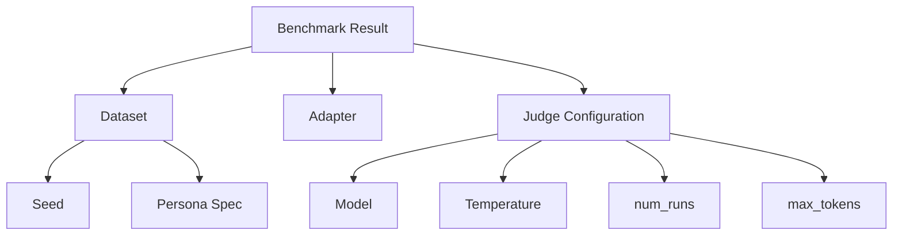

# Reproducibility Guide

Reproducibility is a core principle of the CRI Benchmark. This guide explains every factor that affects benchmark results and how to control them for consistent, comparable evaluations.

## Why Reproducibility Matters

The CRI Benchmark uses an LLM-as-judge for semantic evaluation. LLMs are inherently non-deterministic — the same prompt can produce different outputs across runs. This makes reproducibility more nuanced than traditional benchmarks with deterministic scoring.

CRI addresses this through:

1. **Deterministic dataset generation** via fixed seeds
2. **Majority-vote judging** to reduce single-call variance
3. **Low temperature settings** for near-deterministic judge output
4. **Tolerance bands** for comparing results across runs
5. **Full audit trails** in result and judge log files

## Factors Affecting Reproducibility



### 1. Dataset Seed

The `DatasetGenerator` uses a seeded PRNG. The same seed always produces the same dataset.

```python
from cri.models import GeneratorConfig
from cri.datasets.generator import DatasetGenerator

# Reproducible: same seed → same dataset
gen = DatasetGenerator(GeneratorConfig(seed=42))
dataset_a = gen.generate(persona)

gen2 = DatasetGenerator(GeneratorConfig(seed=42))
dataset_b = gen2.generate(persona)

# dataset_a and dataset_b are identical
```

The canonical datasets ship with `seed` recorded in their `metadata.json`:

```json
{
  "dataset_id": "persona-1-basic",
  "seed": 42,
  "version": "1.0.0"
}
```

**Recommendation**: Always use the canonical datasets for published comparisons. If generating custom datasets, record the seed.

### 2. Judge Model

The LLM judge model has the single largest impact on score variance.

```bash
# Default (recommended for comparisons)
cri run --adapter my-adapter --dataset ... --judge-model claude-haiku-4-5-20250315

# Alternative models
cri run --adapter my-adapter --dataset ... --judge-model gpt-4o-mini
cri run --adapter my-adapter --dataset ... --judge-model gpt-4o
```

**Recommendation**: Always report which judge model was used. The default `claude-haiku-4-5-20250315` is the reference judge for canonical comparisons.

### 3. Judge Temperature

The `BinaryJudge` defaults to `temperature=0.0` for maximum determinism:

```python
from cri.judge import BinaryJudge

# Default: deterministic
judge = BinaryJudge(
    model="claude-haiku-4-5-20250315",
    temperature=0.0,       # ← maximally deterministic
    num_runs=3,
    max_tokens=10,
)
```

Even at `temperature=0.0`, some LLM providers introduce minimal randomness. This is why majority voting is essential.

### 4. Number of Judge Runs (num_runs)

Each evaluation check is sent to the judge `num_runs` times. The final verdict is determined by majority vote.

```bash
# Default: 3 runs (recommended minimum)
cri run --adapter my-adapter --dataset ... --judge-runs 3

# Higher confidence: 5 runs (more expensive, more stable)
cri run --adapter my-adapter --dataset ... --judge-runs 5
```

| num_runs | Cost Multiplier | Stability | Recommended For |
|----------|----------------|-----------|-----------------|
| 1 | 1× | Low | Quick iteration, debugging |
| 3 | 3× | Good | Standard evaluations |
| 5 | 5× | Very good | Published results, paper submissions |
| 7 | 7× | Excellent | High-stakes comparisons |

**Recommendation**: Use `num_runs=3` for development, `num_runs=5` for published results.

### 5. Adapter Determinism

Your memory system adapter should ideally be deterministic. If it uses:

- **Random sampling**: Set a fixed seed in your adapter
- **LLM calls**: Use `temperature=0.0` and a fixed model version
- **Database queries**: Ensure consistent ordering

## Tolerance Bands for LLM-Judged Metrics

Because the judge is an LLM, scores have inherent variance. CRI defines tolerance bands for comparing results:

### Within-Run Variance

With `num_runs=3` and `temperature=0.0`, individual check verdicts typically agree 90–95% of the time. The `unanimous` field in each `JudgmentResult` tracks this:

```json
{
  "check_id": "pas-occupation",
  "verdict": "YES",
  "votes": ["YES", "YES", "YES"],
  "unanimous": true
}
```

### Cross-Run Variance

Running the full benchmark twice with identical settings typically produces scores within ±0.02–0.05 of each other:

| Dimension | Typical Variance (±) | Notes |
|-----------|---------------------|-------|
| PAS | 0.02 | Most stable — factual checks |
| DBU | 0.03 | Moderately stable |
| MEI | 0.05 | Higher variance — efficiency checks |
| TC | 0.03 | Moderately stable |
| CRQ | 0.04 | Depends on conflict complexity |
| QRP | 0.03 | Moderately stable |
| **CRI (composite)** | **0.02** | Averaging smooths variance |

### Comparing Two Systems

When comparing system A vs. system B:

| Score Difference | Interpretation |
|-----------------|---------------|
| < 0.03 | Within noise — **not statistically meaningful** |
| 0.03 – 0.05 | Likely meaningful — run again to confirm |
| 0.05 – 0.10 | Meaningful difference |
| > 0.10 | Clear, significant difference |

**Recommendation**: If two systems score within 0.03 of each other, run both at `num_runs=5` and average across 3 full benchmark runs before claiming one is better.

## How to Compare Runs

### Method 1 — Multiple Runs with Averaging

```python
import asyncio
import json
from pathlib import Path
from cri.runner import run_benchmark


async def run_n_times(adapter: str, dataset: str, n: int = 3):
    """Run the benchmark N times and report statistics."""
    scores = []

    for i in range(n):
        result = await run_benchmark(
            adapter_name=adapter,
            dataset_path=dataset,
            judge_runs=5,
            output_dir=f"results/run-{i+1}",
            output_format="json",
        )
        scores.append(result.cri_result.cri)

    mean_cri = sum(scores) / len(scores)
    variance = sum((s - mean_cri) ** 2 for s in scores) / len(scores)
    std_dev = variance ** 0.5

    print(f"CRI scores across {n} runs: {scores}")
    print(f"Mean CRI: {mean_cri:.4f} ± {std_dev:.4f}")

    return mean_cri, std_dev

asyncio.run(run_n_times("my-adapter:MyAdapter", "datasets/canonical/persona-1-basic"))
```

### Method 2 — Compare Result JSON Files

```python
import json
from pathlib import Path


def compare_results(path_a: str, path_b: str):
    """Compare two benchmark result JSON files."""
    with open(path_a) as f:
        result_a = json.load(f)
    with open(path_b) as f:
        result_b = json.load(f)

    cri_a = result_a["cri_result"]
    cri_b = result_b["cri_result"]

    print(f"{'Dimension':<12} {'System A':>10} {'System B':>10} {'Diff':>10}")
    print("-" * 44)

    for dim in ["cri", "pas", "dbu", "mei", "tc", "crq", "qrp"]:
        score_a = cri_a[dim]
        score_b = cri_b[dim]
        diff = score_b - score_a
        marker = "  ←" if abs(diff) < 0.03 else ""
        print(f"{dim.upper():<12} {score_a:>10.4f} {score_b:>10.4f} {diff:>+10.4f}{marker}")

    print()
    print("← = within noise threshold (±0.03)")


compare_results(
    "results/system-a/result.json",
    "results/system-b/result.json",
)
```

### Method 3 — Judge Log Analysis

Inspect the judge log to understand where systems differ:

```python
import json


def analyze_disagreements(log_path: str):
    """Find non-unanimous judge decisions (highest variance checks)."""
    with open(log_path) as f:
        log = json.load(f)

    non_unanimous = [
        entry for entry in log
        if not entry["unanimous"]
    ]

    print(f"Total checks: {len(log)}")
    print(f"Non-unanimous: {len(non_unanimous)} ({100 * len(non_unanimous) / len(log):.1f}%)")
    print()

    for entry in non_unanimous[:10]:
        votes = entry["votes"]
        yes = sum(1 for v in votes if v == "YES")
        no = len(votes) - yes
        print(f"  {entry['check_id']}: {yes} YES / {no} NO → {entry['verdict']}")


analyze_disagreements("results/my-system/judge_log.json")
```

## Reproducibility Checklist for Publications

When reporting CRI Benchmark results in papers or blog posts, include:

| Item | Example | Why |
|------|---------|-----|
| CRI version | `cri-benchmark==0.1.0` | Framework behavior may change between versions |
| Dataset | `persona-1-basic (seed=42)` | Different datasets produce different scores |
| Judge model | `claude-haiku-4-5-20250315` | Different judges have different evaluation biases |
| Judge temperature | `0.0` | Higher temperatures increase variance |
| Judge runs | `5` | More runs = more stable verdicts |
| Benchmark runs | `3 runs averaged` | Averaging reduces cross-run variance |
| Adapter version | `acme-memory v2.1.0` | Adapter changes affect results |

### Example Citation Block

```
CRI Benchmark Results
- Framework: cri-benchmark v0.1.0
- Dataset: persona-1-basic (canonical, seed=42, 1000 messages)
- Judge: claude-haiku-4-5-20250315, temperature=0.0, 5 runs/check
- Averaged over 3 full benchmark runs
- Composite CRI: 0.7234 ± 0.0089
```

## Configuration Reference

### BinaryJudge Parameters

| Parameter | Default | Impact on Reproducibility |
|-----------|---------|--------------------------|
| `model` | `claude-haiku-4-5-20250315` | Primary source of variance |
| `num_runs` | `3` | Higher = more stable |
| `temperature` | `0.0` | Higher = more variance |
| `max_tokens` | `10` | Rarely affects results |

### GeneratorConfig Parameters

| Parameter | Default | Impact on Reproducibility |
|-----------|---------|--------------------------|
| `seed` | `None` | **Must be set** for reproducibility |
| `simulated_days` | `90` | Affects conversation structure |
| `messages_per_day_range` | `(5, 15)` | Affects message distribution |

### ScoringConfig Parameters

| Parameter | Default | Impact |
|-----------|---------|--------|
| `dimension_weights` | PAS=0.25, DBU=0.20, ... | Changes composite CRI formula |
| `enabled_dimensions` | All seven | Disabling dimensions changes scores |

## Next Steps

- [Quick Start Guide](quickstart.md) — Run your first benchmark
- [Integration Guide](integration.md) — Connect your memory system
- [Adding New Metrics](new-metrics.md) — Create custom evaluation dimensions
- [Adding New Datasets](new-datasets.md) — Create custom benchmark scenarios
- [Methodology Overview](../methodology/overview.md) — Deep dive into evaluation methodology
