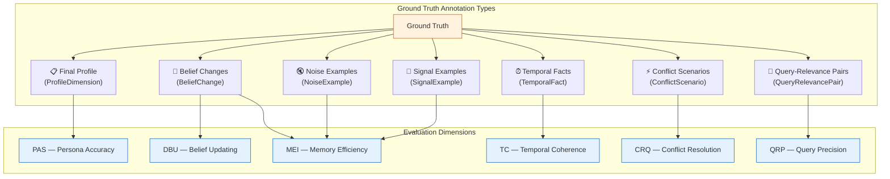
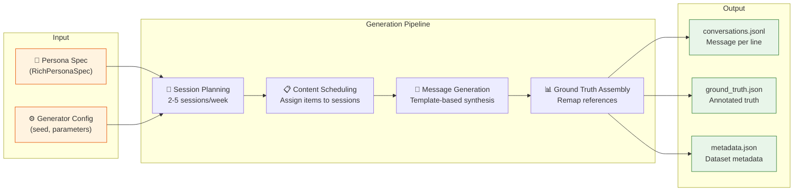
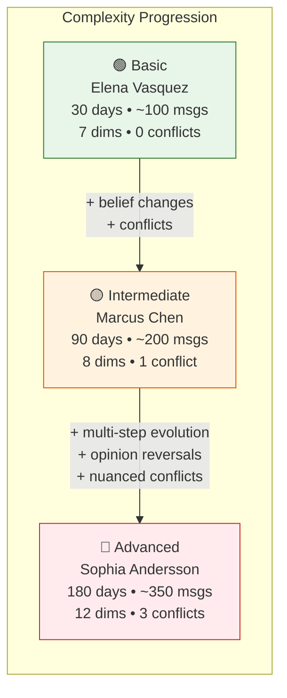

# Dataset Design & Generation Methodology

> *Good benchmarks are only as good as their data. CRI datasets are synthetic by design — ensuring privacy, reproducibility, and complete ground truth control.*

---

## Overview

The CRI Benchmark evaluates memory systems by feeding them realistic conversation data and then querying the stored knowledge against annotated ground truth. The quality of this evaluation depends entirely on the quality of the datasets: they must be realistic enough to challenge memory systems, controlled enough to measure precisely, and documented enough to reproduce exactly.

This document explains:

1. **Why synthetic data** — the rationale for fully synthetic datasets
2. **Persona specifications** — how benchmark personas are defined
3. **Ground truth annotations** — the types of knowledge encoded in each dataset
4. **Canonical datasets** — the three official CRI benchmark datasets
5. **Generation pipeline** — how datasets are generated deterministically
6. **Custom dataset creation** — how to create your own benchmark scenarios

---

## Why Synthetic Data?

CRI uses **100% synthetic conversation data**. This is a deliberate design choice with strong justification.

### The Case Against Real Data

Real conversational data presents insurmountable challenges for a benchmark:

| Problem | Impact on Benchmarking |
|---------|----------------------|
| **Privacy** | Real conversations contain PII — names, locations, medical data, relationships. No anonymization is truly safe. |
| **Ground truth** | With real data, you cannot know the "correct" answer. You'd need to ask the actual user — which doesn't scale. |
| **Reproducibility** | Real data can't be shared freely. Other researchers can't run the exact same benchmark. |
| **Control** | You can't control what real conversations contain. You can't guarantee belief changes, conflicts, or noise patterns appear. |
| **Consent** | Collecting and publishing real conversations raises ethical concerns that would limit adoption. |

### The Case For Synthetic Data

Synthetic data solves all of these problems:

- **Privacy by construction** — fictional personas have no real-world counterparts
- **Perfect ground truth** — every fact, belief change, and conflict is authored with known correct answers
- **Full reproducibility** — anyone can regenerate the exact same dataset from the same seed
- **Controlled complexity** — datasets can be designed to test specific memory properties at specific difficulty levels
- **Open distribution** — no ethical or legal barriers to sharing

### Limitations of Synthetic Data

We acknowledge that synthetic conversations may not capture every pattern found in real human conversation. Specifically:

- **Conversational flow** may be more predictable than real interactions
- **Implicit information** (tone, sarcasm, cultural context) is harder to encode
- **Long-tail scenarios** that emerge from real usage may be underrepresented

CRI mitigates these limitations through:

- Template-based generation with randomized variation
- Explicit inclusion of ambiguous and conflicting information
- Multiple personas with different communication styles
- Community contribution of new personas and scenarios

---

## Persona Specification Format

Every CRI dataset begins with a **persona specification** — a structured definition of a fictional person, their attributes, and how those attributes change over time.

### Anatomy of a Persona

A `RichPersonaSpec` contains everything needed to generate a complete benchmark dataset:

```
┌─────────────────────────────────────────────────────┐
│                  RichPersonaSpec                     │
├─────────────────────────────────────────────────────┤
│  Identity                                           │
│  ├── persona_id          (unique identifier)        │
│  ├── name                (human-readable name)      │
│  ├── description         (background narrative)     │
│  └── complexity_level    (basic|intermediate|adv.)  │
│                                                     │
│  Ground Truth Components                            │
│  ├── profile_dimensions  (final-state facts)        │
│  ├── belief_changes      (knowledge updates)        │
│  ├── conflicts           (contradictory info)       │
│  ├── temporal_facts      (time-bounded knowledge)   │
│  ├── noise_examples      (irrelevant messages)      │
│  ├── signal_examples     (fact-bearing messages)    │
│  └── query_relevance_pairs (retrieval tests)        │
│                                                     │
│  Generation Parameters                              │
│  ├── simulated_days      (timeline length)          │
│  └── target_message_count (approximate # messages)  │
└─────────────────────────────────────────────────────┘
```

### Profile Dimensions

Profile dimensions define the **final-state ground truth** — what a perfect memory system should know about the persona after processing all events.

Each dimension includes:

```json
{
  "dimension_name": "occupation",
  "value": "UX Designer",
  "query_topic": "current occupation",
  "category": "demographics"
}
```

| Field | Purpose |
|-------|---------|
| `dimension_name` | Machine-readable identifier |
| `value` | Ground truth value (string or list of strings) |
| `query_topic` | The topic string used when querying the memory system |
| `category` | Grouping for analysis (demographics, preferences, personal, worldview, professional) |

Values can be:
- **Scalar**: `"Software Engineer"`, `"34"`, `"Austin, Texas"`
- **List**: `["hiking", "reading science fiction", "cooking Italian food"]`
- **Nuanced**: `"flexitarian (mostly vegetarian but occasionally eats sushi)"` — designed to test whether systems capture subtlety

### Complexity Levels

CRI defines three complexity tiers, each testing progressively more challenging memory capabilities:

| Level | Focus | Belief Changes | Conflicts | Temporal Complexity |
|-------|-------|:--------------:|:---------:|:------------------:|
| **Basic** | Factual recall | None | None | Minimal |
| **Intermediate** | Belief updating | Multiple | Some | Moderate |
| **Advanced** | Conflict resolution | Many, multi-step | Complex, multi-source | High |

---

## Ground Truth Annotation Types

CRI datasets encode seven distinct types of ground truth annotations. Each type is designed to test a specific property of memory systems, and each maps to one or more CRI evaluation dimensions.



### 1. Final Profile (ProfileDimension)

**What:** The expected state of the persona at the end of the conversation. Each dimension represents a single facet of the persona's identity.

**Purpose:** Tests whether the memory system accurately captured the current state of the user's profile.

**Evaluation dimension:** PAS (Persona Accuracy Score)

**Example:**
```json
{
  "dimension_name": "location",
  "value": "Seattle, Washington",
  "query_topic": "current city",
  "category": "demographics"
}
```

**Design considerations:**
- Dimensions span multiple categories (demographics, preferences, personal, worldview, professional) to avoid bias toward any single domain
- Some dimensions deliberately include nuance (e.g., "flexitarian — mostly vegetarian but occasionally eats sushi") to test whether systems capture subtlety versus simplifying
- List-valued dimensions (e.g., hobbies) test multi-value tracking

### 2. Belief Changes (BeliefChange)

**What:** Facts that change during the conversation. A belief change records the old value, new value, and the approximate message where the transition occurs.

**Purpose:** Tests whether the memory system correctly updates stored knowledge when new information supersedes old information.

**Evaluation dimensions:** DBU (Dynamic Belief Updating)

**Example:**
```json
{
  "fact": "occupation",
  "old_value": "Architect",
  "new_value": "UX Designer",
  "query_topic": "current occupation",
  "changed_around_msg": 60,
  "key_messages": [55, 58, 62]
}
```

**Design considerations:**
- `changed_around_msg` anchors the change temporally for generation scheduling
- `key_messages` identifies the specific messages where the change is introduced
- Some personas have **multi-step changes** (e.g., Journalist → Freelance Writer → Author) testing whether systems track the full evolution
- Both **recency** (does the system know the new value?) and **staleness** (does it still assert the old value?) are tested

### 3. Conflict Scenarios (ConflictScenario)

**What:** Deliberately contradictory statements introduced at different points in the conversation. Each scenario includes the conflicting statements, the correct resolution, and the resolution strategy.

**Purpose:** Tests whether the memory system can detect, reason about, and correctly resolve contradictory information.

**Evaluation dimension:** CRQ (Conflict Resolution Quality)

**Example:**
```json
{
  "conflict_id": "conflict-adv-01",
  "topic": "diet",
  "conflicting_statements": [
    "I've been vegetarian for five years now. It's a core part of my identity.",
    "We went out for sushi last night and I had the most amazing salmon sashimi."
  ],
  "correct_resolution": "Sophia is mostly vegetarian but occasionally eats sushi (flexitarian). The most recent information clarifies the nuance.",
  "resolution_type": "recency",
  "introduced_at_messages": [40, 250]
}
```

**Resolution types:**
| Type | Strategy | When Used |
|------|----------|-----------|
| `recency` | Most recent statement takes precedence | Preferences that evolve over time |
| `explicit_correction` | User explicitly corrects an earlier statement | Clear "actually, I changed my mind" moments |

**Design considerations:**
- Conflicts are spaced far apart in the conversation (e.g., messages 40 and 250) to test long-range memory coherence
- Some conflicts have nuanced resolutions rather than simple replacements (e.g., the vegetarian→flexitarian example)
- Advanced personas include multiple conflicts across different domains

### 4. Temporal Facts (TemporalFact)

**What:** Facts with explicit time-bounded validity. Each temporal fact specifies when it became true, when (if ever) it stopped being true, and whether it should still be considered current.

**Purpose:** Tests whether the memory system correctly maintains temporal ordering and distinguishes current facts from historical ones.

**Evaluation dimension:** TC (Temporal Coherence)

**Example:**
```json
{
  "fact_id": "tf-int-01",
  "description": "Marcus worked as an architect",
  "value": "Architect",
  "valid_from": "2009-01-01",
  "valid_until": "2026-03-01",
  "query_topic": "occupation history",
  "should_be_current": false
}
```

**Design considerations:**
- Facts marked `should_be_current: true` must be recognized as current by the memory system
- Facts marked `should_be_current: false` should be stored as historical context, not asserted as present truth
- Some temporal chains span the same dimension (e.g., Stockholm → London → Barcelona) testing the full temporal evolution
- `valid_from` and `valid_until` may be `null` for open-ended facts

### 5. Noise Examples (NoiseExample)

**What:** Messages that a memory system **should not** store as durable user facts. These include greetings, weather inquiries, task requests, politeness expressions, and transient emotional reactions.

**Purpose:** Tests whether the memory system correctly filters out irrelevant information.

**Evaluation dimension:** MEI (Memory Efficiency Index — efficiency sub-metric)

**Example:**
```json
{
  "text": "What's the weather going to be like this weekend?",
  "reason": "Weather inquiry unrelated to persona attributes"
}
```

**Noise categories:**
- **Greetings and filler** — "Hey, how's it going?"
- **Transient questions** — "What time is it in Tokyo?"
- **Task requests** — "Can you help me draft an email?"
- **Politeness** — "Thanks, that was really useful!"
- **Social reactions** — "Ha, that's a good one!"
- **Emotional venting** — "Long day today, just need to unwind."

**Design considerations:**
- Noise examples are diverse to test multiple noise categories
- Some noise examples are deliberately close to signal (e.g., "Can you recommend a good movie?" could superficially seem like a preference) to test discrimination ability

### 6. Signal Examples (SignalExample)

**What:** Messages that a memory system **should** store because they contain durable personal facts about the user.

**Purpose:** Tests whether the memory system correctly identifies and retains important factual content.

**Evaluation dimension:** MEI (Memory Efficiency Index — coverage sub-metric)

**Example:**
```json
{
  "text": "I work as a software engineer at a startup here in Austin.",
  "target_fact": "occupation: Software Engineer, location: Austin"
}
```

**Design considerations:**
- Signal messages are written in natural conversational style, not as direct fact declarations
- Some signals embed multiple facts in a single message
- `target_fact` describes what should be extracted, enabling targeted evaluation

### 7. Query-Relevance Pairs (QueryRelevancePair)

**What:** Structured query-and-expected-results definitions that test whether the memory system retrieves the right information for a given question.

**Purpose:** Tests retrieval precision — whether the system returns relevant facts and filters out irrelevant ones.

**Evaluation dimension:** QRP (Query Response Precision)

**Example:**
```json
{
  "query_id": "qrp-int-01",
  "query": "What does Marcus do for a living?",
  "expected_relevant_facts": [
    "UX Designer",
    "previously worked as an architect"
  ],
  "expected_irrelevant_facts": [
    "pescatarian",
    "University of Oregon"
  ]
}
```

**Design considerations:**
- Each QRP tests both **recall** (are relevant facts returned?) and **precision** (are irrelevant facts excluded?)
- Queries are written in natural language, not as keyword searches
- Expected relevant facts may include historical context (e.g., "previously worked as an architect") because a comprehensive answer should reference career evolution

---

## Canonical Datasets

CRI ships with **three canonical datasets** at increasing levels of complexity. These form the official benchmark suite and must be used for any results published as "CRI scores."

### Generation Pipeline



### Dataset 1: Basic — Elena Vasquez

| Property | Value |
|----------|-------|
| **Persona** | Elena Vasquez, 34, Software Engineer |
| **Complexity** | Basic |
| **Simulated Days** | 30 |
| **Target Messages** | ~100 |
| **Profile Dimensions** | 7 (occupation, location, age, hobbies, pet, education, favorite food) |
| **Belief Changes** | 0 |
| **Conflicts** | 0 |
| **Temporal Facts** | 2 |
| **Noise Examples** | 3 |
| **Signal Examples** | 4 |
| **QRP Pairs** | 3 |

**What it tests:**
- Basic factual recall — can the system store and retrieve simple facts?
- Multi-value dimensions — hobbies are a list, requiring multi-item tracking
- Noise filtering at a basic level

**Why it exists:**
Every memory system should score well on this dataset. It establishes a **minimum competency baseline**. A system that fails here has fundamental storage or retrieval problems.

### Dataset 2: Intermediate — Marcus Chen

| Property | Value |
|----------|-------|
| **Persona** | Marcus Chen, 42, Architect → UX Designer |
| **Complexity** | Intermediate |
| **Simulated Days** | 90 |
| **Target Messages** | ~200 |
| **Profile Dimensions** | 8 (occupation, previous occupation, location, age, diet, exercise, family, education) |
| **Belief Changes** | 3 (occupation, location, diet) |
| **Conflicts** | 1 (exercise preference) |
| **Temporal Facts** | 4 |
| **Noise Examples** | 4 |
| **Signal Examples** | 5 |
| **QRP Pairs** | 4 |

**What it tests:**
- Belief updating — can the system correctly update occupation, location, and diet when they change?
- Staleness detection — does the system remove or deprecate superseded facts?
- Basic conflict resolution — the exercise preference conflict (running → yoga/swimming)
- Temporal awareness — distinguishing current from historical occupation and location

**Why it exists:**
This dataset separates **static storage systems** (append-only logs, simple vector stores) from **dynamic knowledge systems** (ontology-based, graph-based). Systems that can't update beliefs will score well on Dataset 1 but poorly here.

### Dataset 3: Advanced — Sophia Andersson

| Property | Value |
|----------|-------|
| **Persona** | Sophia Andersson, 38, Journalist → Freelance Writer → Author & Podcast Host |
| **Complexity** | Advanced |
| **Simulated Days** | 180 |
| **Target Messages** | ~350 |
| **Profile Dimensions** | 12 (occupation, occupation history, location, age, education, languages, relationship status, diet, hobbies, political views, social media stance, book genre) |
| **Belief Changes** | 5 (two occupation changes, two location changes, social media stance reversal) |
| **Conflicts** | 3 (diet nuance, social media reversal, relationship status) |
| **Temporal Facts** | 6 |
| **Noise Examples** | 5 |
| **Signal Examples** | 6 |
| **QRP Pairs** | 5 |

**What it tests:**
- **Multi-step belief evolution** — occupation changes twice (Journalist → Freelance → Author), as does location (Stockholm → London → Barcelona)
- **Complex conflict resolution** — the diet conflict requires understanding nuance (vegetarian + sushi = flexitarian), not simple replacement
- **Opinion reversals** — social media stance shifts from strong opposition to strategic usage
- **Long-range temporal coherence** — facts spanning 180 days with multiple validity windows
- **Worldview tracking** — political views, social media stance, and other non-factual attributes

**Why it exists:**
This dataset is the **true differentiator**. Systems that handle it well demonstrate sophisticated knowledge management — the ability to reason about contradictions, track multi-step evolution, and maintain nuanced representations. This is where ontology-based memory systems should excel.

### Canonical Suite Comparison



---

## Dataset File Format

Each generated dataset consists of three files in a directory:

```
persona-1-basic/
├── conversations.jsonl   # One Message JSON object per line
├── ground_truth.json     # Single GroundTruth JSON object
└── metadata.json         # Single DatasetMetadata JSON object
```

### conversations.jsonl

Each line is a JSON object representing a single message:

```json
{"message_id": 1, "role": "user", "content": "Hey, how's it going?", "timestamp": "2026-01-01T09:00:00+00:00", "session_id": "session-001", "day": 1}
{"message_id": 2, "role": "assistant", "content": "Hi! How can I help you today?", "timestamp": "2026-01-01T09:00:15+00:00", "session_id": "session-001", "day": 1}
```

Messages always alternate between `user` and `assistant` roles, forming natural conversation pairs.

### ground_truth.json

A single JSON object containing all ground truth annotations:

```json
{
  "final_profile": {
    "occupation": {
      "dimension_name": "occupation",
      "value": "Software Engineer",
      "query_topic": "occupation",
      "category": "demographics"
    }
  },
  "changes": [],
  "noise_examples": [],
  "signal_examples": [],
  "conflicts": [],
  "temporal_facts": [],
  "query_relevance_pairs": []
}
```

### metadata.json

Dataset-level metadata for reproducibility:

```json
{
  "dataset_id": "persona-1-basic",
  "persona_id": "persona-1-basic",
  "message_count": 100,
  "simulated_days": 30,
  "version": "1.0.0",
  "seed": 42
}
```

The `seed` field is critical for reproducibility — the same seed always produces the exact same dataset.

---

## Generation Pipeline: How Datasets Are Built

The `DatasetGenerator` is an **offline, deterministic tool** that transforms a `RichPersonaSpec` into a complete `ConversationDataset`. It requires no external API calls — all conversation content is generated from templates with a seeded PRNG (pseudo-random number generator).

### Pipeline Stages

```mermaid
graph TD
    subgraph "Stage 1: Session Planning"
        A["📅 Plan Sessions"]
        A1["Distribute 2-5 sessions per week"]
        A2["Allocate messages per session"]
        A3["Add ±30% variance"]
        A --> A1 --> A2 --> A3
    end

    subgraph "Stage 2: Content Scheduling"
        B["📋 Schedule Content"]
        B1["Place profile facts in early sessions"]
        B2["Place belief changes at target message positions"]
        B3["Distribute conflicts at specified positions"]
        B4["Scatter signals and noise randomly"]
        B5["Place temporal fact references"]
        B --> B1 --> B2 --> B3 --> B4 --> B5
    end

    subgraph "Stage 3: Message Generation"
        C["💬 Generate Messages"]
        C1["Convert content items to user messages"]
        C2["Generate filler messages for remaining slots"]
        C3["Shuffle within each session"]
        C4["Generate assistant responses"]
        C5["Assign timestamps across the day"]
        C --> C1 --> C2 --> C3 --> C4 --> C5
    end

    subgraph "Stage 4: Ground Truth Assembly"
        D["📊 Assemble Ground Truth"]
        D1["Copy profile dimensions from spec"]
        D2["Remap belief change message references"]
        D3["Remap conflict message references"]
        D4["Package noise/signal/temporal/QRP"]
        D --> D1 --> D2 --> D3 --> D4
    end

    A3 --> B
    B5 --> C
    C5 --> D

    style A fill:#e3f2fd,stroke:#1565c0
    style B fill:#fff3e0,stroke:#e65100
    style C fill:#e8f5e9,stroke:#2e7d32
    style D fill:#f3e5f5,stroke:#7b1fa2
```



### Stage 1: Session Planning

The generator creates a realistic multi-session conversation by:

1. **Dividing the simulated days into weeks** (7-day blocks)
2. **Selecting 2–5 session days per week** at random (mimicking natural usage patterns)
3. **Distributing target messages across sessions** with ±30% variance to avoid uniform distribution
4. **Ensuring minimum 4 messages per session** (2 user-assistant pairs)
5. **Enforcing even message counts** (conversations always have paired turns)

### Stage 2: Content Scheduling

Content items from the persona specification are assigned to specific sessions:

- **Profile dimensions** → early sessions (first third) — establishes the persona's baseline
- **Belief changes** → specific session based on `changed_around_msg` — introduces updates at the right point
- **Conflict statements** → specific sessions based on `introduced_at_messages` — ensures conflicts are spaced apart
- **Signals and noise** → randomly distributed — mimics natural conversation patterns
- **Temporal facts** → randomly distributed — temporal references appear organically

### Stage 3: Message Generation

For each session, the generator:

1. **Converts content items to user messages** using domain-specific templates:
   - Occupation facts use templates like: *"I work as a {value}. It keeps me busy but I love it."*
   - Location facts use: *"I live in {value}. It's a great city."*
   - Belief changes use: *"Actually, I need to update you — I used to {old}, but now I {new}."*
   - Generic facts use: *"By the way, my {dim} is {value}."*

2. **Fills remaining slots** with casual filler messages (greetings, small talk, random questions)

3. **Shuffles all user messages within the session** so scheduled content isn't clustered

4. **Generates assistant responses** using pattern-matching heuristics:
   - Greetings receive greeting responses
   - Personal information receives acknowledgment + optional follow-up
   - Other messages receive generic friendly responses

5. **Assigns timestamps** spread across 9:00 AM – 10:00 PM simulation time

### Stage 4: Ground Truth Assembly

The generator builds the `GroundTruth` object by:

1. **Copying profile dimensions directly** from the persona spec
2. **Remapping message references** in belief changes and conflicts to stay within the actual generated message range
3. **Including all annotation types** (noise, signal, temporal facts, QRP pairs) from the spec

### Determinism Guarantee

The generator uses a seeded `random.Random` instance:

```python
gen = DatasetGenerator(GeneratorConfig(seed=42))
```

**The same seed always produces the same dataset.** This is critical for reproducibility:

- Researchers can regenerate canonical datasets independently
- Results are tied to specific data versions
- Dataset metadata records the seed for verification

---

## Creating Custom Datasets

CRI is designed to be extensible. You can create custom datasets to test scenarios specific to your use case.

### Option 1: Define a New Persona Spec

Create a `RichPersonaSpec` with your custom persona and generate a dataset:

```python
from cri.datasets.personas.specs import RichPersonaSpec
from cri.datasets.generator import DatasetGenerator
from cri.models import (
    GeneratorConfig, ProfileDimension, BeliefChange,
    NoiseExample, SignalExample, ConflictScenario,
    TemporalFact, QueryRelevancePair,
)
from pathlib import Path

# Define your persona
my_persona = RichPersonaSpec(
    persona_id="custom-medical-professional",
    name="Dr. James Park",
    description="An ER physician transitioning to telemedicine...",
    complexity_level="intermediate",
    simulated_days=60,
    target_message_count=150,
    profile_dimensions={
        "occupation": ProfileDimension(
            dimension_name="occupation",
            value="Telemedicine Physician",
            query_topic="current occupation",
            category="demographics",
        ),
        # ... more dimensions
    },
    belief_changes=[
        BeliefChange(
            fact="occupation",
            old_value="ER Physician",
            new_value="Telemedicine Physician",
            query_topic="current occupation",
            changed_around_msg=80,
            key_messages=[75, 78, 82],
        ),
    ],
    # ... noise, signals, conflicts, temporal facts, QRPs
)

# Generate and save
gen = DatasetGenerator(GeneratorConfig(seed=42))
dataset = gen.generate(my_persona)
gen.save_dataset(dataset, Path("datasets/custom/medical-professional"))
```

### Option 2: Manually Author Dataset Files

You can also create the three dataset files manually without using the generator:

1. Write `conversations.jsonl` with your own conversation data
2. Write `ground_truth.json` with annotated truth
3. Write `metadata.json` with dataset metadata

See the [New Datasets Guide](../guides/new-datasets.md) for complete instructions and validation.

### Option 3: Contribute Upstream

Custom personas that test useful scenarios can be contributed back to CRI as additional canonical datasets. See [CONTRIBUTING.md](../../CONTRIBUTING.md) for guidelines.

### Validation

Always validate custom datasets before benchmarking:

```bash
cri validate --dataset path/to/my-dataset
```

This checks:
- Schema compliance for all three files
- Referential integrity (message IDs in ground truth exist in conversations)
- Dimension coverage (at least one query per evaluation dimension)
- Logical consistency (belief change message references are ordered)

---

## Dataset Design Principles

When creating custom datasets, follow these principles to ensure meaningful evaluation:

### 1. Signal-to-Noise Ratio

Include both high-signal and high-noise messages. A realistic conversation isn't all facts — it includes greetings, small talk, tangents, and irrelevant questions. Aim for roughly **30-40% signal messages** in your dataset.

### 2. Temporal Spacing

Space belief changes and conflicts apart in the conversation. If two contradictory statements appear in adjacent messages, the conflict is trivial. Place them at least 30-50% of the total message count apart.

### 3. Progressive Complexity

If testing a specific capability (e.g., multi-step belief changes), build toward it. Don't start with the hardest scenario — let the persona establish a baseline before introducing complexity.

### 4. Nuance Over Extremes

The most informative tests involve nuance. Instead of "is vegetarian" → "is omnivore", consider "is vegetarian" → "is mostly vegetarian but occasionally eats sushi". This tests whether systems can represent graduated knowledge rather than binary states.

### 5. Cross-Domain Coverage

Ensure your profile dimensions span multiple domains. Don't test only demographics — include preferences, worldview, professional attributes, and relationships. Different domains may reveal different failure modes.

### 6. Explicit Ground Truth

Every fact you expect the system to know must be grounded in the conversation data. If you include `occupation: "Teacher"` in the final profile, there must be at least one message where the persona mentions being a teacher.

---

## Relationship to Evaluation Dimensions

Each annotation type feeds into specific evaluation dimensions. The table below summarizes how datasets connect to scoring:

| Annotation Type | Primary Dimension | What's Checked |
|----------------|-------------------|----------------|
| Final Profile | **PAS** | Does the system know each current fact? |
| Belief Changes | **DBU** | Did the system update to the new value? Does it still assert the old value? |
| Noise Examples | **MEI** (efficiency) | Did the system incorrectly store noise as fact? |
| Signal Examples | **MEI** (coverage) | Did the system correctly store important facts? |
| Conflict Scenarios | **CRQ** | Did the system resolve contradictions correctly? |
| Temporal Facts | **TC** | Does the system distinguish current from historical facts? |
| Query-Relevance Pairs | **QRP** | Does the system return relevant facts and exclude irrelevant ones? |

For detailed information on how each dimension is scored, see the [individual metric documentation](metrics/).

---

## Further Reading

- [Evaluation Methodology Overview](overview.md) — how the full evaluation pipeline works
- [Judge Methodology](judge.md) — how LLM-as-judge evaluates responses
- [New Datasets Guide](../guides/new-datasets.md) — step-by-step custom dataset creation
- [Reproducibility Guidelines](../guides/reproducibility.md) — ensuring deterministic results
- [Individual Metric Documentation](metrics/) — PAS, DBU, MEI, TC, CRQ, QRP details
