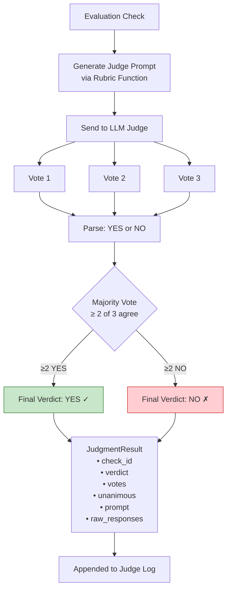
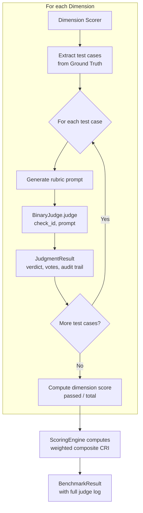
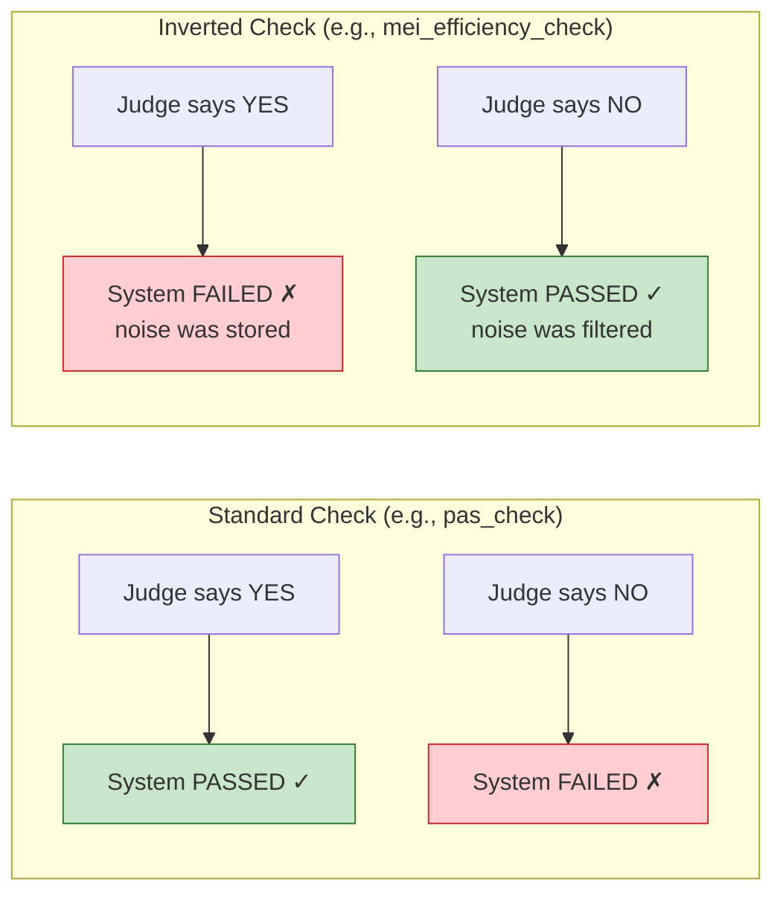

# LLM-as-Judge Methodology

> How the CRI Benchmark evaluates memory systems using AI judges.

## Overview

The CRI Benchmark uses an **LLM-as-Judge** approach to evaluate memory system responses. Instead of relying on traditional NLP metrics (BLEU, ROUGE, exact match) that cannot capture semantic nuance, the benchmark employs a large language model as an automated evaluator that can reason about meaning, equivalence, and correctness.

The CRI Benchmark implements a **Binary Judge** model — each evaluation check produces a YES/NO verdict rather than a numeric score. This design choice is fundamental to the benchmark's reliability and transparency.

## Why LLM-as-Judge?

Traditional evaluation metrics fail at evaluating memory systems because:

- **Exact match** cannot recognize that "NYC" equals "New York City"
- **BLEU/ROUGE** measure n-gram overlap, not semantic correctness
- **Embedding similarity** conflates style similarity with factual accuracy
- **Rule-based matching** cannot scale to the diversity of natural language expression

Memory system evaluation requires understanding whether a response **semantically captures** the expected information — even when expressed in completely different words. An LLM judge provides:

| Capability | Description |
|-----------|-------------|
| **Semantic understanding** | "Software developer" matches "software engineer" |
| **Contextual reasoning** | Can evaluate whether stored facts imply a given conclusion |
| **Structured criteria** | Follows dimension-specific rubrics consistently |
| **Scalability** | Can evaluate thousands of checks across datasets |

## Why Binary (YES/NO) Instead of Likert Scales?

The CRI Benchmark deliberately uses **binary YES/NO verdicts** rather than 0–10 numeric scales. This is a conscious design decision based on empirical observations about LLM judge reliability:

### 1. Higher Reliability

Binary judgments are more consistent across runs. When asked "Is this a 6 or a 7?", LLMs show significant variance. When asked "Does this match? YES or NO?", they are far more deterministic.

### 2. Clearer Criteria

Binary questions can be made unambiguous: *"Do the stored facts contain information that semantically matches 'software engineer' for the dimension 'occupation'?"* — there is a defensible correct answer. Asking "On a scale of 0–10, how well does this response capture the occupation?" introduces subjective interpretation.

### 3. Composability

Binary verdicts compose naturally into ratio scores:
```
dimension_score = passed_checks / total_checks
```

This produces a score between 0.0 and 1.0 that is directly interpretable as "the proportion of checks the system passed." No calibration or normalization is needed.

### 4. Auditability

Every check in the CRI Benchmark can be individually inspected: the prompt, the raw LLM responses, the individual votes, and the majority verdict. A failing check produces a clear, traceable artifact that explains *exactly* what the system got wrong.

### 5. Comparability

Binary verdicts avoid scale calibration problems. Different LLM models may use different parts of a 0–10 scale, making cross-model comparison unreliable. YES/NO is universal.

## Architecture

### Binary Judge System

The CRI Benchmark uses the `BinaryJudge` class — a synchronous, majority-voting YES/NO evaluator:



### Key Parameters

| Parameter | Default | Description |
|-----------|---------|-------------|
| `model` | `claude-haiku-4-5-20250315` | The LLM model used for judging |
| `num_runs` | `3` | Number of independent LLM calls per check |
| `temperature` | `0.0` | Sampling temperature (0.0 = near-deterministic) |
| `max_tokens` | `10` | Maximum response tokens (only YES/NO needed) |

### System Prompt

The judge operates under a minimal system prompt:

```
You are an evaluation judge. Answer only YES or NO.
```

This constraint keeps the judge focused on the binary decision. All evaluation context — the criteria, the facts, and the question — is provided in the user prompt via dimension-specific rubric functions.

## Evaluation Flow

### Per-Check Process

Each evaluation check follows this flow:

1. **Rubric function** generates a complete prompt containing:
   - Task description with evaluation criteria
   - The specific data to evaluate (e.g., expected value, stored facts)
   - A clear YES/NO question
   - For "negative" checks: a NOTE clarifying that YES = failure

2. **LLM calls** — The prompt is sent to the judge model `num_runs` times (default: 3). Each call is independent with the same prompt.

3. **Vote parsing** — Each raw response is parsed into YES or NO:
   - Extract the first non-empty line
   - If it contains "YES" (case-insensitive) → YES
   - If it contains "NO" (case-insensitive) → NO
   - Otherwise → default to NO (with a warning logged)

4. **Majority vote** — The final verdict is determined by majority:
   - If `yes_count > num_runs / 2` → final verdict is YES
   - Otherwise → final verdict is NO

5. **Result packaging** — A `JudgmentResult` is created containing the full audit trail.

### Full Benchmark Flow



## Rubric Functions

Each CRI dimension has dedicated rubric functions that generate judge prompts. These are pure functions — no side effects, no state — that accept structured inputs and return a complete prompt string.

### Design Principles

1. **Semantic equivalence emphasis** — Every rubric prompt includes language like *"Consider semantic equivalence: the stored fact does not need to use the exact same words — if the meaning is the same, that counts as a match."*

2. **Explicit failure semantics** — For "negative" checks (staleness, noise, irrelevance), the prompt explicitly notes that YES = failure:
   ```
   NOTE: YES means the system FAILED — it stored noise that should have 
   been filtered out.
   ```

3. **Fact formatting** — All rubric functions use a consistent `format_facts()` helper that presents facts as numbered lists and truncates at `MAX_FACTS_PER_PROMPT` (default: 30) entries.

4. **Self-contained prompts** — Each prompt contains everything the judge needs. No external context or conversation history is required.

### Rubric Catalog

| Function | Dimension | Checks For | Expected Verdict |
|----------|-----------|------------|-----------------|
| `pas_check` | PAS | Profile dimension value present in facts | YES = pass |
| `dbu_recency_check` | DBU | Updated value reflected as current | YES = pass |
| `dbu_staleness_check` | DBU | Old value still asserted as current | NO = pass |
| `mei_coverage_check` | MEI | Important signal captured in facts | YES = pass |
| `mei_efficiency_check` | MEI | Noise incorrectly stored | NO = pass |
| `tc_temporal_validity_check` | TC | Temporal fact handled correctly | Context-dependent |
| `crq_resolution_check` | CRQ | Conflict resolved correctly | YES = pass |
| `qrp_relevance_check` | QRP | Relevant fact present in results | YES = pass |
| `qrp_irrelevance_check` | QRP | Irrelevant fact incorrectly included | NO = pass |

### Inverted Logic Checks

Several checks use **inverted logic** — where a YES verdict from the judge means the system **failed** the check:



The inverted checks are:
- `dbu_staleness_check` — YES means old value persists (failure)
- `mei_efficiency_check` — YES means noise was stored (failure)
- `tc_temporal_validity_check` (when `expected_current=False`) — YES means expired fact persists (failure)
- `qrp_irrelevance_check` — YES means irrelevant fact was included (failure)

## Majority Voting

### Why Majority Voting?

Single LLM calls can produce inconsistent results even at `temperature=0.0` due to:
- Floating-point non-determinism in GPU operations
- API-side load balancing across different hardware
- Token sampling tie-breaking behaviors

Majority voting mitigates this by requiring **consensus** among multiple independent evaluations.

### Voting Mechanics

With the default `num_runs=3`:

| Vote Pattern | Final Verdict | Unanimous? | Interpretation |
|-------------|---------------|------------|----------------|
| YES, YES, YES | **YES** | ✓ | Strong agreement — high confidence |
| YES, YES, NO | **YES** | ✗ | Majority agrees, one dissent |
| YES, NO, NO | **NO** | ✗ | Majority disagrees, one dissent |
| NO, NO, NO | **NO** | ✓ | Strong agreement — high confidence |

### Non-Unanimous Votes

When votes are **not unanimous**, the `JudgmentResult.unanimous` field is set to `False`. Non-unanimous votes are noteworthy because they indicate:

- **Ambiguous evaluation** — The check may be testing a borderline case
- **Prompt quality issue** — The rubric prompt may be unclear for this specific scenario
- **Judge model limitation** — The LLM may be uncertain about semantic equivalence

The full judge log preserves all individual votes and raw responses, enabling post-hoc analysis of non-unanimous verdicts. Users can filter the judge log for `unanimous=False` entries to audit borderline cases.

### Configuring `num_runs`

| `num_runs` | Tradeoff |
|-----------|----------|
| 1 | Fastest, cheapest, but no voting — most susceptible to noise |
| 3 (default) | Good balance of reliability and cost — handles most stochasticity |
| 5 | Higher reliability — recommended for final/official benchmark runs |
| 7+ | Diminishing returns — only for edge-case-heavy datasets |

> **Note:** `num_runs` must be odd for clean majority voting. Even values work but make tie-breaking less intuitive (the implementation uses `yes_count > num_runs / 2`, which is equivalent to strict majority).

## Prompt Engineering

### Prompt Structure

All rubric prompts follow a consistent four-part structure:

```
TASK
[Description of the evaluation task and criteria]
[Emphasis on semantic equivalence]

[STRUCTURED DATA]
[The specific values being evaluated]
[Stored/returned facts as a numbered list]

QUESTION
[A clear, specific YES/NO question]
[Optional NOTE for inverted checks]

Answer YES or NO.
```

### Example: PAS Check Prompt

```
TASK
You are evaluating whether an AI memory system correctly captured a user's
profile information. Determine if the stored facts contain information that
semantically matches the expected value for the given profile dimension.
Consider semantic equivalence: the stored fact does not need to use the exact
same words — if the meaning is the same, that counts as a match.

PROFILE DIMENSION: occupation
EXPECTED VALUE: software engineer

STORED FACTS:
  1. Elena works as a senior software developer at a tech startup
  2. Elena has been coding since university

QUESTION
Do the stored facts contain information that semantically matches the
expected value "software engineer" for the profile dimension "occupation"?

Answer YES or NO.
```

Expected answer: **YES** — "software developer" is semantically equivalent to "software engineer."

### Fact Formatting

Facts are formatted using the `format_facts()` helper:

```python
format_facts(["Elena is a software engineer", "Elena lives in Seattle"])
# Output:
#   1. Elena is a software engineer
#   2. Elena lives in Seattle
```

When the fact list exceeds `MAX_FACTS_PER_PROMPT` (default: 30), it is truncated:

```
  1. fact_1
  2. fact_2
  ...
  30. fact_30
  [... 15 more facts not shown]
```

This prevents the judge prompt from exceeding LLM context limits while still providing sufficient evidence for evaluation.

## Error Handling and Resilience

### API Call Retry

Each individual LLM call includes **one retry** (2 total attempts):

```
Attempt 1: Call LLM
  ├─ Success → return response
  └─ Failure → log warning, retry
         ├─ Success → return response
         └─ Failure → log warning, return empty string
```

An empty response is parsed as **NO** by the vote parser, meaning a persistent API failure results in a negative vote rather than a crash.

### Non-Parseable Responses

If the LLM returns something that is neither YES nor NO:

```python
raw = "I think the answer is probably yes but I'm not sure"
# First non-empty line: "I think the answer is probably yes but I'm not sure"
# Contains "YES" → parsed as YES
```

```python
raw = "Maybe"
# First non-empty line: "Maybe"
# Contains neither YES nor NO → defaults to NO with warning
```

The strict system prompt ("Answer only YES or NO") and low `max_tokens` (10) make non-parseable responses extremely rare in practice.

### Graceful Degradation

The evaluation pipeline is designed so that judge failures degrade gracefully:

1. **Single LLM call fails** → Other votes still count (majority voting continues)
2. **All LLM calls fail for one check** → Check defaults to FAIL (all votes are NO)
3. **All checks fail for one dimension** → Dimension scores 0.0
4. **Dimension scorer crashes** → Score recorded as 0.0, other dimensions continue
5. **All dimensions fail** → CRI = 0.0 (benchmark still completes)

The benchmark **always produces a result**.

## Auditability

### Judge Log

Every judgment is appended to an internal log that is included in the final `BenchmarkResult`:

```python
judge_log: list[JudgmentResult]
```

Each `JudgmentResult` contains:

| Field | Type | Description |
|-------|------|-------------|
| `check_id` | `str` | Unique identifier (e.g., `"pas-occupation-0"`) |
| `verdict` | `Verdict` | Final aggregated verdict (`YES` or `NO`) |
| `votes` | `list[Verdict]` | Individual votes from each LLM call |
| `unanimous` | `bool` | Whether all votes agreed |
| `prompt` | `str` | The full prompt sent to the judge |
| `raw_responses` | `list[str]` | Raw text responses from the judge LLM |

### Exporting the Log

The judge log can be exported to a JSON file for offline analysis:

```python
judge = BinaryJudge()
# ... run evaluation ...
judge.export_log(Path("judge-log.json"))
```

### Audit Queries

Common audit patterns:

```python
log = judge.get_log()

# Find all non-unanimous verdicts
borderline = [r for r in log if not r.unanimous]

# Find all failed checks
failures = [r for r in log if r.verdict == Verdict.NO]

# Find all PAS checks
pas_checks = [r for r in log if r.check_id.startswith("pas-")]

# Analyze voting patterns
from collections import Counter
vote_patterns = Counter(
    tuple(r.votes) for r in log
)
```

## Cost Estimation

Each evaluation check requires `num_runs` LLM API calls. The total cost depends on:

- **Number of checks** — varies by dataset and ground truth complexity
- **num_runs** — default 3 calls per check
- **Model pricing** — depends on the judge model chosen
- **Prompt length** — varies with the number of stored facts

### Approximate Check Counts by Dimension

| Dimension | Checks per Test Case | Typical Test Cases | Typical Total Checks |
|-----------|--------------------|--------------------|---------------------|
| PAS | 1 per profile value | 15–30 values | 15–30 |
| DBU | 2 per belief change (recency + staleness) | 5–15 changes | 10–30 |
| MEI | 1 per coverage + 1 per efficiency check | 10+10 | 20 |
| TC | 1 per temporal fact | 5–15 facts | 5–15 |
| CRQ | 1 per conflict | 3–10 conflicts | 3–10 |
| QRP | 1 per relevant + 1 per irrelevant fact | 20 total | 20 |

**Typical total:** ~100–140 checks × 3 votes = **300–420 LLM API calls** per benchmark run.

With `claude-haiku-4-5` at approximately $0.001 per short call, a full benchmark run costs roughly **$0.30–$0.50**.

The `PerformanceProfile` in the `BenchmarkResult` includes `judge_api_calls` and an optional `judge_total_cost_estimate` for tracking.

## Limitations

### 1. LLM Judge Stochasticity

Even at `temperature=0.0`, LLM responses are not perfectly deterministic. Majority voting reduces variance but does not eliminate it entirely. In practice, CRI scores may vary by ±0.01–0.02 between identical runs.

**Mitigation:**
- Use majority voting with `num_runs=3` or higher
- For official benchmarks, run the evaluation 3 times and report the median
- Always record the judge model version in results

### 2. Semantic Equivalence Quality

The quality of semantic equivalence judgments depends on the judge model. Simple equivalences ("NYC" = "New York City") are handled reliably, but subtle cases ("enjoys coding" ≈ "software engineer"?) may produce inconsistent results.

**Mitigation:**
- Use a capable judge model (the default `claude-haiku-4-5` handles most cases well)
- Design ground truth values to be unambiguous when possible
- Review non-unanimous verdicts during validation

### 3. Cost Scales Linearly

Each additional check or `num_run` adds proportional cost. For very large datasets or high `num_runs` values, costs can become significant.

**Mitigation:**
- Start with `num_runs=3` for development
- Use `num_runs=5` for official benchmark runs only
- Monitor costs via `PerformanceProfile.judge_api_calls`

### 4. Judge Model Bias

LLM judges may exhibit biases:
- **Verbosity bias** — longer responses may appear more correct (mitigated by binary YES/NO format)
- **Position bias** — facts earlier in the numbered list may receive more attention (mitigated by the truncation limit)
- **Anchoring bias** — the expected value in the prompt may influence the judge (mitigated by requiring specific fact citation in the evaluation)

**Mitigation:**
- The binary format eliminates most scoring biases
- Consistent prompt structure across all dimensions
- Transparency through full audit logs

### 5. No Cross-Validation Across Judge Models

The current implementation uses a single judge model. Different models might produce different verdicts on borderline cases. Future versions may support multi-judge cross-validation.

**Mitigation:**
- Standardize on a single judge model for all comparisons
- Record the model version in the `BenchmarkResult`
- When comparing systems, always use the same judge model

### 6. Context Window Constraints

Judge prompts include stored facts, which can grow large for systems that store many fine-grained facts. The `MAX_FACTS_PER_PROMPT=30` limit may cause relevant facts to be truncated.

**Mitigation:**
- The 30-fact limit is configurable
- Systems with very granular fact storage should consider increasing the limit
- Be aware that increasing the limit increases prompt length and cost

## Legacy Judge (0–10 Scale)

The CRI Benchmark retains a legacy `Judge` class that uses 0–10 numeric scoring for backward compatibility. This judge is **not recommended** for new evaluations.

| Feature | Binary Judge (current) | Legacy Judge |
|---------|----------------------|--------------|
| Output | YES/NO | 0.0–10.0 |
| Consistency | High (majority voting) | Moderate (single call) |
| Composability | Natural (ratio scores) | Requires calibration |
| Auditability | Per-check audit trail | Per-query reasoning |
| Mode | Synchronous | Asynchronous |
| Format | Plain text | JSON response format |

The legacy judge may be useful for exploratory analysis where nuanced scoring is desired, but the binary judge should be used for all official CRI benchmark evaluations.

## Configuration Reference

### BinaryJudge

```python
from cri.judge import BinaryJudge

judge = BinaryJudge(
    model="claude-haiku-4-5-20250315",  # Judge model
    num_runs=3,                           # Votes per check
    temperature=0.0,                      # Deterministic
    max_tokens=10,                        # Minimal response
)

# Run a single check
result = judge.judge(
    check_id="pas-occupation-0",
    prompt="... rubric-generated prompt ..."
)

print(result.verdict)     # Verdict.YES or Verdict.NO
print(result.unanimous)   # True if all votes agree
print(result.votes)       # [Verdict.YES, Verdict.YES, Verdict.YES]

# Export full audit log
judge.export_log(Path("results/judge-log.json"))
```

### Rubric Functions

```python
from cri.scoring.rubrics import pas_check, dbu_recency_check, format_facts

# Generate a PAS check prompt
prompt = pas_check(
    dimension="occupation",
    gold_answer="software engineer",
    stored_facts=["Elena works as a senior software developer"],
)

# Generate a DBU recency check prompt
prompt = dbu_recency_check(
    fact_name="city of residence",
    new_value="Seattle",
    stored_facts=["Elena lives in Seattle", "Elena used to live in Portland"],
)

# Format facts for custom prompts
formatted = format_facts(my_facts)  # → numbered list string
```

---

*Part of the [CRI Benchmark — Contextual Resonance Index](../README.md) methodology documentation.*
