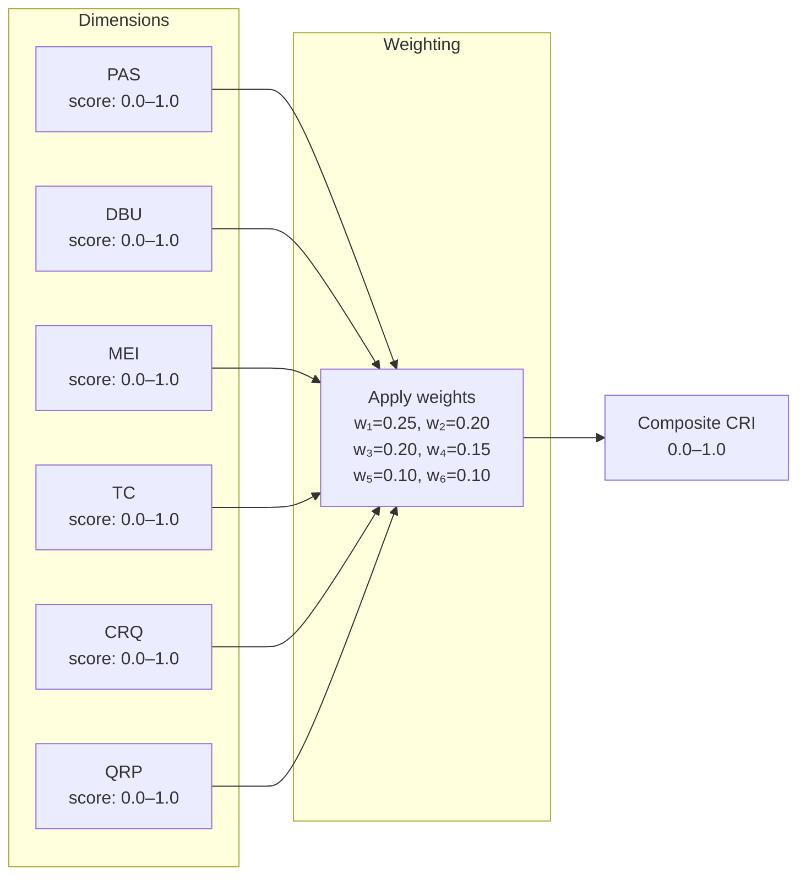
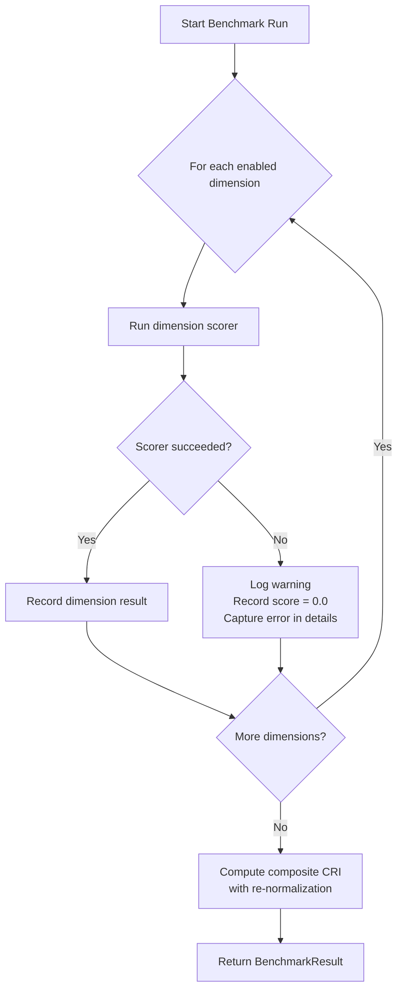
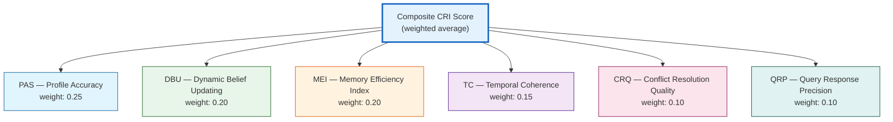

# Composite CRI Score

> The single number that summarizes a memory system's overall quality.

## Overview

The **Composite CRI Score** is a weighted average of all dimension scores, producing a single value between **0.0** and **1.0** that represents the overall quality of an AI memory system. It is the headline metric of the CRI Benchmark — the number that appears on leaderboards, comparison tables, and summary reports.

The composite score is designed to:

- **Summarize** a complex multi-dimensional evaluation in a single, interpretable number
- **Balance** the relative importance of different memory capabilities
- **Support customization** through configurable weights for different use cases
- **Enable comparison** across systems, configurations, and versions

## Formula

```
CRI = w₁×PAS + w₂×DBU + w₃×MEI + w₄×TC + w₅×CRQ + w₆×QRP
```

Where each dimension score is on a 0.0–1.0 scale (computed via [binary LLM judge](../judge.md) evaluations), and the weights w₁…w₆ sum to exactly 1.0.

### Default Weights

| Dimension | Code | Default Weight | Rationale |
|-----------|------|----------------|-----------|
| Persona Accuracy Score | PAS | **0.25** (25%) | Factual recall is the foundational capability — if a system can't remember basic facts, nothing else matters |
| Dynamic Belief Updating | DBU | **0.20** (20%) | Belief updating is critical for long-term utility; stale facts are worse than no facts |
| Memory Efficiency Index | MEI | **0.20** (20%) | Storage efficiency directly impacts retrieval quality and system reliability |
| Temporal Coherence | TC | **0.15** (15%) | Temporal reasoning is important but depends on DBU working correctly first |
| Conflict Resolution Quality | CRQ | **0.10** (10%) | Advanced capability; starts with lower weight pending broader validation |
| Query Response Precision | QRP | **0.10** (10%) | Retrieval precision is important but partially correlated with PAS and MEI |

### Weight Design Rationale

The default weights reflect a deliberate prioritization:

1. **PAS is highest (0.25)** because profile accuracy is the primary purpose of a memory system. Without correct recall, no higher-order reasoning matters.

2. **The original three metrics (PAS, DBU, MEI) receive higher combined weight (0.65)** because they represent proven, well-understood evaluation dimensions derived from the benchmark prototype.

3. **The newer metrics (TC, CRQ, QRP) start with lower combined weight (0.35)** because they are newer additions that may be refined as the benchmark matures.

4. **All weights are configurable**, enabling teams to adjust emphasis based on their specific use case (see [Custom Weight Profiles](#custom-weight-profiles)).

### Computation Flow



## Weight Validation

The scoring engine enforces a strict invariant: **dimension weights must sum to approximately 1.0** (tolerance ±0.01). If the weights violate this constraint, a `ValueError` is raised before any evaluation begins.

```python
total = sum(config.dimension_weights.values())
if abs(total - 1.0) > 0.01:
    raise ValueError(f"Dimension weights must sum to 1.0, got {total:.4f}")
```

This ensures the composite CRI score always falls within the 0.0–1.0 range and is directly interpretable as a proportion.

## Weight Re-Normalization

When a dimension is missing from results (e.g., because it was disabled, has no test data, or its scorer raised an error), the engine **re-normalizes** the remaining weights so the composite score stays on the 0.0–1.0 scale:

```python
# Only include dimensions that were actually scored
active_weights = {dim: weight for dim, weight in config.dimension_weights.items()
                  if dim in dimension_results}

total_weight = sum(active_weights.values())
normalized = {dim: w / total_weight for dim, w in active_weights.items()}

composite = sum(normalized[dim] * dimension_results[dim].score for dim in normalized)
```

### Re-Normalization Example

If TC and CRQ are not evaluated (e.g., the dataset has no temporal facts or conflicts):

| Dimension | Original Weight | Re-Normalized Weight |
|-----------|----------------|---------------------|
| PAS | 0.25 | 0.25 / 0.75 = 0.333 |
| DBU | 0.20 | 0.20 / 0.75 = 0.267 |
| MEI | 0.20 | 0.20 / 0.75 = 0.267 |
| QRP | 0.10 | 0.10 / 0.75 = 0.133 |

The composite still ranges from 0.0–1.0 and can be meaningfully compared with results that include all six dimensions — with the caveat that missing dimensions should be noted.

## Score Interpretation

### Rating Scale

| CRI Score | Rating | Description |
|-----------|--------|-------------|
| **0.90 – 1.00** | Exceptional | The system demonstrates exceptional memory capabilities across all dimensions. Near-perfect factual recall, correct belief updating, strong memory efficiency, temporal awareness, conflict resolution, and retrieval precision. |
| **0.70 – 0.89** | Strong | Strong performance with minor gaps. The system handles most memory challenges well, with occasional misses in advanced scenarios (e.g., subtle conflicts, ambiguous temporal boundaries). |
| **0.50 – 0.69** | Moderate | Solid baseline performance. The system captures key facts and handles straightforward updates but struggles with nuanced scenarios such as gradual changes, complex conflicts, or time-bounded facts. |
| **0.30 – 0.49** | Weak | Significant gaps in memory capabilities. The system may recall some facts but fails at important memory operations like belief updating or memory efficiency. |
| **0.00 – 0.29** | Poor | Fundamental memory failures. The system either stores almost nothing, stores everything indiscriminately, or fails at basic recall. No-memory baselines typically fall here. |

### Reading the Score with Dimension Breakdown

The composite score is most informative when read alongside the individual dimension scores. Two systems with CRI = 0.70 may have very different capability profiles:

**System A — Balanced performer:**
```
CRI:  0.70
PAS:  0.75   DBU:  0.72   MEI:  0.68
TC:   0.65   CRQ:  0.62   QRP:  0.70
```

**System B — Specialized performer:**
```
CRI:  0.70
PAS:  0.95   DBU:  0.85   MEI:  0.80
TC:   0.30   CRQ:  0.25   QRP:  0.40
```

System B excels at basic recall and updating but fails at temporal reasoning and conflict resolution. Depending on the use case, System A or B might be preferable — the composite score alone cannot tell you which.

**Recommendation:** Always report the full dimension breakdown alongside the composite CRI score.

## Custom Weight Profiles

The default weights can be overridden via the `ScoringConfig` to emphasize dimensions that matter most for a specific use case:

### User Profiling Focus

For systems primarily used for user profiling and personalization:

```python
ScoringConfig(dimension_weights={
    "PAS": 0.35,   # Profile accuracy is paramount
    "DBU": 0.25,   # Keeping profiles current matters
    "MEI": 0.20,   # Memory efficiency affects profile quality
    "TC":  0.10,   # Less critical for static profiles
    "CRQ": 0.05,   # Conflicts are rare in direct interactions
    "QRP": 0.05,   # Retrieval is simpler with structured profiles
})
```

### Knowledge Management Focus

For systems managing complex, evolving knowledge bases:

```python
ScoringConfig(dimension_weights={
    "PAS": 0.15,   # Base recall is assumed
    "DBU": 0.25,   # Keeping knowledge current is critical
    "MEI": 0.15,   # Memory efficiency matters but isn't dominant
    "TC":  0.20,   # Temporal validity is central
    "CRQ": 0.15,   # Conflict resolution is frequent
    "QRP": 0.10,   # Retrieval precision matters
})
```

### Conversational AI Focus

For memory systems powering conversational assistants:

```python
ScoringConfig(dimension_weights={
    "PAS": 0.20,   # Remembering user facts
    "DBU": 0.15,   # Updating is important but less frequent
    "MEI": 0.15,   # Memory efficiency
    "TC":  0.15,   # Temporal awareness in conversation
    "CRQ": 0.10,   # Conflict handling
    "QRP": 0.25,   # Retrieval precision is paramount for response quality
})
```

### Equal Weights (Legacy)

For unbiased comparison where no dimension is prioritized:

```python
ScoringConfig(dimension_weights={
    "PAS": 1/6,   "DBU": 1/6,   "MEI": 1/6,
    "TC":  1/6,   "CRQ": 1/6,   "QRP": 1/6,
})
```

> **Note:** When comparing systems across different weight profiles, always report the weights used. CRI scores computed with different weights are **not directly comparable**.

## Statistical Metadata

Each dimension score in the detailed results includes metadata that provides statistical context beyond the headline number:

| Metadata Field | Description |
|---------------|-------------|
| `passed_checks` | Number of individual binary checks that passed |
| `total_checks` | Total number of binary checks evaluated |
| `details` | Per-check breakdown with check IDs, verdicts, and judge responses |

For the legacy scoring engine (0–10 scale), additional statistical metadata is available:

| Metadata Field | Description |
|---------------|-------------|
| `mean` | Average of individual query scores |
| `std` | Standard deviation — variability in scoring |
| `ci_95_lower` / `ci_95_upper` | 95% confidence interval for the mean |
| `min` / `max` | Range of individual scores |
| `count` | Number of individual evaluations |

### Why Statistical Metadata Matters

The composite CRI score and per-dimension scores are averages. Averages can hide important patterns:

- **High mean, high standard deviation** → inconsistent performance. The system aces some checks but completely fails others. This suggests specific capability gaps rather than general weakness.
- **High mean, low standard deviation** → consistent performance. The system reliably handles all check types.
- **Similar means, different confidence intervals** → different reliability levels. A system with a narrow CI is more predictable.

## Error Handling

The scoring engine is designed for **resilience**: if any individual dimension scorer raises an exception, the engine:

1. Logs a warning with the exception details
2. Records a score of **0.0** for that dimension
3. Continues evaluating the remaining dimensions
4. The benchmark **always completes**

This means a single broken scorer or unexpected adapter behavior will not cause the entire benchmark run to fail. The zero score for the failed dimension will lower the composite CRI, and the error details will appear in the `details` field of the `DimensionResult`.



## Relationship to Individual Dimensions

The composite CRI score sits at the top of the metric hierarchy:



Each dimension measures a distinct property of long-term memory behavior:

| Dimension | What It Measures | Key Question |
|-----------|-----------------|--------------|
| [PAS](./pas.md) | Factual accuracy of stored profiles | *Does the system remember what it was told?* |
| [DBU](./dbu.md) | Ability to update beliefs | *When a fact changes, does the system reflect the change?* |
| [MEI](./mei.md) | Memory storage efficiency | *Does the system store knowledge efficiently with good coverage?* |
| [TC](./tc.md) | Temporal awareness | *Does the system understand what is current vs. outdated?* |
| [CRQ](./crq.md) | Conflict resolution | *When information conflicts, does the system resolve it correctly?* |
| [QRP](./qrp.md) | Retrieval precision | *Does the system retrieve the right knowledge for a given query?* |

## Baseline Reference Points

Expected CRI ranges for different system architectures:

| System Type | Expected CRI Range | Notes |
|-------------|-------------------|-------|
| **No-memory baseline** | 0.00 – 0.10 | Cannot recall, update, or retrieve |
| **Full-context window** | 0.40 – 0.65 | Perfect recall within window but poor at updating, filtering, and temporal reasoning |
| **Simple RAG (vector store)** | 0.35 – 0.60 | Good recall but weak at updating and conflict resolution |
| **Ontology-based memory** | 0.70 – 1.00 | Structured knowledge enables strong performance across all dimensions |

These are indicative ranges based on architectural properties. Actual scores depend heavily on implementation quality, dataset difficulty, and the specific scenario being evaluated.

## Reproducibility

For the composite CRI score to be reproducible across runs:

1. **Same dataset** — Use identical conversation datasets and ground truth
2. **Same weights** — Use identical dimension weights
3. **Same judge model** — Use the same LLM judge model and configuration
4. **Same judge parameters** — Use the same `temperature` (default: 0.0) and `num_runs` (default: 3)
5. **Record the configuration** — The `BenchmarkResult` includes `dimension_weights` and the full judge log for auditability

Even with all precautions, minor variations (±0.02) may occur between runs due to LLM judge stochasticity. The [LLM-as-Judge](../judge.md) documentation discusses mitigation strategies.

## API Reference

### ScoringConfig

```python
from cri.models import ScoringConfig

config = ScoringConfig(
    dimension_weights={
        "PAS": 0.25, "DBU": 0.20, "MEI": 0.20,
        "TC": 0.15, "CRQ": 0.10, "QRP": 0.10,
    },
    enabled_dimensions=["PAS", "DBU", "MEI", "TC", "CRQ", "QRP"],
)
```

### ScoringEngine

```python
from cri.scoring.engine import ScoringEngine
from cri.judge import BinaryJudge

engine = ScoringEngine(
    ground_truth=ground_truth,
    judge=BinaryJudge(),
    config=ScoringConfig(),
)

result = await engine.run(adapter, system_name="my-memory-system")
print(f"CRI: {result.cri_result.cri}")
print(f"PAS: {result.cri_result.pas}")
print(f"DBU: {result.cri_result.dbu}")
```

### CRIResult

The `CRIResult` model provides:
- `cri` — The composite score (float, 0.0–1.0)
- `pas`, `dbu`, `mei`, `tc`, `crq`, `qrp` — Individual dimension scores
- `dimension_weights` — The weights used for this computation
- `details` — A `dict[str, DimensionResult]` with per-dimension breakdowns

---

*Part of the [CRI Benchmark — Contextual Resonance Index](../../README.md) methodology documentation.*
