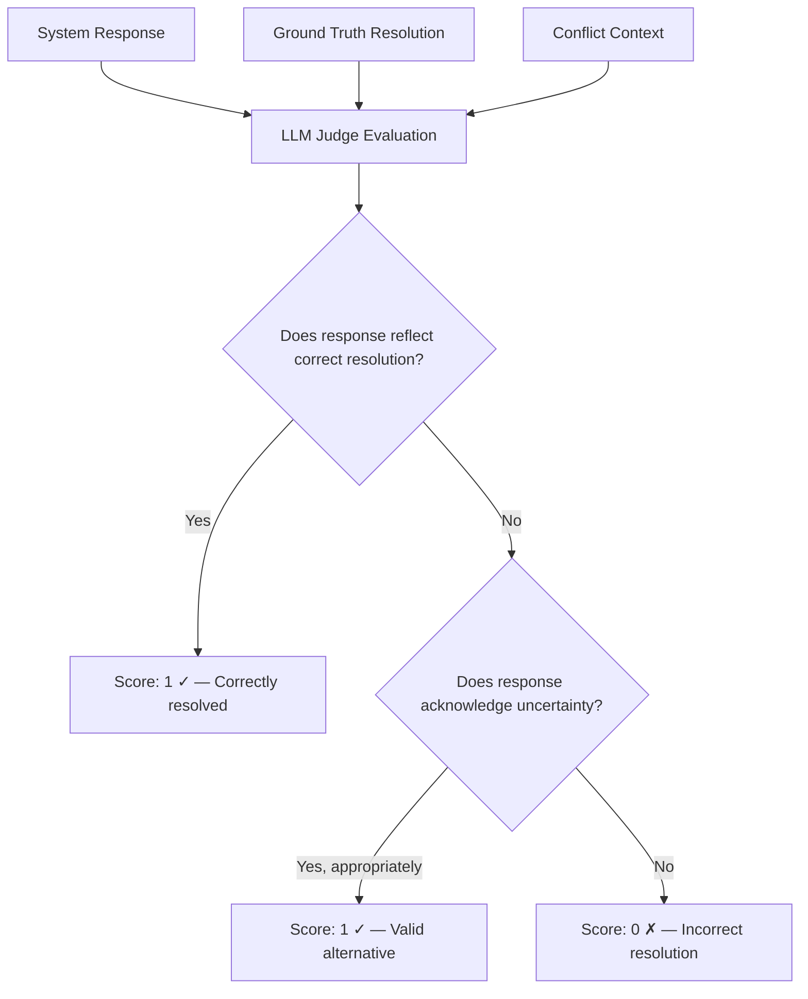

# CRQ — Conflict Resolution Quality

## What It Measures

Conflict Resolution Quality (CRQ) evaluates how well a memory system **identifies, processes, and resolves contradictory information**. When incoming knowledge conflicts with existing knowledge, the system must decide what to believe, what to discard, and how to communicate uncertainty.

CRQ specifically tests whether the system can:

- **Detect** that a conflict exists between two or more pieces of information
- **Resolve** the conflict by applying an appropriate strategy (recency, source authority, contextual reasoning)
- **Communicate** the resolution or acknowledge uncertainty when appropriate
- Handle **multiple conflict types** — from simple temporal updates to subtle behavioral contradictions

This dimension is distinct from Dynamic Belief Updating (DBU) in that CRQ focuses on situations where the conflict is **ambiguous or complex**, not simply a clear replacement of one fact with another.

## Why It Matters

Real-world information is inherently messy and inconsistent:

- A user says they're vegetarian but is later observed eating sushi
- Two different sources provide different dates for the same event
- A stated preference contradicts observed behavior
- Gradual changes create a spectrum where no single "correct" answer exists

A memory system that cannot handle conflicts will either:

1. **Blindly overwrite** — losing nuanced context (e.g., replacing "vegetarian" with "eats fish" without noting the transition)
2. **Blindly accumulate** — storing contradictory facts without resolution, leading to incoherent responses
3. **Silently fail** — ignoring the conflict and returning stale or arbitrary information

Robust conflict resolution is what separates a **knowledge management system** from a simple **data store**. CRQ measures this capability directly.

### Relationship to Other Dimensions

- **DBU** tests straightforward belief updates ("I moved from Portland to Seattle"). **CRQ** tests cases where the correct resolution is not obvious.
- **TC** tests temporal awareness. **CRQ** may involve temporal reasoning but focuses on the **resolution strategy**, not the temporal tracking itself.
- **MEI** measures storage efficiency, but CRQ evaluates the conflict resolution mechanism regardless of content domain.

## How It Is Measured

### Formula

```
CRQ = correctly_resolved / total_conflicts
```

Where:

- **`total_conflicts`** — The number of deliberately introduced conflicts in the evaluation dataset
- **`correctly_resolved`** — The number of conflicts where the system produced the expected resolution, as verified by an **LLM judge**

### Evaluation Method

1. **Conflict injection**: The evaluation dataset includes carefully designed conflict scenarios. Each conflict has:
   - A **setup phase**: initial facts are ingested
   - A **conflict phase**: contradicting information is introduced
   - A **ground-truth resolution**: the expected correct handling, defined by benchmark designers
   - A **conflict type classification**: one of the categories below

2. **Resolution verification via LLM judge**: After the system processes all events, queries are issued that probe the conflicting information. An LLM judge evaluates whether the system's response reflects the correct resolution by comparing:
   - The system's response
   - The ground-truth expected resolution
   - The conflict context (what information was available)

3. **Scoring per conflict**: Each conflict is scored as binary — either correctly resolved (1) or not (0). The CRQ score is the proportion of correctly resolved conflicts.

### Conflict Types

| Conflict Type | Description | Expected Resolution | Example |
|---------------|-------------|---------------------|---------|
| **Explicit corrections** | Direct contradiction of a previous fact | Accept the correction | "I actually graduated in 2019, not 2018" |
| **Temporal updates** | State changes due to time passage | Prefer the most recent state | "Used to live in Portland" → "Now lives in Seattle" |
| **Source authority** | Different sources provide different info | Prefer higher-authority source | Self-report vs. third-party observation |
| **Gradual changes** | Slow transition without clear boundary | Reflect the evolving state | Vegetarian → occasionally eats fish → pescatarian |
| **Behavioral contradiction** | Stated belief vs. observed behavior | Acknowledge both with nuance | Says "I don't like social media" but posts regularly |
| **Ambiguous conflicts** | Information that could be interpreted multiple ways | Acknowledge uncertainty | "Loves hiking" vs. "hasn't hiked in years" |

### LLM Judge Evaluation Criteria

The LLM judge assesses each resolution against these criteria:



The judge uses a structured prompt that provides:
- The full event sequence
- The specific conflict being evaluated
- The expected resolution strategy
- The system's actual response

This approach reduces scoring subjectivity while handling the inherent complexity of conflict evaluation.

## Interpretation

| CRQ Score | Rating | Interpretation |
|-----------|--------|----------------|
| 0.90 – 1.00 | Exceptional | System demonstrates sophisticated conflict handling with appropriate nuance |
| 0.75 – 0.89 | Strong | Most conflicts resolved correctly; minor issues with edge cases |
| 0.55 – 0.74 | Moderate | Handles simple conflicts but struggles with ambiguous or multi-layered ones |
| 0.35 – 0.54 | Weak | Inconsistent conflict handling; frequently produces contradictory or stale information |
| 0.00 – 0.34 | Poor | System largely ignores or mishandles conflicting information |

### What Scores Reveal

- **High CRQ, low DBU**: Unusual — suggests the system handles complex conflicts but fails at simple updates. May indicate the LLM judge is too lenient.
- **Low CRQ, high DBU**: System can process explicit updates but lacks reasoning about ambiguous conflicts. Common in simple overwrite-based systems.
- **CRQ varies by conflict type**: Most systems handle explicit corrections well but struggle with gradual changes and behavioral contradictions. Per-type breakdown is essential for diagnosis.

### Per-Type Breakdown

CRQ should be reported both as an aggregate score and broken down by conflict type:

```
CRQ (aggregate):         0.73
CRQ (explicit):          0.95
CRQ (temporal):          0.88
CRQ (source authority):  0.65
CRQ (gradual):           0.52
CRQ (behavioral):        0.40
CRQ (ambiguous):         0.35
```

This breakdown reveals the system's specific strengths and weaknesses in conflict resolution.

## Examples

### Example 1: Explicit Correction

**Events ingested:**
1. "Marcus graduated from MIT in 2018"
2. "Marcus mentioned he actually graduated in 2019 — he had miscounted earlier"

**Query:** "When did Marcus graduate from MIT?"

**Expected resolution:** "2019" — the explicit correction supersedes the original statement.

**Scoring:** If system responds "2019" → Score: 1. If system responds "2018" or presents both without resolving → Score: 0.

### Example 2: Gradual Change

**Events ingested (over 6 months):**
1. "Sophia is a committed vegetarian"
2. "Sophia tried fish at a sushi restaurant and liked it"
3. "Sophia has been eating fish once or twice a week"
4. "Sophia described herself as 'mostly vegetarian, flexible with seafood'"

**Query:** "Is Sophia vegetarian?"

**Expected resolution:** Should reflect the gradual transition — she's shifted from strict vegetarian to pescatarian or flexitarian. The system should not simply say "yes" or "no" but capture the nuance.

**Scoring:** LLM judge evaluates whether the response captures the evolution. A response like "Sophia was vegetarian but has gradually incorporated seafood" → Score: 1. A response like "Sophia is vegetarian" → Score: 0.

### Example 3: Source Authority

**Events ingested:**
1. (From Sophia directly) "I've been feeling great about my fitness routine"
2. (From a friend) "Sophia mentioned she's been struggling with motivation lately"

**Query:** "How is Sophia feeling about her fitness?"

**Expected resolution:** Should prefer the self-report (higher authority for personal feelings) while potentially noting the discrepancy.

**Scoring:** If system prioritizes self-report → Score: 1. If system only reflects the third-party observation → Score: 0.

### Example 4: Behavioral Contradiction

**Events ingested:**
1. "Elena says she doesn't watch much TV"
2. "Elena mentioned binge-watching three series last month"
3. "Elena recommended a new show she's been watching"

**Query:** "Does Elena watch TV?"

**Expected resolution:** Should acknowledge the gap between stated preference and behavior — she says she doesn't watch much but clearly does.

**Scoring:** LLM judge evaluates whether the response handles the contradiction appropriately.

## Limitations

1. **LLM judge subjectivity**: Despite structured prompts, the LLM judge introduces variability. Different judge models or prompt formulations may produce different scores. The benchmark should document the judge model and prompt used, and provide inter-rater reliability metrics.

2. **Ground-truth ambiguity**: For complex conflicts (gradual changes, behavioral contradictions), the "correct" resolution is itself debatable. The benchmark must provide well-justified ground-truth resolutions and acknowledge where reasonable disagreement exists.

3. **Binary scoring for nuanced situations**: Some resolutions are partially correct. A system that says "Sophia might be pescatarian" is better than one that says "Sophia eats meat daily," but both score 0 if the ground truth is "Sophia transitioned from vegetarian to pescatarian." The LLM judge mitigates this somewhat, but the final binary score still loses gradation.

4. **Conflict density**: Real-world information has a low conflict rate. The evaluation dataset deliberately concentrates conflicts, which may not reflect realistic conditions. Systems optimized for high-conflict scenarios may behave differently under normal conditions.

5. **Conflict type coverage**: The taxonomy of conflict types (explicit, temporal, source authority, gradual, behavioral, ambiguous) may not cover all real-world conflict patterns. The benchmark should be extensible to new conflict types.

6. **Cultural and contextual norms**: What counts as a "conflict" may vary by culture. In some contexts, saying one thing and doing another is normal and doesn't represent a meaningful contradiction. The benchmark should document its assumptions about conflict semantics.
