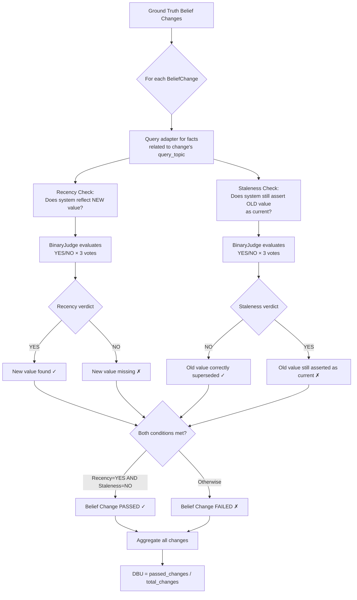
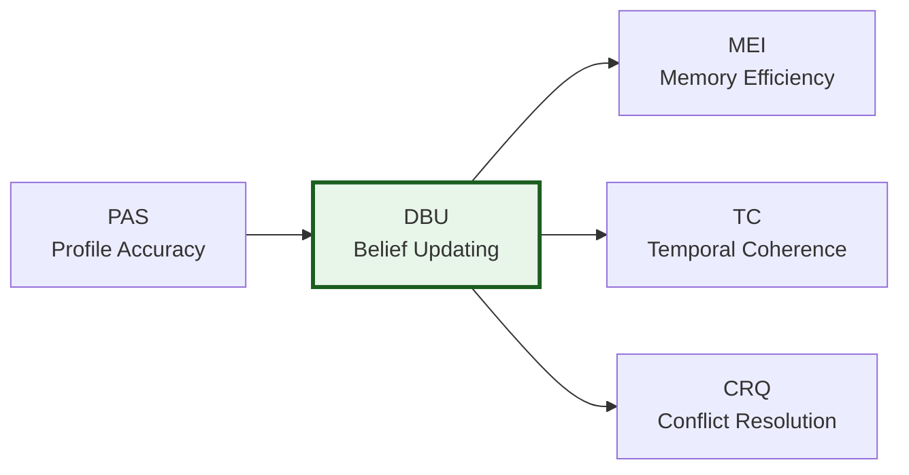

# DBU — Dynamic Belief Updating

> **Dimension weight in CRI composite:** 0.20

## What It Measures

Dynamic Belief Updating evaluates how well a memory system **updates its knowledge** when new information contradicts or supersedes previous information. DBU answers a critical question for long-term memory systems: **when a fact changes, does the system reflect the change?**

Real-world knowledge is not static. Users change jobs, move cities, update preferences, switch tools, adopt new habits, and revise opinions. A memory system that clings to outdated information — or worse, presents stale facts as current truth — actively degrades the user experience. DBU measures the system's ability to transition from old beliefs to new ones.

### Scope

DBU covers:

- **Fact supersession** — when a new value explicitly replaces an old value (e.g., "moved from Portland to Seattle")
- **Attribute updates** — when an attribute's value changes over time (e.g., job title, phone model, dietary preference)
- **Recency awareness** — whether the system reflects the most current value
- **Staleness rejection** — whether the system stops asserting the outdated value as current truth

DBU does **not** cover:

- Initial fact recall without changes (→ see [PAS](./pas.md))
- Noise vs. signal discrimination (→ see [MEI](./mei.md))
- Time-bounded fact validity (→ see TC)
- Resolution of genuinely conflicting claims (→ see CRQ)

### Key Distinction: Staleness vs. Historical Context

DBU does **not** penalize a system for retaining historical context. If the system stores "Elena previously worked in Portland" alongside "Elena currently lives in Seattle," that is perfectly acceptable. DBU only fails a system when the old value is **still asserted as the current truth** — for example, if the system responds "Elena lives in Portland" when asked about her current residence.

## Why It Matters

Dynamic belief updating is one of the most challenging capabilities for long-term memory systems, and one of the most impactful for user experience:

- **Outdated information is worse than no information.** A system that confidently presents stale facts misleads both users and downstream AI agents. Acting on outdated context can cause real harm.
- **It separates real memory from append-only logs.** Any system can append new facts. The hard problem is *revising* existing knowledge — identifying which facts have been superseded and updating the representation accordingly.
- **It tests ontological reasoning.** Updating a belief requires the system to: (1) recognize that new information relates to the same entity and attribute, (2) determine that the new value supersedes the old, and (3) update its internal representation while optionally preserving history.
- **It reveals architectural differences.** Simple vector stores typically score low on DBU because they lack mechanisms for supersession. Ontology-based systems with explicit entity-attribute models tend to score higher because they can reason about which facts are current.

## How It Is Computed

### Algorithm

DBU evaluates each `BeliefChange` recorded in the ground truth using a **dual-check** approach: a recency check and a staleness check. Both must pass for a belief change to count as successfully handled.



### Step-by-Step

1. **Retrieve** all `BeliefChange` entries from `ground_truth.changes`.
2. **For each belief change:**
   - **Query** the adapter using the change's `query_topic` to retrieve stored facts.
   - **Recency check**: Generate a judge prompt asking whether the stored facts reflect the **new value** as the current truth. Expected verdict: **YES**.
   - **Staleness check**: Generate a judge prompt asking whether the stored facts still assert the **old value** as the current truth. Expected verdict: **NO**.
   - Both prompts are evaluated via the `BinaryJudge` with 3-vote majority.
3. **A belief change passes** only when:
   - Recency verdict = **YES** (the new value is present)
   - Staleness verdict = **NO** (the old value is not asserted as current)
4. **Compute the score** as the ratio of passed changes to total changes.

### Formula

```
DBU = passed_changes / total_changes
```

Where:
- `passed_changes` = number of belief changes where recency=YES **AND** staleness=NO
- `total_changes` = total number of belief changes in the ground truth

The score ranges from **0.0** (no beliefs updated correctly) to **1.0** (all beliefs updated correctly).

If the ground truth contains no belief changes (`total_changes = 0`), the score defaults to **1.0** (nothing to fail).

### Judge Prompt Templates

#### Recency Check (`dbu_recency_check`)

```
TASK
You are evaluating whether an AI memory system has correctly updated its
knowledge when new information was provided. Determine if the stored facts
reflect the most recent / current value for the given fact.
Consider semantic equivalence: the wording does not need to be identical —
the meaning must match.

FACT: {fact_name}
EXPECTED CURRENT VALUE: {new_value}

STORED FACTS:
  1. {fact_1}
  2. {fact_2}
  ...

QUESTION
Do the stored facts reflect that the current value of
"{fact_name}" is "{new_value}" (or something semantically equivalent)?

Answer YES or NO.
```

#### Staleness Check (`dbu_staleness_check`)

```
TASK
You are evaluating whether an AI memory system still incorrectly asserts
an outdated value as the CURRENT truth. The old value may appear in a
historical context (e.g. 'previously was X', 'used to be X') — that is
acceptable. It is only a problem if the old value is presented as the
current, active value.
Consider semantic equivalence when comparing values.

FACT: {fact_name}
OLD (OUTDATED) VALUE: {old_value}

STORED FACTS:
  1. {fact_1}
  2. {fact_2}
  ...

QUESTION
Do the stored facts still assert that the current value of
"{fact_name}" is "{old_value}" (or something semantically equivalent),
treating it as the present truth rather than a historical note?
NOTE: YES means the system FAILED to update — the old value is still
treated as current.

Answer YES or NO.
```

Key design decisions:
- The staleness prompt **explicitly allows historical context** — "used to be X" is acceptable
- The prompts use **semantic equivalence** — "NYC" matches "New York City"
- The staleness prompt includes a **NOTE** clarifying that YES = failure, to reduce judge confusion

## Interpretation Guide

| Score Range | Interpretation | Typical Scenario |
|-------------|---------------|-------------------|
| **0.95 – 1.00** | Excellent — all beliefs updated correctly, no stale assertions | Ontology systems with explicit entity-attribute update mechanisms |
| **0.80 – 0.94** | Strong — most beliefs updated, minor gaps on edge cases | Well-designed systems with occasional update failures on subtle changes |
| **0.60 – 0.79** | Moderate — majority of updates reflected but some stale facts persist | Systems that handle simple updates but struggle with nuanced changes |
| **0.40 – 0.59** | Weak — significant number of outdated beliefs still asserted | Systems without explicit supersession logic |
| **0.20 – 0.39** | Poor — mostly outdated information persists | Append-only systems that accumulate contradictions |
| **0.00 – 0.19** | Failure — the system shows no evidence of updating beliefs | No-memory baselines or systems that ignore temporal ordering |

### What a High DBU Score Means

A system scoring above 0.90 demonstrates:
- **Effective supersession** — it recognizes when new information replaces old
- **Recency awareness** — it presents the most current value when queried
- **Clean knowledge state** — it does not present contradictory current and outdated values simultaneously

### What a Low DBU Score Means

A system scoring below 0.50 reveals:
- **Append-only behavior** — the system accumulates facts without updating existing ones
- **Missing supersession logic** — it cannot determine that a new fact replaces an old one
- **Contradictory knowledge** — both old and new values coexist as "current" truths
- **Recency blindness** — the system treats all facts as equally current regardless of when they were introduced

### Failure Modes

DBU failures fall into four categories:

| Failure Mode | Recency | Staleness | Meaning |
|-------------|---------|-----------|---------|
| **Clean update** | YES | NO | ✓ Passed — new value present, old value superseded |
| **Parallel assertion** | YES | YES | Both old and new values asserted as current |
| **Complete failure** | NO | YES | Old value still asserted, new value missing |
| **Total loss** | NO | NO | Neither value found (loss of both old and new) |

The per-check details in `DimensionResult.details` include the recency and staleness verdicts for each belief change, enabling you to diagnose which failure mode is occurring.

### Baseline Reference Points

| System Type | Expected DBU Range |
|-------------|-------------------|
| No-memory baseline | 0.00 (cannot update what it never stored) |
| Full-context window | 0.60 – 0.90 (can see all messages, but may struggle with explicit update reasoning) |
| Simple RAG (vector store) | 0.20 – 0.50 (appends facts, poor at supersession) |
| Ontology-based memory | 0.80 – 1.00 (explicit entity-attribute update mechanisms) |

## Examples

### Example 1: Successful Update (Pass)

**Belief change in ground truth:**
```json
{
  "fact": "city of residence",
  "old_value": "Portland",
  "new_value": "Seattle",
  "query_topic": "residence",
  "changed_around_msg": 45
}
```

**Stored facts returned by adapter:**
```
1. Marcus currently lives in Seattle, Washington
2. Marcus previously lived in Portland before relocating
```

**Recency check:** *"Do the stored facts reflect that the current value of 'city of residence' is 'Seattle'?"*
→ Judge verdict: **YES** (3/3) ✓

**Staleness check:** *"Do the stored facts still assert that the current value of 'city of residence' is 'Portland'?"*
→ Judge verdict: **NO** (3/3) ✓ — Portland is mentioned only in historical context

**Result:** Belief change **PASSED** ✓

### Example 2: Parallel Assertion (Fail)

**Belief change:** `"phone" → old: "iPhone", new: "Pixel"`

**Stored facts:**
```
1. Alice uses an iPhone for daily communication
2. Alice recently got a Google Pixel phone
```

**Recency check:** YES ✓ — Pixel is mentioned
**Staleness check:** YES ✗ — iPhone is still asserted as a current device

**Result:** Belief change **FAILED** ✗ — both values are presented as current

### Example 3: Total Failure (Fail)

**Belief change:** `"job title" → old: "journalist", new: "author and podcaster"`

**Stored facts:**
```
1. Sophia is a journalist covering technology
2. Sophia writes articles for major publications
```

**Recency check:** NO ✗ — no mention of author or podcaster
**Staleness check:** YES ✗ — journalist is still asserted as current

**Result:** Belief change **FAILED** ✗ — old value persists, new value absent

### Example 4: Edge Case — Historical Context (Pass)

**Belief change:** `"diet" → old: "vegetarian", new: "vegan"`

**Stored facts:**
```
1. Elena follows a vegan diet strictly
2. Elena was vegetarian for several years before going fully vegan
```

**Recency check:** YES ✓ — vegan is reflected as current
**Staleness check:** NO ✓ — vegetarian appears only as historical context ("was vegetarian... before going vegan")

**Result:** Belief change **PASSED** ✓ — historical mention is acceptable

## Known Limitations

### 1. Binary Pass/Fail Per Belief Change

Each belief change is either fully passed or fully failed. There is no partial credit for systems that correctly update the new value but fail to mark the old value as historical (or vice versa). The details array provides the individual check results for more nuanced analysis.

### 2. Sensitivity to Ground Truth Design

DBU quality depends heavily on how `BeliefChange` entries are defined in the ground truth. If the `query_topic` is poorly aligned with how the adapter organizes its knowledge, the retrieval step may fail, causing false negatives. Careful dataset design is essential.

### 3. Implicit vs. Explicit Updates

DBU primarily tests **explicit** updates — cases where the conversation clearly states a change (e.g., "I just moved to Seattle"). It is less effective at testing **implicit** updates where the change must be inferred from context. The TC dimension partially addresses this gap.

### 4. Historical Context Nuance

While the staleness check prompt explicitly allows historical context, the LLM judge may not always correctly distinguish between "Elena used to live in Portland" (historical) and "Elena lives in Portland" (current assertion). Edge cases involving ambiguous phrasing may produce inconsistent results.

**Mitigation:** The 3-vote majority system reduces this variance. Consistent use of a low-temperature judge model improves reliability.

### 5. No Measurement of Update Timing

DBU evaluates the **final state** of the memory system after all events have been ingested. It does not measure *when* the system performed the update or whether it handled the update promptly vs. with delay. A system that updates its beliefs only during a batch compaction step would receive the same score as one that updates in real-time.

### 6. Assumes Ground Truth Completeness

DBU only evaluates belief changes that are explicitly listed in the ground truth. If the conversation contains updates that are not captured in the `changes` list, they are not tested. The ground truth must be carefully curated to include all significant changes.

## Relationship to Other Dimensions



- **PAS → DBU**: PAS tests whether facts are recalled at all; DBU tests whether recalled facts are *current*. A low PAS score typically implies a low DBU score.
- **DBU → MEI**: MEI evaluates storage efficiency, which is influenced by how well the system updates beliefs — good updates reduce redundant or stale storage.
- **DBU → TC**: TC extends the temporal reasoning tested by DBU to include time-bounded fact validity (e.g., facts that expire after a certain date).
- **DBU → CRQ**: CRQ handles cases where conflicting information is *genuinely ambiguous*, whereas DBU handles cases where the update direction is clear (newer supersedes older).

---

*Part of the [CRI Benchmark — Contextual Resonance Index](../../README.md) metric documentation.*
