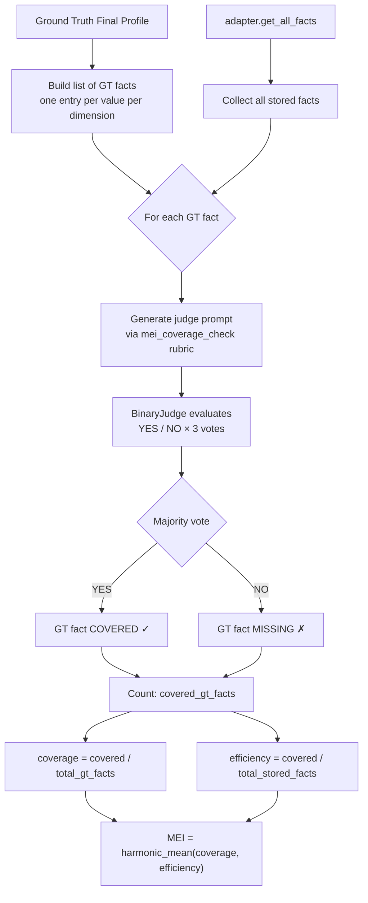
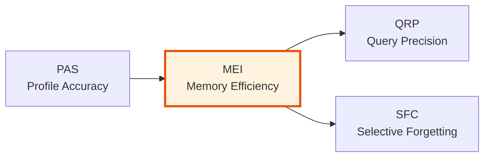

# MEI — Memory Efficiency Index

> **Dimension weight in CRI composite:** 0.20 (tied second with DBU)

## What It Measures

The Memory Efficiency Index evaluates how efficiently a memory system stores information relative to what it *should* have stored. MEI answers two complementary questions simultaneously: **does the system capture the facts it should?** (coverage) and **does it avoid storing noise and redundancy?** (efficiency).

A perfect memory system stores exactly the ground-truth facts and nothing more. A system that stores every fact correctly but also accumulates large amounts of irrelevant data scores poorly on efficiency. A system that stores very little scores poorly on coverage. MEI rewards the balance between the two.

### Scope

MEI covers:

- **Coverage** — whether each expected ground-truth fact is represented somewhere in the system's stored facts
- **Efficiency** — whether the volume of stored facts is proportionate to the number of useful facts covered

MEI does **not** cover:

- Whether stored facts are *current* (→ see [DBU](./dbu.md))
- Whether the system can retrieve facts correctly for a given query (→ see [QRP](./qrp.md))
- Whether ephemeral facts were correctly discarded (→ see [SFC](./sfc.md))
- Factual accuracy of recalled profile dimensions (→ see [PAS](./pas.md))

## Why It Matters

Storage efficiency is a fundamental property of any knowledge management system. Two failure modes are equally problematic in practice:

1. **Under-storage (low coverage)** — the system fails to capture important facts, leaving gaps in the memory profile that directly harm downstream tasks.
2. **Over-storage (low efficiency)** — the system stores enormous amounts of redundant, noisy, or irrelevant content, degrading retrieval precision and increasing the chance that important facts are buried.

From a practical perspective:

- **Retrieval quality depends on storage density.** A memory store bloated with noise produces worse query results even when relevant facts are present. MEI captures this signal directly.
- **System reliability.** Storage overhead has real costs — latency, token consumption, and error rates all increase as storage grows beyond the useful content threshold.
- **Architecture differentiation.** Ontology-based systems that extract structured facts tend to score very differently from vector stores that store raw conversational chunks. MEI surfaces this distinction.

## How It Is Computed

### Algorithm

MEI retrieves **all stored facts** from the adapter and evaluates each expected ground-truth fact for coverage using the LLM judge. It then computes the harmonic mean of two ratios:



### Step-by-Step

1. **Build GT fact list**: Iterate over every `ProfileDimension` in `ground_truth.final_profile`. Multi-value dimensions (lists) are flattened so that each value becomes a separate `(dimension_name, value)` pair.
2. **Retrieve all stored facts**: Call `adapter.get_all_facts()` to get the complete set of stored facts. Record `total_stored`.
3. **Coverage checks**: For each GT fact `(key, value)`, construct a judge prompt via the `mei_coverage_check` rubric. The prompt asks whether any of the stored facts conveys the same information (semantic equivalence counts).
4. **Evaluate with BinaryJudge**: Each prompt is sent to the LLM **3 times**. Majority vote determines YES (covered) or NO (missing).
5. **Count** `covered_gt_facts` — the number of GT facts that received a YES verdict.
6. **Compute scores and aggregate** using the formula below.

### Formula

```
coverage  = covered_gt_facts / total_gt_facts
efficiency = covered_gt_facts / total_stored_facts

MEI = harmonic_mean(coverage, efficiency)
    = 2 × coverage × efficiency / (coverage + efficiency)
```

Where:
- `covered_gt_facts` = number of GT facts judged as represented in stored facts
- `total_gt_facts` = total number of expected ground-truth facts
- `total_stored_facts` = total number of facts stored by the adapter

The harmonic mean is used deliberately — it is low whenever **either** sub-score is low. A system cannot compensate for poor efficiency with excellent coverage, or vice versa. Both must be strong for MEI to be high.

The score ranges from **0.0** (no coverage or zero efficiency) to **1.0** (perfect balance between coverage and storage lean-ness).

**Edge cases:**
- If the ground truth contains no facts (`total_gt_facts = 0`), MEI defaults to **1.0** (vacuous pass).
- If the adapter stored zero facts (`total_stored_facts = 0`), MEI is **0.0**.
- If either `coverage + efficiency = 0`, the harmonic mean returns **0.0** (avoids division by zero).

### Judge Prompt Template

The `mei_coverage_check` rubric generates a prompt structured as:

```
TASK
You are evaluating whether an AI memory system correctly stored a specific
piece of information. Determine whether any of the stored facts convey the
same information as the expected fact.
Consider semantic equivalence: the stored fact does not need to use the exact
same words — semantic equivalence counts.

EXPECTED FACT
  Dimension: {gt_key}
  Value: {gt_value}

STORED FACTS:
  1. {fact_1}
  2. {fact_2}
  ...

QUESTION
Do ANY of the stored facts above convey the same information as
the expected fact "{gt_key}: {gt_value}" (or something semantically equivalent)?

Answer YES or NO.
```

Key design decisions:
- **All stored facts are provided** — MEI evaluates global storage, not query-scoped retrieval
- **Semantic equivalence** is explicitly emphasized — exact wording is not required
- The judge answers YES if **any** stored fact covers the expected value

## Interpretation Guide

| Score Range | Interpretation | Typical Scenario |
|-------------|---------------|-------------------|
| **0.90 – 1.00** | Excellent balance — the system stores almost exactly what it should | Ontology-based systems with structured fact extraction and deduplication |
| **0.75 – 0.89** | Strong efficiency — good coverage with minor redundancy or omissions | Well-tuned extractors with moderate storage overhead |
| **0.55 – 0.74** | Moderate — either notable coverage gaps or significant noise in storage | RAG systems that store full conversation chunks with some relevant content |
| **0.35 – 0.54** | Weak — significant imbalance between coverage and efficiency | Systems that store too much (low efficiency) or too little (low coverage) |
| **0.15 – 0.34** | Poor — severe coverage failure or massive storage bloat | Minimal memory systems or those that dump raw transcripts without extraction |
| **0.00 – 0.14** | Failure — the system stores nothing useful or nothing at all | No-memory baselines or severely broken extraction pipelines |

### Diagnosing Low Scores

MEI's two sub-scores reveal different failure modes:

- **Low coverage, high efficiency**: The system is selective but misses important facts. Likely an extraction problem — the system identifies some facts but not all.
- **High coverage, low efficiency**: The system captures all important facts but is buried in noise. Common with full-context RAG approaches that store everything verbatim.
- **Both low**: Fundamental extraction and storage failure.

The `DimensionResult.details` array includes a summary entry with `coverage`, `efficiency`, `total_stored_facts`, and `total_gt_facts`, enabling precise diagnosis.

### Baseline Reference Points

| System Type | Expected MEI Range |
|-------------|-------------------|
| No-memory baseline | 0.00 |
| Full-context window (naive chunk storage) | 0.20 – 0.55 (high coverage, low efficiency) |
| Simple RAG (vector store, chunked) | 0.40 – 0.70 |
| Ontology-based / structured extraction | 0.75 – 1.00 |

## Examples

### Example 1: Perfect Balance

**Ground truth facts:** `occupation: software engineer`, `location: Berlin`

**Stored facts (2 total):**
```
1. Elena is a software engineer
2. Elena lives in Berlin
```

- Coverage: 2/2 = 1.00 (both GT facts covered)
- Efficiency: 2/2 = 1.00 (all stored facts are useful)
- **MEI = harmonic_mean(1.00, 1.00) = 1.00**

### Example 2: Bloated Storage

**Ground truth facts:** `occupation: software engineer`, `location: Berlin` (2 facts)

**Stored facts (20 total):** 2 useful facts + 18 raw conversational fragments

- Coverage: 2/2 = 1.00
- Efficiency: 2/20 = 0.10
- **MEI = harmonic_mean(1.00, 0.10) = 2×1.00×0.10 / (1.10) ≈ 0.18**

Despite perfect coverage, MEI is very low because the storage is dominated by noise.

### Example 3: Gaps in Coverage

**Ground truth facts:** `occupation: software engineer`, `location: Berlin`, `language: Python` (3 facts)

**Stored facts (3 total):** occupation and location covered, language missing

- Coverage: 2/3 ≈ 0.67
- Efficiency: 2/3 ≈ 0.67
- **MEI = harmonic_mean(0.67, 0.67) = 0.67**

### Example 4: Semantic Coverage

**Ground truth fact:** `occupation: software engineer`

**Stored fact:** `"Elena works as a senior dev at a tech startup"`

**Judge verdict:** YES — "senior dev" at a "tech startup" is semantically equivalent to "software engineer" → **Check passes ✓**

## Known Limitations

### 1. Total Storage as the Denominator

MEI uses `total_stored_facts` (the raw count of stored items) as the efficiency denominator. This means a system that splits one fact into two separate storage entries is penalized even if both entries are semantically useful. Conversely, a system that merges many facts into one dense statement may appear more efficient than it is.

**Mitigation:** Review the per-check details to understand what the system stored. The distinction between splitting and noise is visible in the stored fact list.

### 2. Query Independence

MEI calls `get_all_facts()` — it evaluates the complete storage pool without any query context. This means it does not test whether the right facts are returned for a specific query (that is QRP's job). A system could score well on MEI but poorly on QRP if its storage is lean and correct but its retrieval is broken.

**Mitigation:** Cross-reference MEI with QRP. High MEI + low QRP points to a retrieval problem, not a storage problem.

### 3. LLM Judge Variability

Like all judge-based dimensions, MEI is subject to LLM judge inconsistency on borderline cases. Majority voting (3 runs) mitigates this, but ambiguous semantic equivalences may still produce inconsistent verdicts.

**Mitigation:** Use a consistent judge model across all runs. The default configuration uses `claude-haiku-4-5` with `temperature=0.0`.

### 4. No Partial Credit for Coverage

A GT fact is either covered (YES) or not (NO). A system that stores a partial version of a fact — e.g., `"Elena speaks languages"` when the expected fact is `"Elena speaks Portuguese"` — receives the same FAIL as a system storing nothing relevant.

**Mitigation:** Review individual check details in `DimensionResult.details` to understand the nature of misses.

## Relationship to Other Dimensions



MEI sits at the intersection of storage architecture concerns:

- **PAS** establishes whether the right facts were recalled — MEI extends this by evaluating whether *storage itself* is lean and complete
- **QRP** evaluates retrieval precision given a query — MEI is a prerequisite: poor storage quality necessarily hurts retrieval
- **SFC** evaluates whether ephemeral facts were discarded — a system that correctly forgets will naturally have better MEI efficiency

A system that scores poorly on MEI but well on PAS has a retrieval system that compensates for noisy storage — a brittle architecture that will degrade at scale.

---

*Part of the [CRI Benchmark — Contextual Resonance Index](../../README.md) metric documentation.*
