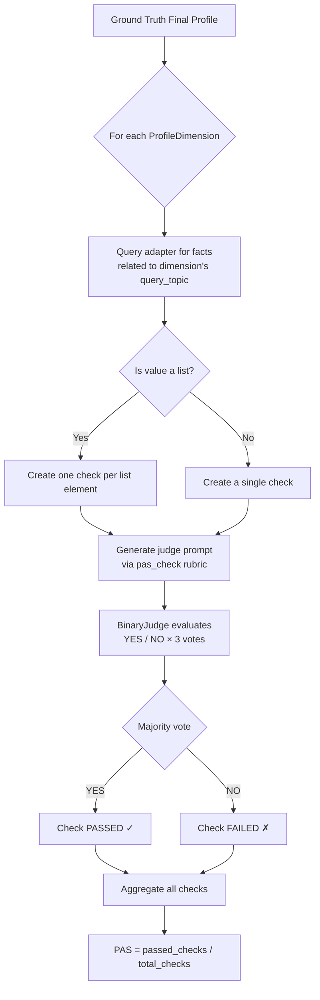
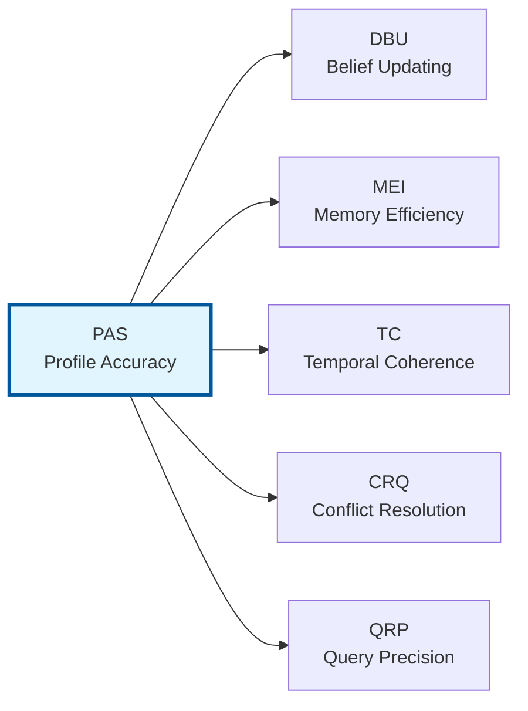

# PAS — Profile Accuracy Score

> **Dimension weight in CRI composite:** 0.25 (highest)

## What It Measures

The Profile Accuracy Score evaluates how accurately a memory system recalls specific persona details after ingesting a stream of conversational events. PAS answers the most fundamental question a memory benchmark can ask: **does the system remember what it has been told?**

PAS targets factual recall of explicit user attributes — demographics, preferences, biographical facts, stated opinions, and any other concrete information that appears in the conversation stream. It does not assess inference, temporal reasoning, or conflict resolution; those are handled by other CRI dimensions.

### Scope

PAS covers:

- **Single-value attributes** — facts with one expected answer (e.g., "occupation → software engineer")
- **Multi-value attributes** — facts with a list of valid values (e.g., "spoken languages → [English, Spanish, Portuguese]")
- **Any profile dimension** defined in the ground truth, including demographics, preferences, relationships, and explicitly stated facts

PAS does **not** cover:

- Whether the system updated beliefs when facts changed (→ see [DBU](./dbu.md))
- Whether the system filtered noise or captured signals correctly (→ see [MEI](./mei.md))
- Temporal validity of facts (→ see TC)
- Conflict resolution (→ see CRQ)
- Query retrieval precision (→ see QRP)

## Why It Matters

Factual accuracy is the **foundation** of contextual understanding. If a memory system cannot reliably recall basic attributes — name, age, occupation, location, stated preferences — it cannot perform any higher-order memory task. A system that fails at PAS will inevitably struggle with belief updating, preference handling, and temporal reasoning.

PAS serves as the **baseline dimension** of the CRI Benchmark. It establishes the minimum bar: before evaluating whether a system can handle nuanced memory operations, we first verify that it can store and retrieve straightforward facts.

From a practical perspective:

- **User trust depends on accuracy.** A system that forgets or confabulates basic facts erodes user confidence.
- **Downstream tasks depend on correct context.** Personalization, recommendation, and adaptive behavior all require accurate profile recall.
- **Competitive differentiation starts here.** Even this seemingly simple dimension reveals significant differences between memory architectures.

## How It Is Computed

### Algorithm

PAS uses a **binary-verdict LLM judge** model. Each profile dimension in the ground truth is independently evaluated:



### Step-by-Step

1. **Iterate** over every `ProfileDimension` in `ground_truth.final_profile`.
2. **Query** the memory adapter using the dimension's `query_topic` to retrieve stored facts.
3. **Determine check targets:**
   - If the dimension value is a **list** (multi-value), create one binary check per element.
   - If the dimension value is a **single string**, create one binary check.
4. **For each check**, construct an LLM judge prompt using the `pas_check` rubric template:
   - The prompt includes the dimension name, the expected gold-standard value, and the stored facts.
   - The judge is asked: *"Do the stored facts contain information that semantically matches the expected value?"*
   - **Semantic equivalence** is emphasized — exact wording is not required; meaning match counts.
5. **Evaluate** with the `BinaryJudge`:
   - The prompt is sent to the LLM **3 times** (configurable `num_runs`).
   - Each response is parsed into `YES` or `NO`.
   - The final verdict is determined by **majority vote** (≥ 2 out of 3).
6. **A check passes** if the majority verdict is `YES`.

### Formula

```
PAS = passed_checks / total_checks
```

Where:
- `passed_checks` = number of individual checks where the LLM judge returned a majority `YES` verdict
- `total_checks` = total number of individual checks across all profile dimensions

The score ranges from **0.0** (no facts recalled correctly) to **1.0** (all facts recalled perfectly).

If the ground truth contains no profile dimensions (`total_checks = 0`), the score defaults to **0.0**.

### Judge Prompt Template

The `pas_check` rubric generates a prompt structured as:

```
TASK
You are evaluating whether an AI memory system correctly captured a user's
profile information. Determine if the stored facts contain information that
semantically matches the expected value for the given profile dimension.
Consider semantic equivalence: the stored fact does not need to use the exact
same words — if the meaning is the same, that counts as a match.

PROFILE DIMENSION: {dimension}
EXPECTED VALUE: {gold_answer}

STORED FACTS:
  1. {fact_1}
  2. {fact_2}
  ...

QUESTION
Do the stored facts contain information that semantically matches the
expected value "{gold_answer}" for the profile dimension "{dimension}"?

Answer YES or NO.
```

Key design decisions in the prompt:
- **Semantic equivalence** is explicitly called out — "software developer" matches "software engineer"
- Facts are presented as a **numbered list** for clarity
- A maximum of **30 facts** are included per prompt (truncated with a note if exceeded)
- The judge is constrained to **YES or NO only**

## Interpretation Guide

| Score Range | Interpretation | Typical Scenario |
|-------------|---------------|-------------------|
| **0.95 – 1.00** | Excellent recall — the system captured virtually all profile details correctly | Well-tuned ontology-based systems with structured extraction |
| **0.80 – 0.94** | Strong recall — most facts captured, minor gaps in secondary details | Good memory systems with occasional extraction misses |
| **0.60 – 0.79** | Moderate recall — key facts present but notable omissions | RAG-based systems that capture salient facts but miss subtle ones |
| **0.40 – 0.59** | Weak recall — significant gaps, only the most prominent facts captured | Systems with limited extraction capability or high noise |
| **0.20 – 0.39** | Poor recall — few facts captured correctly | Minimal memory systems or those with fundamental extraction issues |
| **0.00 – 0.19** | Failure — the system captured almost no profile information | No-memory baselines or severely broken systems |

### What a High PAS Score Means

A system scoring above 0.90 is accurately extracting, storing, and retrieving explicit facts from conversations. This indicates:
- Effective information extraction from natural language
- Reliable storage without data loss
- Accurate retrieval when queried by topic

### What a Low PAS Score Means

A system scoring below 0.50 is failing at basic factual recall. Common causes include:
- **Extraction failures** — the system cannot identify facts in conversational text
- **Storage loss** — facts are extracted but lost during storage or compaction
- **Retrieval mismatches** — facts are stored but the query mechanism cannot find them
- **Confabulation** — the system generates plausible but incorrect information

### Baseline Reference Points

| System Type | Expected PAS Range |
|-------------|-------------------|
| No-memory baseline | 0.00 – 0.10 |
| Full-context window | 0.70 – 0.95 (depends on window size) |
| Simple RAG (vector store) | 0.50 – 0.80 |
| Ontology-based memory | 0.80 – 1.00 |

## Examples

### Example 1: Single-Value Dimension (Pass)

**Ground truth dimension:**
```json
{
  "dimension_name": "occupation",
  "value": "software engineer",
  "query_topic": "occupation"
}
```

**Stored facts returned by adapter:**
```
1. Elena works as a senior software engineer at a tech startup
2. Elena has been coding since university
```

**Judge prompt asks:** *Do the stored facts contain information that semantically matches "software engineer" for "occupation"?*

**Judge verdict:** YES (3/3 votes) → **Check passes ✓**

### Example 2: Multi-Value Dimension (Partial Pass)

**Ground truth dimension:**
```json
{
  "dimension_name": "spoken_languages",
  "value": ["English", "Spanish", "Portuguese"],
  "query_topic": "languages"
}
```

**Stored facts returned by adapter:**
```
1. Elena speaks English fluently
2. Elena learned Spanish from her grandmother
```

Three checks are created:
- Check `pas-spoken_languages-0` ("English"): YES → **Pass ✓**
- Check `pas-spoken_languages-1` ("Spanish"): YES → **Pass ✓**
- Check `pas-spoken_languages-2` ("Portuguese"): NO → **Fail ✗**

**Contribution to PAS:** 2 passed out of 3 checks

### Example 3: Semantic Equivalence (Pass)

**Ground truth:** `"residence" → "New York City"`

**Stored fact:** `"Elena lives in NYC"`

**Judge verdict:** YES — "NYC" is semantically equivalent to "New York City" → **Pass ✓**

### Example 4: Complete Miss (Fail)

**Ground truth:** `"pet" → "golden retriever named Max"`

**Stored facts:** `(no facts returned for topic "pets")`

**Judge verdict:** NO — no relevant facts found → **Fail ✗**

## Known Limitations

### 1. LLM Judge Variability

Although majority voting (3 votes) reduces noise, the LLM judge may still produce inconsistent results on ambiguous cases. For example, if a system stores "Elena enjoys coding" and the expected value is "software engineer," the judge must decide whether enjoyment of coding implies the occupation. Different LLM models may disagree.

**Mitigation:** Use a consistent judge model across all runs. The default configuration uses `claude-haiku-4-5` with `temperature=0.0` for maximum determinism.

### 2. Query Topic Sensitivity

PAS depends on the adapter's `query(topic)` method returning relevant facts. If the query topic does not align well with how the adapter indexes its knowledge, the adapter may fail to retrieve facts that are actually stored correctly. This is a retrieval problem, not a storage problem, but PAS cannot distinguish between the two.

**Mitigation:** The QRP dimension separately evaluates query retrieval precision. Cross-reference PAS with QRP to isolate retrieval issues from storage issues.

### 3. No Partial Credit

PAS uses binary verdicts — each check is either passed or failed. There is no partial credit for "close but not quite" answers. A system that stores "Elena works in tech" when the expected value is "software engineer" receives the same FAIL as a system that stores nothing.

**Mitigation:** Review the per-check details in the `DimensionResult.details` array to understand the nature of failures. The judge's raw responses can provide additional context.

### 4. Static Profile Snapshot

PAS evaluates the **final profile** — the expected state after all events have been ingested. It does not evaluate intermediate states. A system that correctly captures a fact early but later loses it during compaction would still fail the PAS check for that fact.

**Mitigation:** The DBU dimension captures some aspects of temporal accuracy. For full temporal analysis, combine PAS with TC results.

### 5. Fact Truncation

The judge prompt includes a maximum of 30 facts per evaluation. Systems that store a very large number of facts may have relevant information truncated from the prompt, leading to false negatives.

**Mitigation:** The 30-fact limit is configurable via `MAX_FACTS_PER_PROMPT` in the rubrics module. Increase it if your system stores many fine-grained facts, but be aware of LLM context window constraints.

## Relationship to Other Dimensions



PAS is the **foundational dimension**. All other dimensions assume some level of basic recall capability:

- **DBU** extends PAS by testing whether recalled facts are *current* (not outdated)
- **MEI** extends PAS by testing whether the system stores knowledge *efficiently* with good coverage
- **TC** extends PAS by testing *temporal validity* of recalled facts
- **CRQ** extends PAS by testing *conflict resolution* when contradictory facts exist
- **QRP** tests whether the *retrieval mechanism* returns the right facts for a given query

A system that scores poorly on PAS should not expect high scores on any other dimension.

---

*Part of the [CRI Benchmark — Contextual Resonance Index](../../README.md) metric documentation.*
