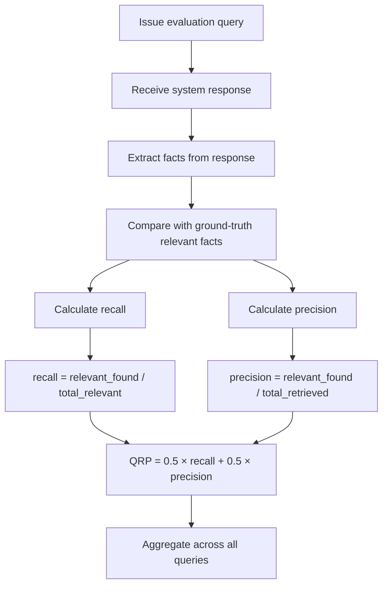

# QRP — Query Response Precision

## What It Measures

Query Response Precision (QRP) evaluates the **retrieval quality** of a memory system — specifically, how well it selects and surfaces the **right knowledge** in response to a query. QRP measures both the system's ability to return **relevant** information and its discipline in **excluding irrelevant** information.

QRP is fundamentally a **retrieval quality metric**. It does not test whether the system *has* the knowledge (that's PAS) or whether the knowledge is *up to date* (that's DBU/TC). Instead, QRP tests whether the system can **find and present the right subset** of its knowledge in response to a specific question.

This distinction is critical: a system might have perfect knowledge internally but still score poorly on QRP if it dumps everything it knows instead of answering the specific question, or if it retrieves tangentially related but ultimately unhelpful information.

## Why It Matters

Memory systems accumulate vast amounts of knowledge over time. As knowledge grows, the challenge shifts from *having* information to *selecting the right information* for a given context:

- A system with 500 facts about a user must select the 3-5 relevant ones for a specific query
- Returning too much information overwhelms the consumer and dilutes the useful signal
- Returning too little misses important context that could improve the response
- Returning wrong information (even if factually correct about the user) wastes context window and potentially misleads

QRP captures this retrieval precision, which becomes increasingly important as memory size grows. A system that scores well on QRP at 100 facts but poorly at 10,000 facts reveals a **scalability problem** in its retrieval mechanism.

### Relationship to Other Dimensions

- **PAS** measures whether the system *has* the correct facts. **QRP** measures whether it *retrieves the right ones* for a given query.
- **MEI** tests storage efficiency. **QRP** tests retrieval quality across all attribute types.
- **QRP is an output-side metric**: it evaluates the system's response quality, while PAS/DBU/TC/CRQ evaluate knowledge management quality.

## How It Is Measured

### Formula

```
QRP = 0.5 × recall + 0.5 × precision
```

Where:

- **`recall`** — The proportion of relevant facts that the system successfully included in its response
- **`precision`** — The proportion of facts in the system's response that are actually relevant to the query

Formally:

```
recall    = |relevant ∩ retrieved| / |relevant|
precision = |relevant ∩ retrieved| / |retrieved|
```

Where:

- **`relevant`** — The set of facts from the ground truth that should be included in the response to this specific query
- **`retrieved`** — The set of facts that the system actually included in its response

### Evaluation Method

1. **Query design**: Each evaluation query has a defined set of **expected relevant facts** and **expected irrelevant facts**:
   - **Relevant facts**: Information that directly answers or meaningfully contributes to answering the query
   - **Irrelevant facts**: Information that the system knows about the entity but is not pertinent to this specific query

2. **Response analysis**: The system's response is analyzed to identify which facts it included. This can be done via:
   - **LLM-based fact extraction**: An LLM identifies individual factual claims in the response
   - **Structured output comparison**: If the system returns structured data, direct comparison with ground truth

3. **Recall and precision calculation**:
   - **Recall check**: For each relevant fact, verify whether it appears (semantically, not literally) in the response
   - **Precision check**: For each fact in the response, verify whether it belongs to the relevant set

4. **Score aggregation**: The QRP score for each query is the equally-weighted average of recall and precision. The overall QRP score is the mean across all evaluation queries.

### Evaluation Process Flow



### Test Categories

| Category | Tests | Example Query | Relevant Facts | Irrelevant Facts |
|----------|-------|---------------|----------------|------------------|
| **Focused retrieval** | Can the system answer narrow questions? | "What is Elena's job?" | Occupation, employer | Hobbies, food preferences |
| **Contextual retrieval** | Does it include related context? | "Should I invite Marcus to a BBQ?" | Dietary preferences, social style | Employer, education |
| **Scope discipline** | Does it avoid information dumping? | "What music does Sophia like?" | Music preferences | Career, location, family |
| **Cross-entity** | Can it handle multi-entity queries? | "What do Marcus and Elena have in common?" | Shared attributes | Unique attributes of each |
| **Temporal scoping** | Does it retrieve time-appropriate facts? | "What is Marcus doing this week?" | Current activities | Past activities, general traits |

## Interpretation

| QRP Score | Rating | Interpretation |
|-----------|--------|----------------|
| 0.90 – 1.00 | Exceptional | System consistently retrieves the right information with minimal noise |
| 0.75 – 0.89 | Strong | Good retrieval quality with occasional misses or minor irrelevant inclusions |
| 0.55 – 0.74 | Moderate | Retrieves most relevant facts but includes noticeable noise or misses secondary facts |
| 0.35 – 0.54 | Weak | Significant retrieval issues — either missing key facts or including too much irrelevant content |
| 0.00 – 0.34 | Poor | System fails to retrieve relevant information or produces predominantly irrelevant responses |

### Recall vs. Precision Breakdown

QRP should be reported with its component scores to diagnose retrieval behavior:

```
QRP (composite):  0.72
QRP (recall):     0.85
QRP (precision):  0.59
```

This breakdown reveals the retrieval strategy:

- **High recall, low precision**: The system retrieves everything — good at finding relevant facts but includes too much noise. Common in systems that dump large context windows.
- **Low recall, high precision**: The system is conservative — what it returns is relevant, but it misses important facts. Common in systems with aggressive filtering.
- **Balanced**: The system effectively balances inclusiveness with focus.

### What Scores Reveal

- **QRP degrades with memory size**: If QRP drops significantly as more events are ingested, the system's retrieval mechanism doesn't scale. This is a critical finding.
- **High QRP, low PAS**: The system retrieves well from what it has, but it doesn't have much. Retrieval is not the bottleneck.
- **Low QRP, high PAS**: The system remembers everything but can't surface the right things. The retrieval/ranking mechanism needs improvement.

## Examples

### Example 1: Focused Retrieval (High QRP)

**Query:** "What does Elena do for work?"

**Ground-truth relevant facts:**
- Elena is a graphic designer
- She works at a creative agency
- She specializes in brand identity

**Ground-truth irrelevant facts (known but not pertinent):**
- Elena has a dog named Biscuit
- Elena prefers Italian food
- Elena runs marathons

**System response:** "Elena is a graphic designer who specializes in brand identity at a creative agency."

**Scoring:**
- Recall: 3/3 = 1.0 (all relevant facts included)
- Precision: 3/3 = 1.0 (no irrelevant facts included)
- QRP = 0.5 × 1.0 + 0.5 × 1.0 = **1.0**

### Example 2: Information Dumping (Low Precision)

**Query:** "What does Elena do for work?"

**System response:** "Elena is a graphic designer at a creative agency, specializing in brand identity. She also has a dog named Biscuit, enjoys Italian food, and runs marathons on weekends. She recently visited Tokyo and is thinking about learning Japanese."

**Scoring:**
- Recall: 3/3 = 1.0 (all relevant facts included)
- Precision: 3/7 = 0.43 (4 irrelevant facts included)
- QRP = 0.5 × 1.0 + 0.5 × 0.43 = **0.71**

### Example 3: Missing Key Facts (Low Recall)

**Query:** "What does Elena do for work?"

**System response:** "Elena works in a creative field."

**Scoring:**
- Recall: 1/3 = 0.33 (only vaguely captured one fact; missed specialization and employer)
- Precision: 1/1 = 1.0 (what was said is relevant)
- QRP = 0.5 × 0.33 + 0.5 × 1.0 = **0.67**

### Example 4: Complete Failure

**Query:** "What does Elena do for work?"

**System response:** "Elena has a dog named Biscuit and enjoys running."

**Scoring:**
- Recall: 0/3 = 0.0 (no relevant work facts included)
- Precision: 0/2 = 0.0 (nothing returned is relevant to the query)
- QRP = 0.5 × 0.0 + 0.5 × 0.0 = **0.0**

## Limitations

1. **Relevance boundary ambiguity**: The distinction between "relevant" and "irrelevant" is not always clear. For the query "Should I invite Marcus to a BBQ?", is his occupation relevant? It depends on context. The benchmark must define relevance boundaries carefully for each query.

2. **Equal weighting of recall and precision**: The 0.5/0.5 weighting treats recall and precision as equally important. In practice, some use cases prioritize one over the other:
   - **Conversational AI** may prefer higher precision (concise responses)
   - **Knowledge reports** may prefer higher recall (comprehensive coverage)
   The benchmark should allow configurable weights while defaulting to equal.

3. **Semantic matching complexity**: Determining whether a fact in the response matches a ground-truth fact requires semantic comparison, not exact string matching. "Elena designs brands" matches "Elena specializes in brand identity," but automated matching may miss such equivalences.

4. **Response format influence**: Systems that produce longer, more detailed responses may score differently than concise systems, independent of actual retrieval quality. The scoring method must account for response style differences.

5. **Single-query granularity**: QRP is computed per-query and then averaged. A system might excel at certain query types (simple factual) and fail at others (contextual reasoning). Per-category breakdown mitigates this but doesn't eliminate the averaging effect.

6. **Interaction with system prompting**: The system's response behavior may be influenced by how the query is framed or what system prompt is used. The benchmark must standardize query format and system prompting to ensure fair comparison.

7. **Ground-truth completeness**: If the ground-truth relevant fact set is incomplete, the precision score will be unfairly penalized when systems correctly include relevant facts not in the ground truth. The benchmark must invest heavily in comprehensive ground-truth definitions.
