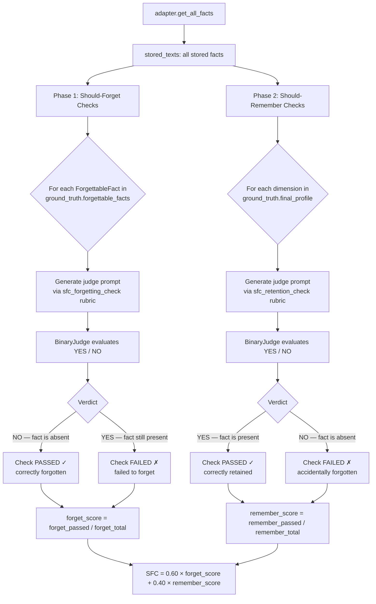

# SFC — Selective Forgetting Capability

> **Dimension weight in CRI composite:** 0.10 (available in `extended` and `full` scoring profiles; not included in `core`)

## What It Measures

Selective Forgetting Capability evaluates whether a memory system can **appropriately discard ephemeral, superseded, or session-contextual information** while retaining facts that should persist. SFC answers a question that other dimensions do not: **does the system know what to forget?**

Most memory benchmarks focus exclusively on retention — whether the system recalls what it was told. SFC adds the complementary perspective: a system that remembers *everything* is not well-behaved. Real conversations contain temporary states, corrected information, session-specific context, and noise that should be purged before it pollutes the long-term memory profile.

SFC is structured as two sub-dimensions:

1. **Should-forget** (weight: 0.60) — explicitly flagged ephemeral or superseded facts that the system should have discarded
2. **Should-remember** (weight: 0.40) — facts from the ground-truth final profile that must still be present

The weighted combination rewards systems that balance active forgetting with reliable retention.

### Scope

SFC covers:

- **Ephemeral states** — transient facts that were true only in the moment (e.g., "I'm currently traveling", "I'm hungry right now")
- **Superseded facts** — information that was explicitly replaced by a later update (e.g., a previous address after the user announces they moved)
- **Session-contextual noise** — conversational filler and temporary context that should not persist as long-term memory
- **Persistent fact retention** — verifying that non-ephemeral facts from the final profile were not accidentally discarded alongside the ephemeral ones

SFC does **not** cover:

- Whether the system updated a fact to its new value (→ see [DBU](./dbu.md))
- Whether important facts are stored with coverage and efficiency (→ see [MEI](./mei.md))
- Conflict resolution between contradictory information (→ see [CRQ](./crq.md))

## Why It Matters

A memory system accumulates context over time. Without selective forgetting:

- **Stale facts persist alongside current ones**, creating conflicting signals that degrade retrieval quality
- **Ephemeral state pollutes long-term profiles** — a user who was "nervous before a job interview" should not have that stored permanently
- **Storage grows unboundedly**, with no mechanism to clean up facts that have been superseded

Selective forgetting is what separates a **living memory system** from a static log. From a practical perspective:

- **User privacy expectations.** Users implicitly expect that temporary states and corrected information are not retained indefinitely. A system that stores "I'm going through a divorce" long after the fact has been corrected or resolved fails user expectations.
- **Retrieval precision.** Superseded facts compete with current facts at retrieval time, increasing the chance of returning stale information.
- **Downstream task quality.** Personalization and recommendation based on outdated facts can be worse than no memory at all.

### Relationship to Other Dimensions

- **DBU** tests whether a fact was *updated* to its new value. **SFC** tests whether the old value was *discarded* entirely when appropriate.
- **MEI** tests storage efficiency globally. **SFC** focuses specifically on the hygiene dimension — is the right content being shed?
- **CRQ** handles *ambiguous* conflicts. **SFC** handles cases where the ground truth definitively specifies that a fact should be gone.

## How It Is Computed

### Algorithm

SFC runs in two sequential phases against all stored facts retrieved via `adapter.get_all_facts()`:



### Step-by-Step

1. **Retrieve all stored facts** once via `adapter.get_all_facts()` — both phases use this same snapshot.

2. **Phase 1 — Should-forget checks:**
   - Iterate over every `ForgettableFact` in `ground_truth.forgettable_facts`.
   - For each, generate a judge prompt via `sfc_forgetting_check(fact_text, reason, stored_texts)`.
   - The judge is asked whether the fact is still present in storage.
   - **Verdict inversion**: a `NO` verdict (fact is absent) means the system correctly forgot → **pass**. A `YES` verdict (fact is still present) → **fail**.

3. **Phase 2 — Should-remember checks:**
   - Iterate over every `ProfileDimension` in `ground_truth.final_profile`.
   - Multi-value dimensions are expanded so each value receives its own check.
   - For each, generate a judge prompt via `sfc_retention_check(dimension, value, stored_texts)`.
   - A `YES` verdict (fact is present) → **pass**. A `NO` verdict → **fail**.

4. **Compute sub-scores and composite:**
   - `forget_score = forget_passed / forget_total` (defaults to 1.0 if no forgettable facts)
   - `remember_score = remember_passed / remember_total` (defaults to 1.0 if no profile items)
   - `SFC = 0.60 × forget_score + 0.40 × remember_score`

### Formula

```
forget_score   = correctly_absent / total_should_forget
remember_score = correctly_present / total_should_remember

SFC = 0.60 × forget_score + 0.40 × remember_score
```

Where:
- `correctly_absent` = forgettable facts that the judge confirmed are no longer in storage
- `total_should_forget` = total number of `ForgettableFact` items in the ground truth
- `correctly_present` = final-profile facts that the judge confirmed are still in storage
- `total_should_remember` = total number of expected persistent fact values

**Weight rationale:** The forget sub-score receives the higher weight (0.60) because the primary purpose of SFC is to test the system's active forgetting mechanism. Retention is also tested but is partially covered by PAS and MEI; the 0.40 weight for retention acts as a guard against systems that achieve high forgetting scores by blindly deleting everything.

The score ranges from **0.0** to **1.0**.

**Edge case:** If there are no forgettable facts and no profile items, SFC defaults to **1.0** (vacuous pass — nothing to evaluate).

### Judge Prompt Templates

**Forgetting check** (`sfc_forgetting_check`):

```
TASK
You are evaluating whether an AI memory system correctly discarded
ephemeral, fully superseded, or session-contextual information.
Consider semantic equivalence when comparing.

FACT THAT SHOULD BE FORGOTTEN: {fact_text}
REASON IT SHOULD BE FORGOTTEN: {reason}

STORED FACTS:
  1. {fact_1}
  2. {fact_2}
  ...

QUESTION
Is the fact above (or a semantically equivalent version) still
present in the stored facts?
NOTE: YES means the system FAILED to forget this fact.

Answer YES or NO.
```

**Retention check** (`sfc_retention_check`):

```
TASK
You are evaluating whether an AI memory system correctly retained
a persistent profile fact.

PROFILE DIMENSION: {dimension}
EXPECTED VALUE: {expected_value}

STORED FACTS:
  1. {fact_1}
  2. {fact_2}
  ...

QUESTION
Do the stored facts contain information that matches the expected
value "{expected_value}" for the profile dimension "{dimension}"?

Answer YES or NO.
```

Key design decisions:
- The forgetting check explicitly labels `YES` as a **failure** in the prompt, reducing judge confusion about the inverted verdict logic
- The `reason` field in the forgetting check provides context for why the fact should have been discarded, enabling the judge to evaluate intent, not just text matching

## Interpretation Guide

| Score Range | Interpretation | Typical Scenario |
|-------------|---------------|-------------------|
| **0.90 – 1.00** | Excellent hygiene — the system reliably discards ephemeral facts and retains persistent ones | Structured memory systems with explicit TTL or lifecycle management |
| **0.75 – 0.89** | Strong — most ephemeral facts discarded; minor retention or forgetting errors | Systems with active compaction or summarization that prunes ephemeral content |
| **0.55 – 0.74** | Moderate — inconsistent forgetting; some ephemeral facts persist or some persistent facts lost | RAG systems without lifecycle-aware storage |
| **0.35 – 0.54** | Weak — significant forgetting failures or unintended retention losses | Append-only stores with no cleanup mechanism |
| **0.00 – 0.34** | Poor — the system either retains all ephemeral facts or loses critical persistent facts | No-memory baselines (score 0 on forgetting); delete-everything systems (score 0 on retention) |

### Interpreting the Sub-Scores

The composite score can mask important patterns. Always examine the sub-scores:

- **High forget, low remember**: The system is aggressively discarding content, including things it should keep. May indicate over-aggressive compaction or summarization that loses detail.
- **Low forget, high remember**: The system reliably retains everything it stores but never discards anything. Good for retention; fails at memory hygiene.
- **Both high**: The system correctly distinguishes ephemeral from persistent facts — the ideal outcome.
- **Both low**: Fundamental storage lifecycle failure.

Sub-scores are available in the `DimensionResult.details` summary entry (`forget_score`, `remember_score`, `composite`).

### Baseline Reference Points

| System Type | Expected SFC Range |
|-------------|-------------------|
| Append-only store (no forgetting) | 0.00 – 0.40 (forget_score ≈ 0) |
| Full-context window | 0.00 – 0.40 (retains all ephemeral facts verbatim) |
| RAG with periodic compaction | 0.40 – 0.70 |
| Structured memory with lifecycle management | 0.75 – 1.00 |

## Examples

### Example 1: Ephemeral State Correctly Forgotten

**Forgettable fact:** `"I'm really stressed about my job interview tomorrow"` — Reason: `"Session-specific emotional state, no longer relevant after the interview date"`

**Stored facts:** No match found for this content.

**Judge verdict:** NO (fact is absent) → **Check passes ✓** — the system correctly discarded the temporary state.

### Example 2: Superseded Fact Incorrectly Retained

**Forgettable fact:** `"Lives at 42 Oak Street, Portland"` — Reason: `"User announced they moved to Seattle in a later session"`

**Stored facts:**
```
1. Elena lives at 42 Oak Street in Portland
2. Elena recently moved to Seattle
```

**Judge verdict:** YES (fact is still present) → **Check fails ✗** — the system updated its belief about current location but failed to remove the old address from storage.

### Example 3: Persistent Fact Retained Through Lifecycle

**Retention check — profile dimension:** `occupation: software engineer`

**Stored facts after multiple compaction cycles:**
```
1. Elena is a software engineer at a tech startup
```

**Judge verdict:** YES → **Check passes ✓** — the persistent fact survived compaction.

### Example 4: Accidental Deletion During Cleanup

**Retention check — profile dimension:** `spoken_languages: Portuguese`

**Stored facts:** No mention of Portuguese found after compaction.

**Judge verdict:** NO → **Check fails ✗** — the system discarded a persistent fact during cleanup, reducing the remember_score.

### Example 5: Partial Score Breakdown

```
Forgettable facts: 5 total, 4 correctly absent  → forget_score = 4/5 = 0.80
Profile facts:     8 total, 7 correctly present → remember_score = 7/8 = 0.875

SFC = 0.60 × 0.80 + 0.40 × 0.875
    = 0.480 + 0.350
    = 0.830
```

## Known Limitations

### 1. Requires Annotated Forgettable Facts

SFC depends on `ground_truth.forgettable_facts` — a list of explicitly annotated ephemeral facts. If the dataset does not include this annotation, SFC can only evaluate the retention sub-dimension. The forget sub-score defaults to 1.0 in this case, which may overstate overall SFC performance.

**Mitigation:** Ensure datasets include `forgettable_facts` annotations when evaluating SFC. Datasets without forgettable facts should note this limitation when reporting SFC scores.

### 2. Verdict Inversion Complexity

The forgetting check uses an inverted verdict: YES means failure, NO means pass. This is necessary because the judge is asked "is the fact still present?" rather than "did the system forget correctly?" The inversion is documented in the judge prompt itself, but it introduces an additional source of potential confusion when reviewing raw judge logs.

**Mitigation:** The `DimensionResult.details` entries include a `passed` field that already accounts for the inversion — use this rather than interpreting the raw verdict directly.

### 3. Semantic Ambiguity at the Boundary

Some facts are genuinely ambiguous about whether they should persist. A fact like "Elena was feeling anxious about her health" could be ephemeral (a temporary emotion) or persistent (an ongoing health concern). Ground-truth annotation decisions in this grey zone directly affect SFC scores.

**Mitigation:** Dataset designers should document annotation criteria for `forgettable_facts` clearly. The `reason` field in `ForgettableFact` should explain the classification decision.

### 4. Interaction with MEI

A system that aggressively deletes content to maximize MEI efficiency may inadvertently improve its forget_score while hurting its remember_score. Systems should not be optimized for MEI in ways that systematically discard all stored facts.

**Mitigation:** Cross-reference SFC's remember_score with MEI's coverage score. Consistent low remember_score + low MEI coverage points to over-aggressive deletion.

---

*Part of the [CRI Benchmark — Contextual Resonance Index](../../README.md) metric documentation.*
