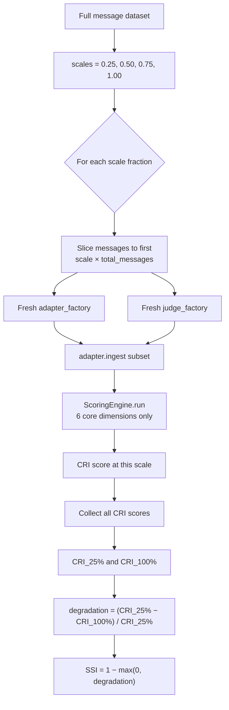

# SSI — Scale Sensitivity Index

> **Meta-metric:** SSI is reported separately from the CRI composite score. It is only computed when running the **`full` scoring profile**.

## What It Measures

The Scale Sensitivity Index measures **how stable a memory system's composite CRI score is as the volume of ingested messages increases**. SSI answers the question: **does the system's quality hold up at scale?**

A system might score excellently on a small dataset — 50 messages — but degrade significantly when ingesting 500 messages from the same conversation. This degradation can happen for many reasons: context window saturation, compaction artifacts, retrieval ranking pressure, or storage architecture limits. SSI surfaces this fragility directly.

SSI is a **meta-metric** — it does not evaluate memory content like PAS, MEI, or SFC do. Instead, it evaluates the *stability* of the overall benchmark score across dataset scales. A system that degrades gracefully is robust; a system that collapses at larger scales is not production-ready regardless of its peak performance.

### What SSI Is Not

SSI is not:

- A replacement for the core dimension scores — it complements them with a stability perspective
- A measure of absolute performance at any single scale — that is what CRI measures
- Included in the CRI composite calculation — it is reported as a standalone score alongside CRI

## Why It Matters

Memory systems are typically developed and tested on small, controlled datasets. Production use involves much longer conversations:

- **Context window saturation**: Systems that use full-context LLMs degrade sharply when conversations exceed the context window.
- **Compaction artifacts**: Systems that summarize or compress memory may lose detail with each compaction cycle, with the effect compounding as more messages are ingested.
- **Retrieval degradation**: Vector search systems experience retrieval precision drops as the store grows, because the ratio of relevant to irrelevant facts decreases.
- **Indexing and storage limits**: Some systems have architectural limits that only manifest at larger scales.

From a practical perspective, SSI is the most operationally relevant signal for production deployment decisions. A system that achieves CRI 0.85 at 25% of the dataset but drops to CRI 0.50 at full scale is not suitable for production use, regardless of its peak score.

## How It Is Computed

### Algorithm

SSI runs the CRI benchmark **multiple times**, each time using a different fraction of the full message set. A fresh adapter and judge instance are created for each scale point to prevent earlier ingestions from leaking into later runs.



### Step-by-Step

1. **Determine scale points**: By default, the benchmark is evaluated at fractions `[0.25, 0.50, 0.75, 1.00]` of the total message count.
2. **For each scale point:**
   - Compute the message cutoff: `cutoff = max(1, int(total_messages × scale))`
   - Take the first `cutoff` messages from the ordered message list.
   - Create a **fresh adapter** via `adapter_factory()` (no state carried over from prior scale points).
   - Create a **fresh judge** via `judge_factory()`.
   - Ingest the subset: `adapter.ingest(subset)`.
   - Run the `ScoringEngine` using the six core CRI dimensions (SSI itself is excluded to avoid recursion).
   - Record the composite CRI score for this scale.
3. **Compute SSI** from the smallest and largest scale CRI scores using the formula below.

### Formula

```
degradation_rate = (CRI_smallest_scale − CRI_largest_scale) / CRI_smallest_scale

SSI = 1 − max(0, degradation_rate)
```

Default scale points: `[0.25, 0.50, 0.75, 1.00]`

Where:
- `CRI_smallest_scale` = composite CRI score using the first 25% of messages
- `CRI_largest_scale` = composite CRI score using all messages (100%)
- `degradation_rate` = fractional drop in CRI from smallest to largest scale
- `max(0, ...)` ensures that *improvement* with scale does not push SSI above 1.0

**Key properties:**
- **SSI = 1.0** means no degradation — performance at full scale is equal to or better than at the smallest scale
- **SSI = 0.0** means total degradation — the system's CRI dropped to 0.0 at full scale relative to its 25% performance
- SSI can never exceed 1.0 — scale improvement is clamped at 0.0 degradation
- If `CRI_smallest_scale = 0`, the degradation rate is defined as 0.0 to avoid division by zero, giving SSI = 1.0

**Note on the formula:** SSI measures degradation relative to the smallest-scale baseline (25%), not relative to perfect performance (1.0). A system that scores CRI 0.40 at 25% and CRI 0.40 at 100% achieves SSI 1.0 — it is stable, even if its absolute performance is low. Absolute quality is captured by the core dimensions; SSI captures only the stability dimension.

### Default Scales

```python
DEFAULT_SCALES = [0.25, 0.50, 0.75, 1.00]
```

Custom scales can be provided via the `scales` parameter of `compute_ssi()`. The function accepts any list of fractions in [0.0, 1.0]. At minimum, two scale points are needed for a meaningful SSI calculation.

### Scoring Profile Requirement

SSI is only computed when using the **`full` scoring profile**. It is not run under the `core` or `extended` profiles because:

1. SSI requires multiple full benchmark runs (one per scale point) — it is significantly more expensive than a single evaluation
2. The `core` and `extended` profiles are designed for rapid iteration; SSI is a thorough stability test intended for final evaluation and production validation

To trigger SSI, use:

```python
from cri.models import ScoringConfig, ScoringProfile

config = ScoringConfig.from_profile(ScoringProfile.FULL)
```

## Interpretation Guide

| SSI Score | Interpretation | Typical Scenario |
|-----------|---------------|-------------------|
| **0.95 – 1.00** | Excellent stability — the system performs consistently across all dataset sizes | Architectures with explicit capacity management and stable retrieval |
| **0.80 – 0.94** | Strong — minor degradation at scale; acceptable for most production use | Well-engineered RAG systems with manageable context growth |
| **0.60 – 0.79** | Moderate — noticeable degradation; scale limitations present | Systems approaching context window or storage limits at full scale |
| **0.40 – 0.59** | Weak — significant degradation; scale sensitivity is a real concern | Full-context LLMs near their window limit; simple append-only stores |
| **0.00 – 0.39** | Poor — severe degradation; system is not production-ready at the tested scale | Context window saturation, compaction failures, or storage architecture limits |

### Diagnosing Low SSI

The `DimensionResult.details` array includes one entry per scale point, each with:
- `scale` — the fraction of the dataset used
- `message_count` — actual number of messages ingested
- `cri` — the composite CRI score at this scale

And a summary entry with:
- `cri_at_smallest_scale` — CRI at 25% scale
- `cri_at_largest_scale` — CRI at 100% scale
- `degradation_rate` — the computed degradation fraction
- `ssi` — the final SSI score

Examining the per-scale CRI trajectory reveals the degradation pattern:

- **Sharp drop between 50% and 75%**: Suggests a capacity threshold — a context window limit, compaction trigger, or indexing limit at that message count.
- **Gradual linear decline**: Suggests retrieval precision degradation as the storage store grows — common in vector search systems.
- **Non-monotonic (improvement then decline)**: Suggests the system benefits from more context up to a point, then degrades — may indicate a summarization strategy that helps at moderate scale but loses precision at large scale.
- **Flat across all scales**: High SSI — the system scales well within the tested range.

### Baseline Reference Points

| System Type | Expected SSI Range |
|-------------|-------------------|
| No-memory baseline | 1.00 (always returns nothing — consistently bad but stable) |
| Full-context LLM (small context window) | 0.20 – 0.60 (sharp cliff at window boundary) |
| Full-context LLM (large context window) | 0.60 – 0.90 (degrades gradually) |
| Vector RAG without compaction | 0.50 – 0.80 (retrieval precision degrades with store growth) |
| Ontology-based / structured memory | 0.75 – 1.00 (structured stores tend to scale more predictably) |

## Examples

### Example 1: Stable System

| Scale | Messages | CRI |
|-------|----------|-----|
| 25% | 50 | 0.82 |
| 50% | 100 | 0.84 |
| 75% | 150 | 0.83 |
| 100% | 200 | 0.81 |

```
degradation = (0.82 − 0.81) / 0.82 = 0.012
SSI = 1 − 0.012 = 0.988
```

The system is highly stable — CRI barely changes across scales.

### Example 2: Context Window Saturation

| Scale | Messages | CRI |
|-------|----------|-----|
| 25% | 50 | 0.88 |
| 50% | 100 | 0.85 |
| 75% | 150 | 0.71 |
| 100% | 200 | 0.52 |

```
degradation = (0.88 − 0.52) / 0.88 = 0.409
SSI = 1 − 0.409 = 0.591
```

Performance holds at low scale but drops sharply once the full dataset is ingested — likely the system's context window is saturated around the 75%–100% range.

### Example 3: Improving with Scale

| Scale | Messages | CRI |
|-------|----------|-----|
| 25% | 50 | 0.70 |
| 50% | 100 | 0.75 |
| 75% | 150 | 0.78 |
| 100% | 200 | 0.80 |

```
degradation = (0.70 − 0.80) / 0.70 = −0.143
SSI = 1 − max(0, −0.143) = 1 − 0 = 1.00
```

The system *improves* with more context — perhaps because its summarization or extraction becomes more accurate with more evidence. SSI is clamped at 1.00.

### Example 4: Complete Collapse

| Scale | Messages | CRI |
|-------|----------|-----|
| 25% | 50 | 0.75 |
| 50% | 100 | 0.45 |
| 75% | 150 | 0.20 |
| 100% | 200 | 0.05 |

```
degradation = (0.75 − 0.05) / 0.75 = 0.933
SSI = 1 − 0.933 = 0.067
```

The system essentially fails at full scale — indicating a fundamental architectural limitation that becomes disabling as the dataset grows.

## Known Limitations

### 1. Computational Cost

SSI requires running the full CRI benchmark at each of the four scale points, with fresh adapter and judge instances each time. This means SSI evaluation costs approximately 4× the compute of a single CRI run, before factoring in judge API calls. For large datasets, this is significant.

**Mitigation:** SSI is only triggered by the `full` scoring profile, which is explicitly intended for comprehensive evaluation. Use `core` or `extended` profiles during development and reserve `full` for final evaluation.

### 2. Dataset Size Dependency

SSI measures degradation between the 25% and 100% scale points. If the total dataset is small (e.g., 20 messages), the 25% slice (5 messages) may produce a noisy or unrepresentative CRI baseline, making the SSI calculation unreliable.

**Mitigation:** SSI is most meaningful for datasets of 100+ messages. For smaller datasets, treat SSI values cautiously and focus on the raw per-scale CRI trajectory rather than the aggregate SSI score.

### 3. Snapshot Semantics

Each scale point ingests a prefix of the message sequence (the first N messages). This means the ground truth is evaluated against a *partial* conversation — the ground-truth facts that are only established in the later portion of the conversation will necessarily score lower at smaller scales, even for a perfect system.

**Mitigation:** This is intentional — SSI tests whether the system's overall profile degrades under scale pressure, not whether it achieves full accuracy at partial context. Ground truth designed for SSI should include facts established early in the conversation, so that smaller-scale baselines are meaningful.

### 4. Fixed Baseline Scale

SSI compares the smallest scale (25% by default) against the largest (100%). If the system happens to perform unusually well or poorly at exactly 25%, the SSI calculation may overstate or understate true stability.

**Mitigation:** Examine the full per-scale CRI trajectory in `DimensionResult.details` rather than relying solely on the aggregate SSI score. Custom scale points can be configured if the default 25%/100% comparison is not representative for a specific dataset.

---

*Part of the [CRI Benchmark — Contextual Resonance Index](../../README.md) metric documentation.*
