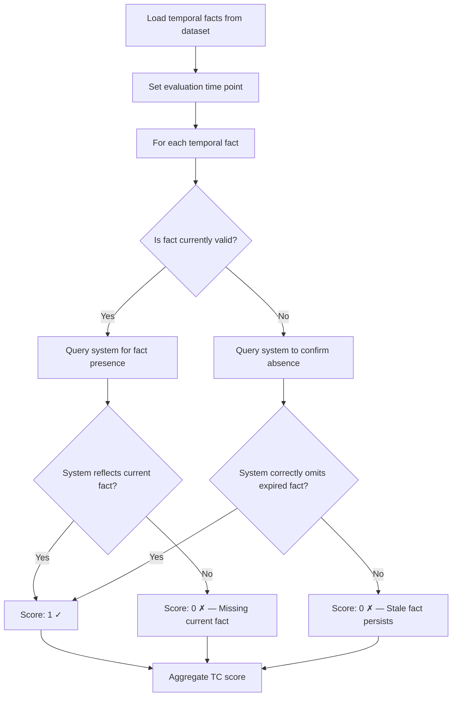

# TC — Temporal Coherence

## What It Measures

Temporal Coherence (TC) evaluates how well a memory system handles the **temporal dimension of knowledge** — understanding what is current versus outdated, correctly tracking time-bounded facts, and recognizing when information has expired or been superseded.

TC specifically tests whether the system can:

- Maintain **current facts** that are still valid
- Remove or deprecate **expired facts** that are no longer true
- Distinguish between **ongoing** and **completed** states
- Correctly handle **time-bounded preferences** (e.g., "likes X until Y")
- Preserve **chronological ordering** of events and state transitions

This dimension is critical because time is an inherent property of nearly all real-world knowledge. A system that treats "Marcus is an architect" and "Marcus is a UX designer" as equally valid — ignoring that one superseded the other — will produce confused, unreliable responses.

## Why It Matters

Long-term memory systems accumulate knowledge over extended periods. During this time:

- **People change**: jobs, locations, relationships, preferences
- **Events conclude**: projects finish, subscriptions expire, trips end
- **Context shifts**: what was relevant yesterday may be irrelevant today

A memory system without temporal awareness commits two critical failure modes:

1. **Stale persistence** — Retaining expired information as if it were still true (e.g., "She's currently traveling to Japan" months after the trip ended)
2. **Premature expiry** — Dropping information that is still valid (e.g., forgetting an ongoing subscription)

Both failure modes degrade the quality of responses and erode user trust. TC measures the system's ability to avoid both.

### Relationship to Other Dimensions

TC is closely related to **DBU (Dynamic Belief Updating)** but tests a distinct property. While DBU measures whether the system *updates* when given new contradicting information, TC measures whether the system correctly handles the **passage of time itself** — even when no explicit correction is provided. A system might pass DBU (it updates when told "I moved to Seattle") but fail TC (it still reports a temporary trip as ongoing long after it should have concluded).

## How It Is Measured

### Formula

```
TC = correctly_handled / total_temporal_facts
```

Where:

- **`total_temporal_facts`** — The number of facts in the evaluation dataset that have a temporal component (start time, end time, duration, or time-bounded validity)
- **`correctly_handled`** — The number of temporal facts where the system's response correctly reflects the current temporal state

### Evaluation Method

1. **Dataset construction**: The evaluation dataset includes facts with explicit temporal properties:
   - Facts with **start and end dates** (e.g., "Lived in Portland from 2018 to 2022")
   - Facts with **ongoing status** (e.g., "Started learning piano in March 2025")
   - Facts with **implicit expiry** (e.g., "Currently on a two-week vacation" — ingested 3 weeks ago)
   - Facts that **supersede** earlier facts of the same type

2. **Temporal verification**: For each temporal fact, the system is queried at a specific **evaluation time point**. The evaluator checks:
   - **Current facts present**: Facts that should be valid at the evaluation time are reflected in the system's response
   - **Expired facts absent**: Facts that should have expired by the evaluation time are NOT presented as current

3. **Scoring per fact**: Each temporal fact is scored as a binary — either the system correctly handles its temporal status (1) or it doesn't (0). The TC score is the proportion of correctly handled facts.

### Test Categories

| Category | Description | Example |
|----------|-------------|---------|
| **Time-bounded preferences** | Preferences with explicit start/end | "Doing keto for January" → should not be active in March |
| **Expired states** | Conditions that have concluded | "Has a broken arm" (6 months ago) → should recognize recovery |
| **Ongoing vs. completed events** | Distinguishing active from finished | "Is studying for the bar exam" vs. "passed the bar exam" |
| **Temporal supersession** | Newer state replacing older | "Lives in Portland" → "Lives in Seattle" → current = Seattle |
| **Relative temporal reasoning** | Understanding "recently", "a while ago" | "Just started a new job" (ingested 2 years ago) → no longer "just" |

### Evaluation Process Flow



## Interpretation

| TC Score | Rating | Interpretation |
|----------|--------|----------------|
| 0.95 – 1.00 | Exceptional | System demonstrates near-perfect temporal awareness |
| 0.80 – 0.94 | Strong | Minor temporal errors, mostly on edge cases |
| 0.60 – 0.79 | Moderate | Noticeable temporal confusion; some stale or missing facts |
| 0.40 – 0.59 | Weak | Frequent temporal errors; unreliable time handling |
| 0.00 – 0.39 | Poor | System largely ignores the temporal dimension |

### What Scores Reveal

- **High TC, low DBU**: The system handles time naturally but struggles with explicit corrections — suggests good temporal metadata but weak update logic
- **Low TC, high DBU**: The system updates when told to but doesn't track time independently — suggests reactive but not proactive temporal handling
- **Low TC across all systems**: May indicate the evaluation dataset's temporal challenges are exceptionally difficult, or the time gaps are too subtle

## Examples

### Example 1: Time-Bounded Preference

**Events ingested:**
1. (January 5) "Elena said she's doing a dry January — no alcohol for the month"
2. (January 20) "Elena mentioned she's really enjoying the challenge"

**Query at evaluation time (February 15):**
"Does Elena drink alcohol?"

**Correct response:** Should NOT present "dry January" as current behavior. Should either note it as past or simply not restrict her current state.

**Scoring:** If system says "Elena doesn't drink alcohol" → Score: 0 (stale fact persists). If system correctly treats it as expired → Score: 1.

### Example 2: Ongoing Event

**Events ingested:**
1. (March 1) "Marcus started training for a marathon"
2. (March 15) "Marcus ran 15 miles this weekend as part of his training"

**Query at evaluation time (March 20):**
"Is Marcus training for anything?"

**Correct response:** Yes, marathon training is ongoing.

**Scoring:** If system correctly reports active training → Score: 1.

### Example 3: Implicit Expiry

**Events ingested:**
1. (June 1) "Sophia is on a two-week vacation in Italy"

**Query at evaluation time (July 15):**
"Where is Sophia right now?"

**Correct response:** Should NOT say "Sophia is in Italy on vacation." The two-week window has clearly passed.

**Scoring:** If system still reports the vacation as current → Score: 0.

## Limitations

1. **Temporal ambiguity**: Not all facts have clear expiry times. "Elena is into yoga" has no natural expiry — testing such facts risks penalizing systems for reasonable assumptions.

2. **Evaluation time sensitivity**: The TC score can vary depending on when the evaluation time point is set relative to the events. A system might score well at T+1 month but poorly at T+6 months.

3. **Binary scoring granularity**: The binary correct/incorrect scoring does not capture *degrees* of temporal error. A system that says "Elena was doing dry January" (past tense, partially correct) scores the same as one that says "Elena is a lifelong teetotaler" (completely wrong).

4. **Cultural and contextual time norms**: Some temporal concepts are culturally relative. "Recently" can mean different things in different contexts. The benchmark must define clear temporal boundaries to avoid ambiguity.

5. **Implicit vs. explicit time**: Some temporal information is stated explicitly ("for two weeks") while other must be inferred ("just started" → how long is "just"?). Systems may handle explicit time better than implicit, and the metric doesn't distinguish between these sub-capabilities.

6. **Interaction with conflict resolution**: When temporal changes create conflicts, the boundary between TC and CRQ becomes blurred. The benchmark must clearly assign each test case to one dimension to avoid double-counting.
