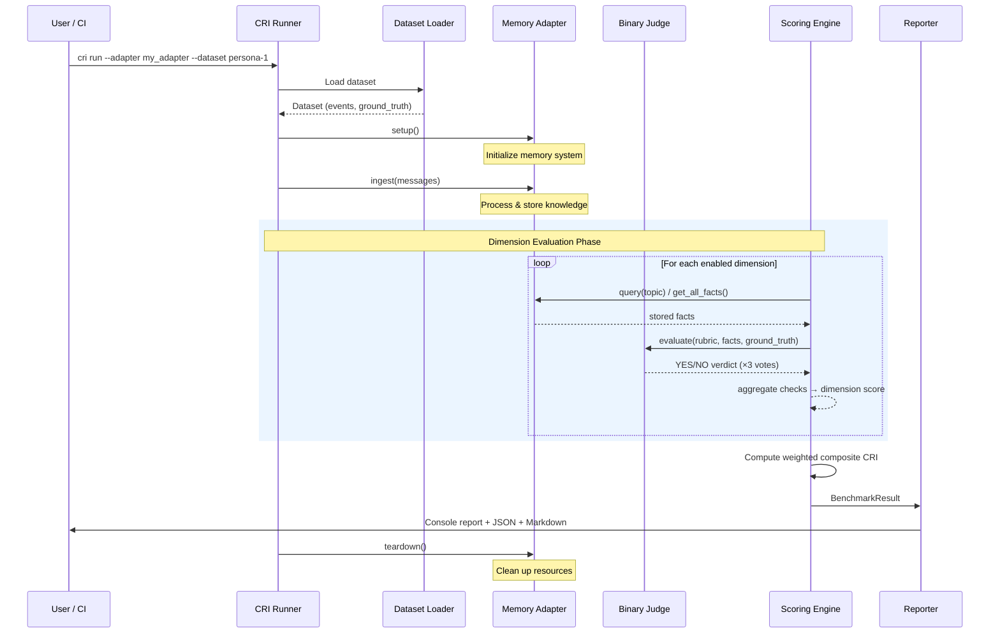
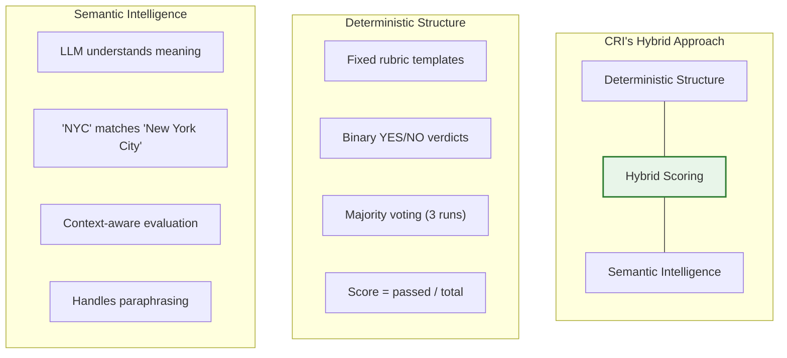
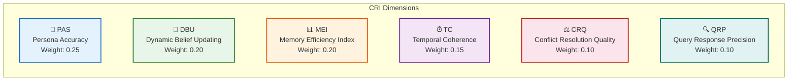
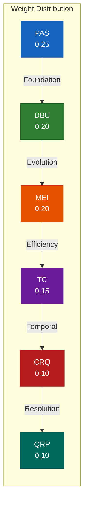
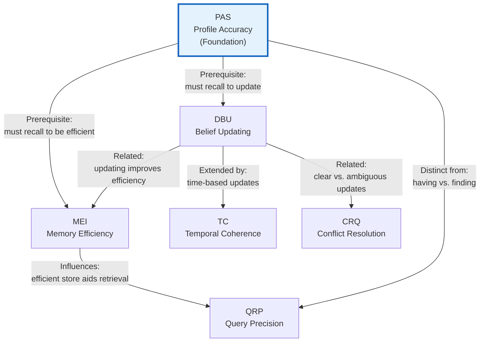
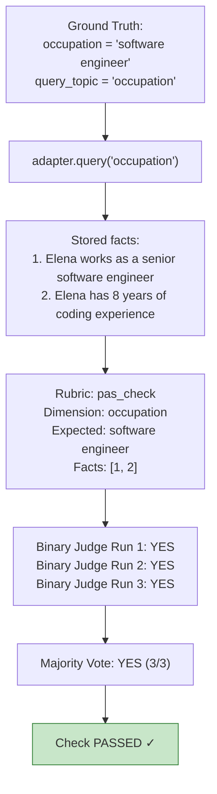

# Evaluation Methodology Overview

> *A benchmark is only as credible as its methodology. This document explains exactly how the CRI Benchmark evaluates memory systems — from dataset ingestion to final score.*

---

## The CRI Evaluation Pipeline

Every CRI benchmark run follows a deterministic six-stage pipeline. Each stage has clearly defined inputs and outputs, enabling full auditability and reproducibility.



### Stage 1 — Dataset Loading

The runner loads a benchmark dataset from the filesystem. Each dataset contains:

| File | Contents | Purpose |
|------|----------|---------|
| `conversations.jsonl` | Chronological conversation messages | Input to the memory system |
| `ground_truth.json` | Expected knowledge state after ingestion | Evaluation reference |
| `metadata.json` | Dataset metadata (seed, version, persona ID) | Reproducibility |

The dataset loader validates the structure, checks required fields, and produces a typed `Dataset` object. Invalid datasets fail fast with clear error messages.

> *See [Dataset Design](datasets.md) for details on dataset structure, canonical datasets, and creation of custom datasets.*

### Stage 2 — Adapter Initialization

The runner calls `adapter.setup()` to initialize the memory system under test. This is where the adapter creates connections, initializes storage, and prepares for event ingestion.

The adapter must implement three methods:

```python
class MemoryAdapter(Protocol):
    def ingest(self, messages: list[Message]) -> None: ...
    def query(self, topic: str) -> list[StoredFact]: ...
    def get_all_facts(self) -> list[StoredFact]: ...
```

This minimal interface is architecture-neutral — vector stores, knowledge graphs, ontology systems, and hybrid approaches can all implement it without compromise.

> *See the [Integration Guide](../guides/integration.md) and [Adapter Interface](../architecture/adapter-interface.md) for implementation details.*

### Stage 3 — Event Ingestion

Events are fed to the memory system **in strict chronological order**, one at a time. Each event represents a piece of information the system should process:

```python
adapter.ingest(dataset.conversations)
```

Events simulate real-world information flow: biographical facts, preference statements, life updates, contradictions, temporal changes, and noise (greetings, filler). The memory system must decide what to extract, store, update, and discard.

Ingestion timing is recorded for performance profiling but does **not** affect the quality score.

### Stage 4 — Dimension Evaluation

After all events are ingested, the scoring engine evaluates each enabled dimension independently. This is the core of CRI's evaluation methodology.

Each dimension scorer:

1. **Queries the adapter** — using `query(topic)` for targeted retrieval or `get_all_facts()` for global inspection
2. **Constructs judge prompts** — using dimension-specific rubric templates
3. **Runs binary evaluations** — each check produces a YES/NO verdict via majority vote (3 runs)
4. **Aggregates results** — computes the dimension score as a ratio of passed checks

The seven dimensions run sequentially and independently. A failure in one dimension does not affect others.

### Stage 5 — Composite CRI Computation

The weighted composite CRI score is calculated from the individual dimension scores:

```
CRI = 0.25 × PAS + 0.20 × DBU + 0.20 × MEI + 0.15 × TC + 0.10 × CRQ + 0.10 × QRP
```

Weights are configurable but the defaults are provided with explicit justification (see [Scoring Composition](#scoring-composition) below).

### Stage 6 — Report Generation

The reporter produces the final output in multiple formats:

- **Console** — Rich-formatted terminal output with color-coded scores
- **JSON** — Machine-readable results with full metadata for CI/CD integration
- **Markdown** — Human-readable report suitable for documentation or pull requests

Every report includes the complete judge log — every prompt sent, every response received — enabling full audit of the evaluation.

---

## The Hybrid Scoring Approach

CRI employs a **hybrid scoring model** that combines deterministic structure with semantic intelligence. This is one of its most important methodological contributions.

### The Problem with Pure Approaches

Traditional benchmarks use one of two approaches, each with significant drawbacks:

| Approach | Strength | Weakness |
|----------|----------|----------|
| **Exact match** | Perfectly reproducible | Cannot handle semantic equivalence ("NYC" ≠ "New York City") |
| **LLM scoring (1-10 scale)** | Handles semantic nuance | Poor inter-rater reliability, hard to reproduce |

CRI combines the best of both:



### How It Works

1. **Structured decomposition** — Each dimension is broken into independent binary checks. Rather than asking "How well did the system handle this?" (subjective), CRI asks "Did the system store the user's occupation correctly?" (binary).

2. **Binary LLM verdicts** — Each check is evaluated by an LLM judge constrained to answer **YES or NO**. This dramatically improves inter-rater reliability compared to Likert scales:

   | Method | Inter-rater agreement | Score variance |
   |--------|----------------------|----------------|
   | 5-point Likert scale | ~60-70% | High |
   | Binary YES/NO | ~90-95% | Near zero |

3. **Majority voting** — Each check is evaluated **3 times** (configurable). The final verdict is determined by majority vote (≥2 of 3). This eliminates most remaining stochastic noise.

4. **Deterministic aggregation** — Dimension scores are computed as `passed_checks / total_checks`. The composite CRI is a weighted sum. No learned parameters, no calibration, no opaque transformations.

### Why Binary Verdicts?

The decision to use binary YES/NO verdicts rather than graded scales is a deliberate design choice grounded in evaluation science:

- **Reproducibility**: Binary questions produce consistent answers across LLM runs. "Is X present?" has a clear answer; "How good is X on a scale of 1-10?" does not.
- **Auditability**: A human reviewer can verify every YES/NO judgment. A 7.3 vs. 7.5 distinction is nearly impossible to audit.
- **Cost efficiency**: `max_tokens=10` eliminates verbose judge responses. Each evaluation costs a fraction of free-form scoring.
- **Granularity through aggregation**: Many binary checks produce fine-grained scores. A dimension with 20 checks can produce scores at 0.05 intervals (0.00, 0.05, 0.10, ..., 1.00) — equivalent granularity to a 20-point scale but with far higher reliability.

> *See [Judge Methodology](judge.md) for the full specification of the LLM-as-judge approach, prompt design, temperature settings, and reproducibility guarantees.*

---

## The Seven Evaluation Dimensions

CRI evaluates memory systems across **seven orthogonal dimensions**, each measuring a distinct property of long-term memory behavior. The dimensions are designed to be independent — a system can score high on one and low on another, revealing specific strengths and weaknesses.



### PAS — Persona Accuracy Score (Weight: 0.25)

**What it measures:** Does the system remember what it was told?

PAS evaluates factual recall of explicit persona attributes — demographics, preferences, biographical facts, stated opinions. It is the **foundational dimension**: if a system cannot recall basic facts, no other capability matters.

**How it works:** For each profile dimension in the ground truth, the judge checks whether the adapter's stored facts semantically match the expected value. Multi-value attributes (e.g., spoken languages) generate one check per element.

**Formula:** `PAS = passed_checks / total_checks`

> *See [PAS — Persona Accuracy Score](metrics/pas.md) for the complete specification.*

---

### DBU — Dynamic Belief Updating (Weight: 0.20)

**What it measures:** When facts change, does the system update?

DBU evaluates whether the memory system correctly transitions from old beliefs to new ones when information changes. This is what separates a real memory system from an append-only log.

**How it works:** Each belief change is evaluated with a **dual-check approach**:
1. **Recency check** — Does the system reflect the new value? (Expected: YES)
2. **Staleness check** — Does the system still assert the old value as current? (Expected: NO)

A belief change passes **only** when both conditions are met. Historical context ("used to be X") is explicitly allowed.

**Formula:** `DBU = passed_changes / total_changes`

> *See [DBU — Dynamic Belief Updating](metrics/dbu.md) for the complete specification.*

---

### MEI — Memory Efficiency Index (Weight: 0.20)

**What it measures:** Does the system store knowledge efficiently with good coverage?

MEI evaluates the **efficiency** of the memory system's storage — measuring coverage (how much relevant information is captured) relative to the total storage footprint. It captures signal retention and noise rejection via coverage/efficiency ratios.

**How it works:** MEI calls `get_all_facts()` to retrieve the complete fact store and evaluates the ratio of useful knowledge to total stored content.

**Formula:** `MEI = 2 × coverage_score × efficiency_score / (coverage_score + efficiency_score)` (harmonic mean)

> *See [MEI — Memory Efficiency Index](metrics/mei.md) for the complete specification.*

---

### TC — Temporal Coherence (Weight: 0.15)

**What it measures:** Does the system understand time?

TC evaluates how well the memory system handles the temporal dimension of knowledge — distinguishing current from expired facts, tracking time-bounded preferences, and recognizing when information has a natural lifespan.

**How it works:** TC queries the system about facts with known temporal properties (start dates, end dates, durations, implicit expiry). The judge checks whether the system's response correctly reflects the temporal state at evaluation time.

**Formula:** `TC = correctly_handled / total_temporal_facts`

**Key distinction from DBU:** DBU tests whether the system updates when *explicitly told* something changed. TC tests whether the system handles the *passage of time itself* — even when no explicit correction is provided.

> *See [TC — Temporal Coherence](metrics/tc.md) for the complete specification.*

---

### CRQ — Conflict Resolution Quality (Weight: 0.10)

**What it measures:** How does the system handle contradictions?

CRQ evaluates the system's ability to identify, process, and resolve contradictory information. Unlike DBU (which tests clear updates), CRQ focuses on **ambiguous or complex conflicts** where the correct resolution requires reasoning.

**Conflict types tested:**

| Type | Example |
|------|---------|
| Explicit corrections | "I actually graduated in 2019, not 2018" |
| Gradual changes | Vegetarian → occasionally eats fish → pescatarian |
| Source authority | Self-report vs. third-party observation |
| Behavioral contradictions | Says "I don't watch much TV" but binge-watches series |

**Formula:** `CRQ = correctly_resolved / total_conflicts`

> *See [CRQ — Conflict Resolution Quality](metrics/crq.md) for the complete specification.*

---

### QRP — Query Response Precision (Weight: 0.10)

**What it measures:** Does the system retrieve the right facts for a given query?

QRP evaluates retrieval quality — whether the system surfaces relevant information and excludes irrelevant information when queried. This is an **output-side metric**: it tests the system's ability to select the right subset of its knowledge.

**How it works:** Each evaluation query has a defined set of relevant and irrelevant facts. QRP measures both recall (did it include the relevant facts?) and precision (did it exclude the irrelevant ones?).

**Formula:** `QRP = 0.5 × recall + 0.5 × precision`

**Key distinction from PAS:** PAS tests whether the system *has* the correct facts. QRP tests whether it can *find and present the right ones* for a specific query.

> *See [QRP — Query Response Precision](metrics/qrp.md) for the complete specification.*

---

## Scoring Composition

### The Composite CRI Formula

```
CRI = 0.25 × PAS + 0.20 × DBU + 0.20 × MEI + 0.15 × TC + 0.10 × CRQ + 0.10 × QRP
```

All dimension scores are in the range **[0.0, 1.0]**. The composite CRI score is therefore also in **[0.0, 1.0]**.

### Weight Justification

The default weights reflect a principled ordering of importance for long-term memory quality:



| Dimension | Weight | Justification |
|-----------|:------:|---------------|
| **PAS** | 0.25 | **Foundational** — if the stored knowledge is wrong, nothing else matters. Accuracy is the bedrock of all other capabilities. |
| **DBU** | 0.20 | **Critical** — knowledge that doesn't evolve becomes increasingly wrong over time. Static memory is a liability in a changing world. |
| **MEI** | 0.20 | **Important** — efficient storage with good coverage and minimal noise ensures retrieval quality and system reliability. |
| **TC** | 0.15 | **Significant** — temporal reasoning is essential for long-term memory, but less frequent than basic updates. Most knowledge is not time-bounded. |
| **CRQ** | 0.10 | **Valuable** — contradictions are common in real-world data but occur less frequently than straightforward updates. A specialized but important capability. |
| **QRP** | 0.10 | **Supporting** — retrieval quality matters, but CRI's primary focus is on the knowledge model itself. QRP confirms that good storage translates to good retrieval. |

### Custom Weight Profiles

Weights are fully configurable for specific use cases:

```python
from cri.models import ScoringConfig

# User profiling emphasis
profiling_config = ScoringConfig(
    dimension_weights={
        "PAS": 0.30, "DBU": 0.25, "MEI": 0.20,
        "TC": 0.10, "CRQ": 0.05, "QRP": 0.10,
    }
)

# Knowledge management emphasis
knowledge_config = ScoringConfig(
    dimension_weights={
        "PAS": 0.15, "DBU": 0.25, "MEI": 0.15,
        "TC": 0.20, "CRQ": 0.15, "QRP": 0.10,
    }
)

# Conversational AI emphasis
conversational_config = ScoringConfig(
    dimension_weights={
        "PAS": 0.20, "DBU": 0.15, "MEI": 0.15,
        "TC": 0.10, "CRQ": 0.10, "QRP": 0.30,
    }
)
```

**Constraint:** Weights must always sum to 1.0 (validated at engine initialization with ±0.01 tolerance).

### Score Interpretation

| CRI Score | Rating | Interpretation |
|-----------|--------|----------------|
| **0.90 – 1.00** | Exceptional | Near-perfect contextual memory across all dimensions |
| **0.70 – 0.89** | Strong | Reliable memory system with minor gaps in specific areas |
| **0.50 – 0.69** | Moderate | Functional memory with noticeable weaknesses in some dimensions |
| **0.30 – 0.49** | Weak | Significant memory quality issues; not suitable for production use |
| **0.00 – 0.29** | Poor | Minimal or no effective memory capability |

### The Power of Per-Dimension Reporting

The composite CRI score provides a convenient summary, but the **per-dimension breakdown is where the real diagnostic value lies**. Consider two systems with nearly identical composite scores:

| System | PAS | DBU | MEI | TC | CRQ | QRP | **CRI** |
|--------|:---:|:---:|:---:|:--:|:---:|:---:|:-------:|
| System A | 0.95 | 0.90 | 0.85 | 0.30 | 0.20 | 0.80 | **0.73** |
| System B | 0.70 | 0.70 | 0.70 | 0.75 | 0.75 | 0.70 | **0.71** |

Both score ~0.72 overall, but they reveal fundamentally different architectures:

- **System A** excels at capturing and updating facts but fails at temporal reasoning and conflict resolution — likely a simple extraction pipeline without temporal metadata.
- **System B** is consistently moderate across all dimensions — likely a more balanced architecture that handles everything adequately but nothing exceptionally.

This diagnostic capability makes CRI actionable, not just informative.

---

## Dimension Relationships

While each dimension measures an independent property, there are meaningful relationships between them:



**Key insight:** PAS is the **foundation**. A system that scores poorly on PAS (cannot recall basic facts) should not expect high scores on any other dimension. The dimensions form a natural hierarchy:

1. **Can it remember?** (PAS)
2. **Can it update?** (DBU)
3. **Can it store efficiently?** (MEI)
4. **Can it reason about time?** (TC)
5. **Can it resolve conflicts?** (CRQ)
6. **Can it retrieve effectively?** (QRP)

---

## Evaluation Lifecycle: End-to-End Example

To make the methodology concrete, here is a complete walkthrough of evaluating a single dimension (PAS) for a single profile attribute:



This same process repeats for every check in every dimension, producing hundreds of individual binary verdicts that aggregate into the final CRI score.

---

## Statistical Metadata

Every CRI result includes comprehensive statistical metadata to support scientific rigor:

| Metadata Field | Description | Use Case |
|---------------|-------------|----------|
| **Per-check verdicts** | Individual YES/NO results for every binary check | Debugging specific failures |
| **Vote distributions** | How many of 3 runs agreed (unanimous vs. split) | Identifying ambiguous checks |
| **Non-unanimous flags** | Checks where the judge disagreed with itself | Quality control, edge case identification |
| **Dimension breakdowns** | Score, passed/total counts per dimension | Diagnostic analysis |
| **Sub-dimension scores** | MEI coverage/efficiency breakdown | Granular MEI analysis |
| **Judge log** | Full prompt and response for every judge call | Complete audit trail |
| **Run metadata** | Judge model, temperature, timestamp, run ID | Reproducibility verification |

This metadata enables practitioners to move beyond the headline score and understand exactly *why* a system scored the way it did.

---

## Reproducibility Guarantees

CRI is designed for reproducible results. Given identical inputs:

| Configuration | Effect |
|--------------|--------|
| **Judge temperature: 0.0** | Minimizes LLM stochasticity |
| **Majority voting: 3 runs** | Reduces per-check variance to near zero |
| **Canonical datasets: versioned** | Same data across all evaluations |
| **Rubric prompts: committed** | Same evaluation criteria across all runs |
| **Adapter reset: required** | Clean state for each benchmark run |
| **Random seeds: configurable** | Deterministic behavior for all RNG |

**The reproducibility contract:**

```
GIVEN:
  - Canonical dataset v1.0
  - Adapter implementation X (deterministic behavior)
  - Judge model: claude-haiku-4-5
  - Judge runs: 3
  - Judge temperature: 0.0

THEN:
  - CRI composite score is identical across runs (within ±0.01)
  - Per-dimension scores are identical (within ±0.02)
  - Any non-unanimous verdicts are flagged in the report
```

> *See [Reproducibility Guidelines](../guides/reproducibility.md) for detailed guidance on achieving reproducible results.*

---

## Further Reading

| Topic | Link |
|-------|------|
| Project vision and motivation | [Vision](../vision.md) |
| Design principles and philosophy | [Benchmark Philosophy](../concepts/benchmark-philosophy.md) |
| LLM judge specification | [Judge Methodology](judge.md) |
| Dataset structure and design | [Dataset Design](datasets.md) |
| Individual dimension deep-dives | [PAS](metrics/pas.md) · [DBU](metrics/dbu.md) · [MEI](metrics/mei.md) · [TC](metrics/tc.md) · [CRQ](metrics/crq.md) · [QRP](metrics/qrp.md) |
| Composite score details | [Composite CRI Score](metrics/composite-cri.md) |
| System architecture | [Architecture Overview](../architecture/overview.md) |
| Quick start guide | [Quick Start](../guides/quickstart.md) |
| Adapter integration | [Integration Guide](../guides/integration.md) |

---

*Part of the [CRI Benchmark — Contextual Resonance Index](../README.md) documentation.*
