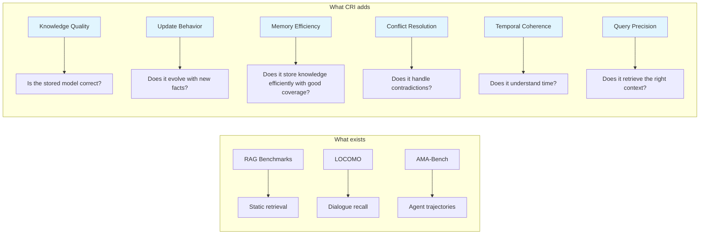
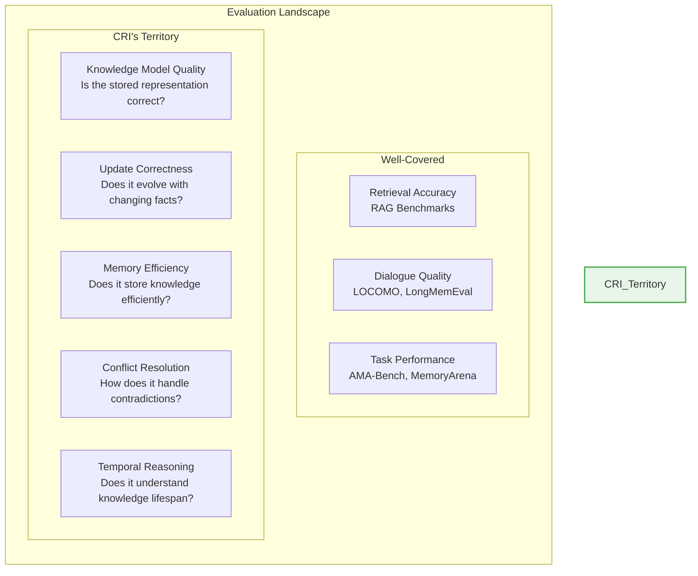

# Project Vision

> *How well does your AI actually know its users?*

---

## The Problem Nobody Has Solved

AI systems are increasingly expected to maintain long-term understanding of users, contexts, and evolving knowledge across sessions, days, and months. Yet there is **no standard way to measure how well they do this**.

This is remarkable. We have benchmarks for language understanding (GLUE), for world knowledge (MMLU), for code generation (HumanEval), for reasoning (GSM8K). But for the fundamental question — *does the AI system maintain an accurate, coherent model of the entities it interacts with?* — there is nothing.

### What Exists Today

| Benchmark | What It Measures | What It Misses |
|-----------|-----------------|----------------|
| **LOCOMO** | QA recall from long conversations | Tests retrieval, not storage quality. Doesn't evaluate whether the system built a correct knowledge model. |
| **LongMemEval** | Multi-session dialogue memory | Limited to dialogue-centric evaluation. No structured knowledge assessment. |
| **AMA-Bench** | Agent trajectory memory | Agent task execution focus. No entity/relationship modeling. Single-episode only. |
| **MemoryBench** | Continual learning | No write quality assessment. No conflict resolution testing. |
| **RAG benchmarks** | Retrieval from static corpora | Tests static retrieval, not evolving knowledge. No temporal dimension. |

Every existing benchmark shares the same blind spot: **they test what comes out (query answers) but never what went in (stored knowledge quality)**.

Consider a memory system that stores "User lives in New York" and "User lives in Buenos Aires" simultaneously — both from different points in time. If you ask "Where does the user live?", it might randomly pick the right answer 50% of the time. Existing benchmarks would score it at 50% accuracy. But the *knowledge model itself* is broken — it holds contradictory beliefs.

**CRI measures the model, not the answer.**

---

## The Vision

The **Contextual Resonance Index (CRI)** aims to become the **industry-standard benchmark** for evaluating AI long-term memory systems — analogous to what GLUE/SuperGLUE became for NLU tasks or MMLU for LLM knowledge evaluation.

### What CRI Provides

- **Six distinct evaluation dimensions**, each measuring a different property of memory behavior
- **Canonical datasets** with realistic personas at varying complexity levels
- A **3-method adapter interface** that any memory system can implement in under an hour
- A **transparent, reproducible** evaluation pipeline with full audit trail
- A **hybrid scoring engine** combining deterministic checks with LLM-as-judge
- **Extensive documentation** designed for progressive disclosure — from curiosity to contribution

### The Key Insight

CRI evaluates the **stored knowledge representation itself**, not the downstream LLM generation. This is the fundamental difference.

A traditional benchmark asks: *"Given this memory system, can an LLM answer questions correctly?"*

CRI asks: *"Did this memory system build an accurate, coherent, up-to-date model of the entities it learned about?"*

This separation is critical because it isolates memory quality from generation quality. A brilliant LLM can compensate for a mediocre memory system on traditional benchmarks. CRI eliminates this confound.

---

## Who Benefits

### Researchers
Compare memory architectures on equal footing. Publish results against a recognized standard. Use CRI's per-dimension breakdown to identify specific strengths and weaknesses of novel approaches.

### Startups & Companies
Demonstrate the quality of your memory solution with objective metrics. Show prospective customers and investors that your system outperforms alternatives on specific, well-defined dimensions.

### Academic Labs
Use CRI as a standard evaluation methodology in publications. Reproduce and extend results. Contribute new evaluation dimensions or datasets as the field matures.

### AI Infrastructure Teams
Evaluate memory components before deployment. Run CRI as part of CI/CD to catch regressions. Compare commercial offerings quantitatively.

### The Field
Establish a shared vocabulary for discussing memory quality. Move beyond vague claims ("our memory is better") to specific, measurable assertions ("our system scores 0.92 on temporal coherence while the baseline scores 0.61").

---

## What Makes CRI Different

### 1. Evaluates Storage, Not Generation
CRI inspects what the memory system *stored* — the facts, relationships, and knowledge it captured — rather than testing what an LLM would *say* given that storage. This is like testing a database for data integrity rather than testing the application that queries it.

### 2. Multi-Dimensional Scoring
Six independent dimensions that capture different aspects of memory quality. A system can score high on Persona Accuracy (PAS) but low on Conflict Resolution (CRQ). This diagnostic power helps builders understand exactly where to improve.

| Dimension | Code | Tests |
|-----------|------|-------|
| Persona Accuracy Score | **PAS** | Did it capture the correct current state? |
| Dynamic Belief Updating | **DBU** | Did it update when facts changed? |
| Memory Efficiency Index | **MEI** | Did it store knowledge efficiently with good coverage? |
| Temporal Coherence | **TC** | Does it handle time-dependent knowledge? |
| Conflict Resolution Quality | **CRQ** | Does it resolve contradictions correctly? |
| Query Relevance Precision | **QRP** | Does it retrieve the right context? |

### 3. Architecture-Neutral
CRI does not assume or reward any particular internal architecture. Vector stores, knowledge graphs, ontology-based systems, and hybrid approaches are all evaluated on the same terms — by their observable behavior.

### 4. Reproducible by Design
Same dataset + same adapter + same judge configuration = same results (within documented tolerance for LLM-judged components). All randomness is seeded. All prompts are logged. All judgments are auditable.

### 5. Built for Adoption
A 3-method adapter interface means any system can be evaluated. No complex API requirements. No specific infrastructure. No vendor lock-in. The benchmark runs wherever Python runs.

---

## The Gap CRI Fills

No existing benchmark evaluates the five properties in the green box. These are the properties that determine whether a memory system is actually *reliable* for long-term use.

Consider what happens when a memory system is deployed in production:

1. **Day 1**: User says "I'm a vegetarian." System stores it. ✓
2. **Day 30**: User says "I had steak for dinner last night." System must recognize this as a potential belief change, not just append a food preference.
3. **Day 60**: Another system reports "User is vegetarian" (outdated). The primary system must adjudicate this conflict.
4. **Day 90**: You query "What does this user eat?" The system must return the current state, not a confused mix of contradictory facts.

No existing benchmark tests this sequence. CRI does — across all six dimensions.

---

## Research Foundation

CRI's design is informed by analysis of the current research landscape:

### Ontology-as-Memory Systems
The emergence of systems like Animesis (Constitutional Memory Architecture) demonstrates that treating memory as *structured knowledge* rather than *raw text retrieval* enables fundamentally different capabilities — governance, inheritance, temporal coherence. However, these systems currently lack any evaluation methodology. CRI provides the first standardized way to measure whether their claims hold up.

> *See [Research: Ontology as Memory Analysis](research/ontology-as-memory-analysis.md) for the complete analysis.*

### Existing Benchmark Methodology
AMA-Bench's rigorous approach — POMDP formalization, dual subset design (real + synthetic), capability taxonomy, ablation methodology — provides excellent methodological patterns. CRI adopts several of these patterns (dual datasets, per-dimension scoring, ablation levels) while extending evaluation to cover knowledge quality dimensions that AMA-Bench does not address.

> *See [Research: AMA-Bench Analysis](research/ama-bench-analysis.md) for the complete analysis.*

### Protocol-Driven Memory Design
The Universal Personalization Protocol (UPP) provides a mature model of structured memory with event-sourcing, supersession mechanics, sensitivity tiers, and durability semantics. CRI's evaluation dimensions are directly informed by the properties that UPP identifies as essential for high-quality memory.

> *See [Research: UPP Protocol Analysis](research/upp-protocol-analysis.md) for the complete analysis.*

---

## Design Principles

| Principle | What It Means | Why It Matters |
|-----------|---------------|----------------|
| **Transparency** | Every metric is justified and explained. No black-box scoring. | Trust requires understanding. |
| **Neutrality** | No bias toward any specific architecture or vendor. | Adoption requires fairness. |
| **Reproducibility** | Same inputs → same outputs. All randomness seeded. | Science requires repeatability. |
| **Extensibility** | Easy to add metrics, datasets, adapters. | Longevity requires evolution. |
| **Simplicity** | Binary judgments over Likert scales. Clear formulas over opaque composites. | Usability requires clarity. |
| **Scientific Rigor** | Grounded in evaluation methodology best practices. Statistical metadata included. | Credibility requires rigor. |

---

## Long-Term Goals

1. **Become the recognized standard** for memory system evaluation — the benchmark people cite in papers and product comparisons
2. **Build a contributor community** that extends the benchmark with new dimensions, datasets, and adapters
3. **Publish reference results** for common memory architectures, establishing baselines that the field can build upon
4. **Evolve with the field** — as memory architectures advance, CRI's dimensions and datasets should grow to match
5. **Support both academia and industry** — rigorous enough for papers, practical enough for CI/CD pipelines
6. **Drive quality improvement** — by making memory quality measurable, incentivize better memory systems

---

## What CRI Does NOT Do

CRI is deliberately focused. It does **not**:

- **Evaluate LLM generation quality** — it tests what's stored, not what's generated
- **Prescribe a memory architecture** — it evaluates outcomes, not implementations
- **Replace task-specific benchmarks** — it complements them with a focus on knowledge quality
- **Require specific infrastructure** — it runs anywhere Python runs
- **Score raw speed** — latency is reported as a performance profile, not as part of the CRI score
- **Measure cost efficiency** — that's a deployment concern, not a quality concern

---

## Get Started

Ready to evaluate your memory system?

- **[Quick Start Guide](guides/quickstart.md)** — Run CRI against your system in 15 minutes
- **[Integration Guide](guides/integration.md)** — Implement the 3-method adapter interface
- **[Methodology Overview](methodology/overview.md)** — Understand what CRI measures and why
- **[Benchmark Philosophy](concepts/benchmark-philosophy.md)** — The principles behind CRI's design

---

*CRI is open source under the MIT license. Contributions welcome.*
